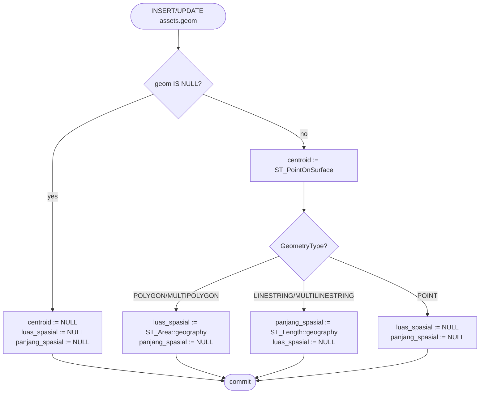
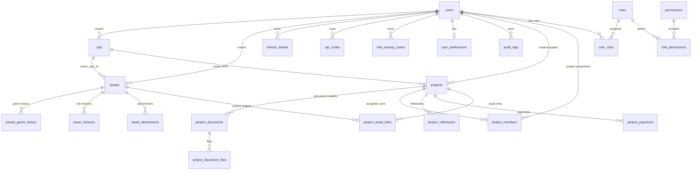
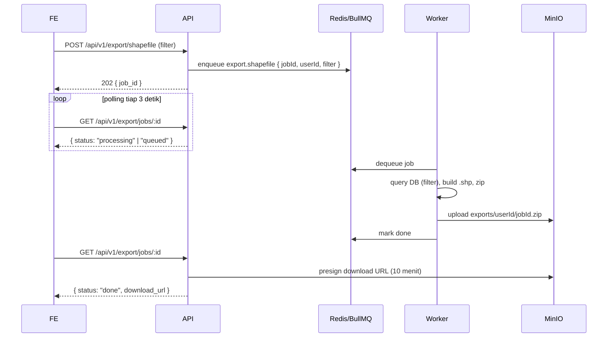

# Project Requirements Document (PRD)
## SIMANTA — Platform Web GIS untuk Manajemen Aset Wilayah dan Administrasi Proyek GIS

**Versi:** 1.4.2
**Tanggal:** Juni 2026
**Dibuat oleh:** Tim Engineering  
**Status:** Draft

> Versi 1.4.2 melakukan **sinkronisasi menyeluruh spesifikasi backend dengan frontend codebase & shared schema**: menyelaraskan intrinsic geometry (`projects.geom`, GIST index, enum `jenis_infrastruktur`), granular address (`district`, `road_name`, `rt`, `rw`, `kelurahan`, `kecamatan`), `sk_proyek`, auto-centering OPD profile (`default_latitude`, `default_longitude`, `default_zoom`, `default_bbox`), dashboard endpoints (`/projects/dashboard-stats`, `/projects/geojson`), batch project create (`POST /projects?include=documents,files`), user session & backup-code routes, probe `/api/v1/health`, dan route alias verifikasi OTP. Versi 1.4 sebelumnya melakukan **dashboard pivot** dari "Dashboard Aset" menjadi "Dashboard Proyek". Single active OPD mode tetap permanen.

---

## 1. Ringkasan Eksekutif

Dokumen ini mendefinisikan kebutuhan teknis dan fungsional untuk pembangunan ulang **SIMANTA** sebagai platform Web GIS untuk **manajemen aset wilayah** dan **administrasi Proyek GIS** Pemerintah Daerah menggunakan stack teknologi modern. Sistem ini dirancang untuk menggantikan implementasi Laravel/Bootstrap yang ada, dengan menggunakan SvelteKit (frontend), Hono.js (backend), PostgreSQL + PostGIS (database), Bun (runtime), dan Drizzle ORM — demi mencapai performa lebih tinggi, arsitektur lebih bersih, dan pengalaman developer yang lebih baik.

Cakupan domain sistem ini adalah **pemetaan wilayah secara umum**, tidak hanya satu jenis aset. Layer/objek yang dikelola minimal mencakup:

- **Aset tanah** — bidang tanah pemerintah dengan polygon batas
- **Aset bangunan** — gedung/fasilitas pemerintah (footprint polygon di atas tanah)
- **Aset jalan raya** — ruas jalan (polyline / multi-line) milik atau yang dikelola pemerintah
- **Aset lain (extensible)** — saluran, lapangan, makam, taman, dsb. dengan tipe geometri yang sesuai

Karena cakupannya beragam, model data dirancang generik berbasis tabel `assets` dengan kolom `jenis` dan kolom geometry yang fleksibel (lihat §6), bukan tabel khusus per jenis aset.

**Positioning Produk:** SIMANTA diposisikan sebagai platform dua pilar: (1) manajemen aset/tata wilayah berbasis Web GIS; dan (2) administrasi Proyek GIS yang menghubungkan paket pekerjaan, dokumen/checklist, milestone, referensi pembayaran, dan output proyek ke aset/layer GIS secara auditable. Pilar Proyek GIS adalah domain produk resmi berdampingan dengan Aset Wilayah, tetapi tetap sebatas repositori administrasi/audit dan tidak menggantikan sistem sumber pengadaan atau keuangan daerah.

**Nama Sistem:** SIMANTA — Sistem Informasi Manajemen Aset, Tata Wilayah & Administrasi Proyek GIS
**Target Pengguna:** Satu OPD pengguna utama untuk keseluruhan proyek (mis. Dinas/Unit pengelola aset/GIS). Pengelompokan internal memakai Sub OPD/Bidang/UPT, bukan multi-OPD.

**Ringkasan tambahan v1.4:** Dashboard utama setelah login direvisi dari "Dashboard Aset" menjadi "Dashboard Proyek" (lihat §8.1) — fokus visual berpindah dari sebaran aset ke sebaran geografis proyek di wilayah kerja OPD aktif, dengan 2 KPI ringkas (Total Proyek + Proyek Berjalan) dan layer control per status/jenis infrastruktur. Patch ini **tidak menghapus** Modul Web GIS Aset (Pilar 1) secara substantif, namun menghapus atau memindahkan fitur Dashboard lama yang terkait modul Aset (pencarian aset di peta, measure, reverse-geocode, bookmark, BarChart/PieChart, StatsCards spasial 7-metric) sesuai daftar di §8.1 "Dihilangkan dari produk". Penghapusan menyeluruh Modul Aset (beserta §6.3 tabel `assets`, §7.3 endpoint `/api/v1/assets/*`, §8.2 CRUD Aset, §8.3 Digitasi Peta, dan turunannya) dijadwalkan untuk revisi berikutnya — lihat §16 Roadmap TODO. Perubahan v1.4 tidak menambah kewajiban task management, resource planning, procurement, finance, atau approval workflow baru di luar scope yang sudah didefinisikan.

**Ringkasan tambahan v1.3.7:** PRD memperkuat narasi dua pilar SIMANTA agar stakeholder membaca Proyek GIS sebagai domain administrasi/audit yang setara secara produk dengan Aset Wilayah, tanpa menambah kewajiban task management, resource planning, procurement, finance, atau approval workflow di luar scope yang sudah didefinisikan.

**Ringkasan tambahan v1.3.6:** PRD kini menegaskan satu OPD pengguna utama (**single active OPD mode**) sebagai scope permanen produk, membersihkan sisa istilah legacy yang mengarah ke relokasi/CRUD multi-OPD, dan memperjelas Modul Proyek GIS agar satu header dokumen proyek dapat memiliki banyak file/lampiran fisik. Modul ini memakai entitas `projects`, `project_documents` sebagai header metadata, `project_document_files` sebagai file/lampiran, milestone, payment reference, dan link opsional ke aset/layer GIS; file tetap melalui object storage, signed URL, scan/quarantine, RBAC permission/scope, optimistic locking, enum/check status, dan audit log. PRD juga menegaskan bahwa SIMANTA hanya menjadi repositori administrasi/audit trail proyek, bukan sistem pengadaan atau keuangan utama.

---

## 2. Latar Belakang & Tujuan Bisnis

### 2.1 Masalah yang Diselesaikan

Pemerintah daerah menghadapi tantangan dalam mengelola dan memantau aset wilayah (tanah, bangunan, jalan, dan fasilitas pendukung) yang tersebar di wilayah administrasinya. Permasalahan utama yang ada:

- Sulit mengetahui lokasi pasti dan status aset yang dikelola lintas jenis (tanah, bangunan, jalan)
- Data aset tidak terintegrasi dan tersebar di berbagai bidang/sub-unit internal OPD pengguna; pengelompokan dilakukan melalui Sub OPD/Bidang/UPT dalam satu OPD aktif, bukan melalui OPD tambahan
- Tidak ada visualisasi spasial yang memadai untuk pengambilan keputusan
- Pengelolaan aset yang tidak optimal menyebabkan nilai intrinsik aset tidak termanfaatkan secara maksimal
- Sebagian aset belum tergeoreferensi (belum punya polygon/line di peta), sehingga sulit diaudit
- Perubahan penanggung jawab, bidang/sub-unit, atau status pengelolaan aset tidak terlacak secara historis (audit trail tidak ada)
- Riwayat perubahan geometry (re-digitasi polygon) hilang setelah overwrite
- Dokumen siklus hidup proyek GIS, mulai dari tender/pengadaan, kontrak, pelaksanaan, berita acara, serah terima, hingga invoice/pembayaran akhir, belum terdokumentasi secara terpusat dan terhubung dengan progres pekerjaan, sehingga menyulitkan audit, monitoring kewajiban kontraktual, dan pelacakan histori administrasi proyek. Di lapangan, satu header dokumen proyek sering terdiri dari beberapa file/lampiran fisik, sehingga model satu dokumen = satu file tidak cukup mewakili kebutuhan administrasi nyata.

### 2.2 Tujuan Pengembangan

1. Membangun sistem pemetaan berbasis web (Web GIS) yang dapat diakses dari mana saja
2. Menyediakan tools digitasi langsung di peta (polygon untuk tanah/bangunan, polyline untuk jalan, point untuk POI)
3. Menyimpan dan mengelola data aset wilayah secara terpusat dengan model data generik
4. Menyediakan laporan interaktif berbasis data spasial dan filter multi-jenis aset
5. Mendukung pengambilan keputusan berbasis data (data-driven decision)
6. Mendukung transformasi digital pemerintahan menuju good corporate governance
7. Menjamin akuntabilitas: lifecycle aset (create → perubahan penanggung jawab/bidang/sub-unit bila diperlukan → arsip) terlacak dan auditable
8. Memenuhi UU 27/2022 (Pelindungan Data Pribadi) untuk semua data PII pengguna
9. Menyediakan kontrol akses granular berbasis role/permission dan scope OPD
10. Menyediakan peta satelit pada Dashboard, View/Detail Aset, Create/Edit Aset, Laporan, dan Atlas
11. Menyimpan properti tambahan aset seperti SP2D Dinas PU, deskripsi, dan lampiran multi-file
12. Menyediakan histori versi penuh untuk setiap perubahan data aset dan lokasi
13. Menyediakan export shapefile `.shp` dalam `.zip` dan laporan interaktif PDF/Excel yang auditable
14. Mendukung administrasi dan pengendalian administratif Proyek GIS secara auditable melalui pencatatan paket pekerjaan, checklist dokumen, milestone, referensi invoice/termin/SP2D, dan relasi output proyek ke aset/layer GIS, dengan dukungan banyak file/lampiran pada satu header dokumen proyek

### 2.3 Batasan & Asumsi

- Sistem berjalan sebagai **SPA statis** (SvelteKit `adapter-static`, `ssr=false`) yang di-serve oleh Nginx, dengan backend Hono.js terpisah
- Autentikasi memakai JWT access (memori FE) + refresh token (HttpOnly cookie); detail di §7.2
- Data spasial disimpan sebagai geometry PostGIS (SRID 4326) dan dipertukarkan dalam GeoJSON
- OTP WhatsApp untuk verifikasi dua faktor menggunakan pihak ketiga (Fonnte / Wablas)
- Ekspor shapefile/Excel/PDF diproses asynchronous di worker (BullMQ + Redis), bukan di request HTTP
- API versioned mulai hari pertama (`/api/v1/*`); breaking change masa depan akan ko-eksis (v1+v2) minimum 6 bulan sebelum sunset v lama
- Data sovereignty: seluruh data + backup berada di infrastruktur dalam negeri (sesuai PP 71/2019 & UU 27/2022)
- Timestamp disimpan `timestamptz` UTC; ditampilkan FE dalam zona `Asia/Jakarta`
- Hak akses memakai RBAC berbasis permission key dan scope (`all`, `own_opd`, `own_created`, `self`), bukan hanya role string sederhana; tabel endpoint API memakai permission + scope, bukan shorthand role lama seperti `viewer+`/`operator+`. Dalam single active OPD mode, `own_opd` selalu mengarah ke OPD aktif/default sebagai batas akses organisasi tunggal, bukan sebagai fondasi multi-OPD.
- Basemap satelit dapat menggunakan ESRI World Imagery, MapTiler, atau Mapbox; provider berbayar membutuhkan API key/token dan attribution yang benar
- Aset mendukung properti SP2D terstruktur dan lampiran multi-file melalui object storage; `asset_attachments` adalah single source of truth untuk semua dokumen/foto/lampiran aset
- Histori versi data memakai snapshot immutable (`asset_versions`); `assets.version` tetap dipakai untuk optimistic locking; hanya lampiran legal/SP2D/sertifikat/perubahan legal penanggung jawab yang wajib membuat revision baru
- SIMANTA mencatat dokumen dan metadata proyek GIS sebagai arsip administrasi dan audit trail, namun tidak menggantikan LPSE/SIRUP/SIPD/SP2D atau sistem keuangan daerah sebagai sumber utama transaksi pengadaan/pembayaran
- Istilah **Administrasi Proyek GIS** dalam PRD ini berarti pencatatan paket pekerjaan, dokumen/checklist, milestone, payment reference, dan relasi output proyek ke aset/layer GIS; bukan project management suite penuh, task/resource planning, e-procurement, akuntansi, atau sistem pembayaran resmi
- Seluruh proyek berjalan dalam **single active OPD mode**: hanya satu OPD aktif yang menjadi pemilik utama data aset, proyek, user, dashboard, dan laporan. Tabel/kolom OPD tetap dipertahankan untuk identitas organisasi dan scope `own_opd`, tetapi CRUD OPD tambahan, statistik lintas OPD, dan transfer antar-OPD tidak menjadi bagian scope produk aktif.
- Dokumen proyek memakai pola **header dokumen + banyak file/lampiran**: metadata administratif disimpan pada `project_documents`, sedangkan object key, filename, MIME, ukuran, checksum, scan status, dan audit upload/download berada di `project_document_files`.
- Integrasi langsung dengan sistem eksternal pengadaan/keuangan daerah bersifat Post-MVP kecuali diwajibkan dalam kontrak pengadaan

#### 2.3.1 Non-Goals / Out of Scope MVP

Untuk mengendalikan scope 18 minggu, fase MVP tidak mencakup:

- Mobile native app. Akses mobile tetap melalui web responsive.
- Offline-first digitasi lapangan.
- Survey geodetik presisi legal tanpa verifikasi lapangan/surveyor berwenang.
- Integrasi real-time dengan seluruh sistem OPD eksternal.
- CRUD OPD tambahan, multi-OPD mode, statistik lintas OPD, dan transfer aset antar-OPD sebagai fitur aktif produk; perubahan ini membutuhkan PRD/kontrak baru bila kelak diminta.
- Penggantian sistem keuangan/SP2D sumber utama; SIMANTA hanya menyimpan referensi SP2D terstruktur.
- Self-hosted national basemap kecuali diwajibkan procurement atau deployment sensitif.
- Migrasi penuh ke MapLibre/vector tile sebelum trigger performa terpenuhi.

#### 2.3.2 MVP vs Post-MVP Phasing

| Kategori | Cakupan |
|---|---|
| MVP / Go-live Required | Auth OTP, RBAC permission/scope, CRUD aset, digitasi geometry, profil OPD pengguna utama (single active OPD), dashboard/laporan single OPD, export Excel/PDF/Shapefile, audit, backup dasar, administrasi Proyek GIS + header dokumen dengan upload multi-file/lampiran |
| Go-live Hardening | Scan/quarantine lampiran dan file dokumen proyek, restore drill, OpenAPI, UAT, CSP, SLO monitoring, object storage policy, import preview/commit, checklist kelengkapan dokumen proyek per stage/header |
| Post-MVP | Vector tile, migrasi MapLibre, OpenTelemetry tracing, self-hosted basemap, advanced atlas grid, overlap auto-resolution, workflow approval dokumen proyek, reminder termin/kontrak, integrasi LPSE/SIRUP/SIPD/SP2D, OCR/e-signature. Multi-OPD tetap di luar scope kecuali ada PRD/kontrak baru. |
| Future Trigger-Based | MapLibre/vector tile jika jumlah aset > 10.000, viewport payload GeoJSON > 2 MB, atau render peta turun di bawah target performa |

---

## 3. Stack Teknologi

| Lapisan | Teknologi | Versi | Alasan |
|---|---|---|---|
| Runtime | **Bun** (primary) + **Node.js** (fallback) | Bun ^1.x / Node ≥20 LTS | Bun untuk performa & DX; Node sebagai fallback production jika ada dependency yang tidak kompatibel |
| Frontend | **SvelteKit** (`adapter-static`, `ssr=false`) | ^2.x (Svelte 5) | Pure SPA, di-deploy sebagai static asset di belakang Nginx |
| Backend | **Hono.js** | ^4.x | Ultra-ringan, TypeScript-first, jalan di Bun maupun Node |
| Database | **PostgreSQL** + **PostGIS** | PG 16 + PostGIS 3.4 | Query spasial penuh (ST_Contains, ST_Intersects, ST_Simplify, dll.) |
| ORM | **Drizzle ORM** + raw SQL untuk PostGIS | ^0.30.x | Type-safe untuk kolom non-spasial; raw SQL eksplisit untuk geometry |
| Migrations | **Drizzle Kit** + plain SQL files untuk PostGIS | — | Drizzle Kit untuk schema biasa; SQL file manual untuk `geometry`, GIST index, constraint |
| Auth | **JWT (access)** + **Refresh token (HttpOnly cookie)** + **bcryptjs / argon2** | — | Access pendek di memori, refresh aman di cookie. `bcryptjs` (pure JS) primer karena native `bcrypt` punya risiko kompatibilitas Bun; `argon2` opsional untuk keamanan lebih tinggi |
| Peta | **MapLibre GL JS** | ^5.x | GPU-accelerated vector/raster renderer; abstraksi engine di `MapContainer.svelte` (lihat §3.4). ADR-002 trigger terpenuhi; migrasi dari Leaflet selesai di v1.4.1 patch FE. |
| Basemap Provider | **ESRI World Imagery / ArcGIS institutional / MapTiler / Mapbox / Google Maps / OSM** | — | Satelit dan street map untuk Dashboard, View, Create/Edit, Laporan, dan Atlas; provider berbayar memakai token/API key. Lihat §3.5 untuk matrix lisensi/attribution/print-allowlist. |
| GIS Client | **MapLibre GL JS** (draw & measure via `MapDrawController.svelte`, search proyek via `DashboardFilterPanel` + `project-search.ts`) | — | Draw/measure/filter diabstraksikan di komponen FE; leaflet-draw/search/measure sudah tidak dipakai sejak v1.4.1 patch FE (lihat §16.5). |
| Grafik | **SVG primitives** (lihat `SimpleBars.svelte` di §8.1) | — | Visualisasi stat minimal pada Dashboard dan filter panel; Chart.js sudah tidak dipakai sejak v1.4 karena Dashboard Proyek hanya memakai 2 KPI dan bar ringkas (lihat §8.1). |
| Validasi | **Zod** | ^3.x | Schema validation type-safe di FE + BE |
| Storage File | **MinIO** (S3-compatible) | — | Upload dokumen dan foto aset |
| Cache & Queue | **Redis** + **BullMQ** | Redis 7.x | Cache GeoJSON/dashboard + background job |
| Reverse Proxy | **Nginx** | stable | HTTPS, compression, upload limit, static serving |
| WhatsApp OTP | **Fonnte** / **Wablas** | — | Gateway WhatsApp lokal terjangkau |
| Email Provider | **SMTP relay** (Gmail Workspace / SES / Mailtrap dev) | — | Email OTP fallback untuk MFA recovery (lihat §7.2) |
| Deploy | **Docker** + **Docker Compose** | — | Reproducible environment |
| Secret Mgmt | **Docker secrets** (prod), `.env` (dev) | — | Pemisahan production secrets dari source; rotasi JWT key via `kid` claim (lihat §10.2) |

### 3.1 Frontend — SvelteKit Static SPA

- Menggunakan `@sveltejs/adapter-static` dengan `ssr = false` di `+layout.ts` (atau `export const ssr = false` global).
- Output adalah static asset (HTML + JS + CSS) yang di-serve oleh Nginx, **tidak ada Node SSR runtime di production**.
- Konsekuensi: semua data diambil via API (`fetch` ke Hono), routing client-side, fallback `index.html` di Nginx (`try_files`).
- Manfaat: deploy sederhana, cache CDN/Nginx mudah, tidak ada masalah bundling Node-only di server runtime.

#### 3.1.1 Mock-Mode (Contract-First FE)

Frontend memakai pola **contract-first**: service layer FE sudah commit ke kontrak API `/api/v1/*` (§7) dan response envelope (§7.1), tetapi saat `PUBLIC_API_MODE=mock` (default) data berasal dari fixtures lokal sehingga FE bisa berjalan tanpa BE yang live.

Toggle di `lib/services/api/client.ts`:

- `PUBLIC_API_MODE=mock` (default): service layer membaca fixture di `frontend/src/lib/mocks/` (`assets.ts`, `projects.ts`, `opd.ts`, `users.ts`, `sidoarjo-boundary.ts`) lalu membungkus payload dengan envelope `{ success, data, message, meta, request_id, timestamp }` yang identik dengan response BE aktual. Latency simulasi ~80ms untuk merasakan loading state UI.
- `PUBLIC_API_MODE=real`: `fetch` ke `${PUBLIC_API_BASE_URL}/api/v1/*` (default `/api/v1`). Digunakan saat integrasi BE.

Konsekuensi:

- Kontrak response (envelope shape, error codes, RBAC scope) sudah teruji end-to-end di FE tanpa menunggu BE.
- `project-search.ts`, filter, sort, paginasi, dan 409 CONFLICT_VERSION handler diuji dengan fixture mock sebelum integrasi.
- Saat transisi ke `real`, FE yang sudah lulus contract-test tidak perlu refactor; cukup sediakan backend yang sesuai OpenAPI (`docs/api/v1.yaml`).
- Mock-mode **bukan** tool untuk production: flag `PUBLIC_API_MODE=real` wajib di production deploy.

Environment variable terkait:

```env
PUBLIC_API_MODE=mock                 # mock | real; default mock
PUBLIC_API_BASE_URL=/api/v1          # hanya dipakai saat PUBLIC_API_MODE=real
PUBLIC_DEFAULT_BASEMAP=esri_satellite
PUBLIC_MAPTILER_API_KEY=
PUBLIC_MAPBOX_ACCESS_TOKEN=
PUBLIC_ARCGIS_TOKEN=
PUBLIC_ARCGIS_IMAGERY_URL=
PUBLIC_ARCGIS_REFERENCE_URL=
PUBLIC_ARCGIS_ROADS_URL=
PUBLIC_ARCGIS_MAX_ZOOM=19
PUBLIC_GOOGLE_MAPS_API_KEY=

### 3.2 Runtime Backend — Bun primary, Node.js fallback

Tujuan: dapatkan performa Bun sambil tetap aman untuk operasional.

- **Default:** Hono.js dijalankan di Bun (`bun run src/index.ts`).
- **Fallback:** kode backend ditulis agar tetap berjalan di Node.js ≥20 (Hono mendukung keduanya). Hindari API yang khusus Bun (`Bun.*`) di hot path; bila terpaksa, bungkus di adapter `runtime/bun.ts` vs `runtime/node.ts`.
- **Library kritis** yang berisiko (driver Postgres, library shapefile, PDF, image processing, password hash) dipilih yang **dual-runtime**: `postgres` (porsager), `pg`, `exceljs`, `pdfkit`, `shp-write`, `sharp` (Node), atau alternatif yang jalan di Bun. Khusus password hash, **`bcryptjs` (pure JS)** dijadikan default; `argon2` (native) dipakai bila tim sudah validasi runtime.
- **CI** menjalankan test di Bun **dan** Node minimal seminggu sekali (matrix), supaya regresi kompatibilitas terdeteksi dini.
- **Docker image production** menyediakan dua varian: `Dockerfile.bun` (default) dan `Dockerfile.node` (fallback) — switch hanya dengan ganti image.
- **Trigger fallback ke Node:** ada dependency penting yang crash/leak di Bun, atau benchmark menunjukkan regresi signifikan untuk workload spesifik.

#### 3.2.1 Database connection pool

| Process | Pool size | Idle timeout | Connect timeout |
|---|---|---|---|
| API (Hono) | `vCPU * 2 + 1` (default 9) | 30s | 5s |
| Worker (BullMQ) | `vCPU * 1.5` (default 6) | 60s | 5s |
| Migration runner | 1 (single connection) | — | 30s |

Pool dipisah per process supaya satu pool yang exhausted (mis. worker import berat) tidak mempengaruhi API user-facing. PgBouncer (transaction mode) dipertimbangkan saat user concurrent > 200.

### 3.3 Drizzle ORM + PostGIS — Strategi Hybrid

Drizzle saat ini belum punya tipe `geometry` first-class. Strategi yang dipakai:

1. **Schema Drizzle hanya untuk kolom non-spasial.** Kolom geometry **tidak** didefinisikan di `schema.ts`, supaya Drizzle Kit tidak mencoba men-generate ulang.
2. **Kolom geometry dikelola via SQL migration manual** di `backend/src/db/migrations/postgis/*.sql` (CREATE EXTENSION, ADD COLUMN geometry, GIST index, CHECK constraint). Migrasi ini di-run berurutan setelah migrasi Drizzle (lihat §6.7).
3. **Akses geometry dari kode** menggunakan `sql` template Drizzle, contoh:
   ```ts
   await db.execute(sql`
     SELECT id, name,
            ST_AsGeoJSON(geom)::json AS geom,
            ST_AsGeoJSON(ST_Centroid(geom))::json AS centroid
     FROM assets
     WHERE deleted_at IS NULL
       AND ST_Intersects(geom, ST_MakeEnvelope(${minLng}, ${minLat}, ${maxLng}, ${maxLat}, 4326))
   `);
   ```
4. **Helper terpusat** di `backend/src/db/postgis.ts` membungkus operasi umum: `insertGeometry`, `updateGeometry`, `selectGeoJSON`, `bboxFilter`, `validateGeometry` (ST_IsValid + ST_MakeValid).
5. **Tipe TypeScript untuk geometry** didefinisikan manual (`Geometry`, `MultiPolygon`, `MultiLineString`, `Point` GeoJSON spec) di `shared/geojson.ts` agar konsisten antar FE-BE.
6. **Test migrasi** wajib: setiap PR yang menambah kolom spasial harus disertai SQL migration + test yang menjalankan `ST_IsValid` pada sample data.

Dengan pola ini, kita dapat type safety Drizzle untuk 95% kolom, dan kontrol penuh untuk PostGIS tanpa "menipu" ORM.

### 3.4 Strategi Peta — MapLibre GL JS dengan abstraksi engine terpusat

Sejak v1.4.1 patch FE, renderer peta adalah **MapLibre GL JS** (^5.x) — migrasi dari Leaflet dilakukan setelah trigger ADR-002 (presisi digitasi + zoom tinggi + dataset besar di Pilar Proyek GIS) terpenuhi. Migrasi tidak memerlukan rewrite karena abstraksi peta terpusat di `MapContainer.svelte`; halaman/komponen di atasnya memakai props dan event dispatcher yang stabil.

**Fase 1 (data kecil-menengah, < ~5.000 fitur tampak di viewport):** MapLibre GL JS + GeoJSON source + 4 layer (`features-fill`, `features-stroke`, `features-line`, `features-circle`) di dalam `MapContainer.svelte`. Render mode:
- `mode="asset"`: filter by `visible: JenisAset[]`, warna per jenis aset, popup link ke `/assets/[id]`.
- `mode="project"` (Dashboard Proyek): filter by `visibleStatuses: ProjectStatusGroup[]` AND `visibleJenis: JenisInfrastruktur[]`, warna per status group, popup link ke `/projects/[id]`.

**Triggers untuk eskalasi** (salah satu terpenuhi → naik fase):
- Jumlah fitur di tabel `projects` (atau `assets` jika masih aktif di v1.4) > 5.000, atau viewport bbox sering > 2.000 fitur
- Payload GeoJSON > 2 MB pada zoom umum
- FPS pan/zoom turun di bawah 30 di laptop kantor standar
- Waktu render layer > 1 detik

**Roadmap teknis future-proofing** (urutan eskalasi, tanpa rewrite total karena engine diabstraksikan di `MapContainer.svelte`):

1. **BBox + zoom-aware loading**  
   Endpoint `/api/v1/projects/geojson?bbox=...&zoom=...&simplify=...` (atau `/api/v1/assets/geojson` selama `assets` masih aktif di v1.4) — backend filter `ST_Intersects` + `ST_SimplifyPreserveTopology` sesuai zoom. Diterapkan sejak hari pertama (lihat §7.3).
2. **Server-side simplification & attribute trimming**  
   Toleransi simplifikasi naik di zoom kecil; atribut yang dikirim minimal (id, nama, status/jenis, link). Detail penuh diambil saat user klik fitur.
3. **Clustering untuk point**  
   Cluster point layer (proyek titik seperti gapura, monumen, pos) di sumber `features` MapLibre dengan `cluster: true`; tidak butuh plugin Leaflet.
4. **Vector tile**  
   Saat polygon > ~10.000 atau pengguna konkuren tinggi: serve Mapbox Vector Tile (MVT) dari PostGIS via `ST_AsMVT`, di-cache di Redis/Nginx, render di client dengan **MapLibre GL JS** (sudah GPU, tidak perlu renderer swap). Endpoint `/api/v1/{projects,assets}/tiles/{z}/{x}/{y}.mvt` ditambahkan tanpa perubahan komponen FE.
5. **3D extrusion / heatmap**  
   Jika kebutuhan visualisasi 3D (elevasi, density) muncul: MapLibre mendukung `fill-extrusion` dan `heatmap` layer native. Tidak ada rewrite.

Catatan: MapLibre GL JS adalah WebGL/GPU-accelerated, sehingga batas atas performa secara signifikan lebih tinggi dari Leaflet (SVG). Trigger §3.4 v1.4 (render MapLibre) sudah terpenuhi; §3.4 roadmap v1.3 (clustering, vector tile, MapLibre fallback) digabung menjadi urutan eskalasi di atas.

### 3.5 Basemap Provider — ESRI/ArcGIS institutional, MapTiler, Mapbox, Google Maps, OSM

Sistem mendukung pilihan basemap yang konsisten pada semua konteks peta: Dashboard, View/Detail Aset, Create/Edit/Digitasi Aset, Laporan Interaktif, dan Atlas/Print Map. Daftar provider di bawah adalah inventori aktual FE (v1.4.1) yang didefinisikan di `frontend/src/lib/components/map/basemaps.ts` (`BasemapKey`).

| Key | Provider | Jenis | Token / Env | Catatan |
|---|---|---|---|---|
| `osm_standard` | OpenStreetMap | Street map | tidak | Fallback terbuka, sesuai tile policy OSM |
| `esri_satellite` | ESRI World Imagery (public) | Satellite | tidak (atau `PUBLIC_ARCGIS_TOKEN` untuk institutional) | Default rekomendasi bila tidak ada provider berbayar; dapat dioverride ke institutional ArcGIS MapServer via `PUBLIC_ARCGIS_IMAGERY_URL` |
| `arcgis_institutional` (alias dari `esri_satellite` saat `PUBLIC_ARCGIS_IMAGERY_URL` di-set) | ArcGIS Server institutional | Satellite | `PUBLIC_ARCGIS_TOKEN`, `PUBLIC_ARCGIS_IMAGERY_URL`, `PUBLIC_ARCGIS_MAX_ZOOM` | Tiles dilayani server ArcGIS instansi; layer reference (boundaries/roads) ditambahkan via `PUBLIC_ARCGIS_REFERENCE_URL` & `PUBLIC_ARCGIS_ROADS_URL` |
| `maptiler_satellite` | MapTiler Satellite (hybrid style) | Satellite | `PUBLIC_MAPTILER_API_KEY` | Style vector hybrid (citra + label) |
| `maptiler_streets` | MapTiler Streets v2 | Street map | `PUBLIC_MAPTILER_API_KEY` | Style vector untuk visualisasi street; dipakai juga untuk Atlas streetmap |
| `mapbox_satellite` | Mapbox Satellite | Satellite | `PUBLIC_MAPBOX_ACCESS_TOKEN` | Tiles raster v9 |
| `google_satellite` | Google Maps Satellite (custom raster) | Satellite | `PUBLIC_GOOGLE_MAPS_API_KEY` | **Disclaimer:** Google tidak menyediakan endpoint tile publik untuk penggunaan tanpa Google Maps Platform resmi. Provider ini dipakai hanya pada deployment yang memiliki perjanjian/licensing dengan Google Maps Platform; admin wajib memastikan ToS dipenuhi. Tile fetch melewati subdomain `mt{0-3}.google.com` dengan parameter `key`. Lihat §3.5.2. |
| `google_streets` | Google Maps Streets (custom raster) | Street map | `PUBLIC_GOOGLE_MAPS_API_KEY` | Disclaimer sama dengan `google_satellite`; hanya untuk deployment dengan lisensi Google Maps Platform aktif. |
| `google_terrain` | Google Maps Terrain (custom raster) | Terrain | `PUBLIC_GOOGLE_MAPS_API_KEY` | Disclaimer sama; terrain untuk visualisasi topografi. |

Aturan implementasi:

- Definisi dan key registry di `frontend/src/lib/components/map/basemaps.ts` (function `basemaps`/`getActiveBasemaps`). UI basemap switcher di-render oleh `MapContainer.svelte` (floating bottom-left panel) dengan menyembunyikan provider yang token/env tidak tersedia.
- Default basemap mengikuti `user_preferences.default_basemap`; fallback ke `PUBLIC_DEFAULT_BASEMAP` dari environment, atau ke `esri_satellite` bila env tidak di-set.
- Provider berbayar disembunyikan dari switcher bila token/API key kosong atau `YOUR_DEMO_KEY`.
- Attribution provider wajib tampil pada peta browser dan output PDF/atlas.
- Jika tile provider gagal (network/auth/quota), UI menampilkan empty/error state di `MapContainer` (`tileError` slot) dan fallback ke provider lain yang tersedia sesuai urutan di `getActiveBasemaps()`.

Environment variable terkait (lengkap di §3.1.1):

```env
PUBLIC_DEFAULT_BASEMAP=esri_satellite
PRINT_ALLOWED_BASEMAPS=esri_satellite,maptiler_satellite,maptiler_streets,mapbox_satellite
PUBLIC_MAPTILER_API_KEY=
PUBLIC_MAPBOX_ACCESS_TOKEN=
PUBLIC_ARCGIS_TOKEN=
PUBLIC_ARCGIS_IMAGERY_URL=
PUBLIC_ARCGIS_REFERENCE_URL=
PUBLIC_ARCGIS_ROADS_URL=
PUBLIC_ARCGIS_MAX_ZOOM=19
PUBLIC_GOOGLE_MAPS_API_KEY=
```

#### 3.5.1 Lisensi, Attribution, Privacy, dan PDF/Atlas

Sistem membedakan **interactive basemap** (tampil di browser Dashboard/View/Create/Edit/Laporan) dan **print/export basemap** (dirender ke PDF/Atlas lalu disimpan sementara di MinIO). PDF/Atlas hanya boleh memakai provider yang mengizinkan static export/print/PDF sesuai Terms of Service/lisensi dan wajib menampilkan attribution. Bila provider yang dipilih user tidak ada di `PRINT_ALLOWED_BASEMAPS`, UI menampilkan warning dan menawarkan fallback legal atau opsi tanpa basemap eksternal.

| Provider | Key | Attribution wajib | Token | Browser use | PDF/Atlas legal use | Cache/proxy/offline | Privacy note | Fallback |
|---|---|---|---|---|---|---|---|---|
| OSM | `osm_standard` | OSM/copyright sesuai policy | tidak | ya sesuai tile policy | cek policy tile provider; tidak otomatis untuk bulk print | cache terbatas sesuai policy | IP + tile coordinate ke provider tile | ESRI/MapTiler/self-hosted |
| ESRI World Imagery (public) | `esri_satellite` (tanpa `PUBLIC_ARCGIS_IMAGERY_URL`) | Esri attribution wajib di UI dan PDF bila dipakai | tidak | ya | hanya bila ToS/lisensi mengizinkan static export/print | tidak cache permanen kecuali lisensi | IP + tile coordinate ke Esri | MapTiler/self-hosted/no-basemap |
| ArcGIS Server institutional | `esri_satellite` (dengan `PUBLIC_ARCGIS_IMAGERY_URL` di-set) + `arcgis_institutional` reference overlay | Attribution sesuai konvensi institutional server; reference layer "World Boundaries and Places" + "World Transportation" dari ArcGIS Online | ya (`PUBLIC_ARCGIS_TOKEN`) | ya | sesuai ToS subscription — admin konfirmasi; kalau tidak termasuk static export, masuk exclusion list | tidak cache permanen kecuali lisensi | IP + tile coordinate ke server Esri institutional | OSM/MapTiler/self-hosted/no-basemap |
| MapTiler Satellite | `maptiler_satellite` | © MapTiler © OpenStreetMap contributors | ya (`PUBLIC_MAPTILER_API_KEY`) | ya | sesuai plan MapTiler; style vector hybrid | sesuai plan | IP + tile coordinate ke MapTiler | ESRI/self-hosted/no-basemap |
| MapTiler Streets | `maptiler_streets` | © MapTiler © OpenStreetMap contributors | ya | ya | sesuai plan; aman untuk static export/print | sesuai plan | IP + tile coordinate ke MapTiler | OSM/ESRI/no-basemap |
| Mapbox Satellite | `mapbox_satellite` | Mapbox attribution/logo | ya | sesuai plan | sesuai plan/lisensi; pastikan static export/print allowed | sesuai plan | IP + tile coordinate ke Mapbox | ESRI/MapTiler/self-hosted/no-basemap |
| Google Maps (Satellite/Streets/Terrain) | `google_satellite`/`google_streets`/`google_terrain` | "© Google" sesuai Google Maps Platform ToS | ya (`PUBLIC_GOOGLE_MAPS_API_KEY`) | hanya pada deployment dengan lisensi Google Maps Platform aktif | sesuai Google Maps Platform ToS; admin konfirmasi sebelum PDF/Atlas | sesuai plan | IP + tile coordinate ke Google | ESRI/MapTiler/self-hosted/no-basemap |

Karena request tile eksternal dapat mengirim IP pengguna dan koordinat tile/viewport, penggunaan basemap eksternal wajib tercakup dalam DPIA. Deployment sensitif harus menyediakan opsi tile proxy atau self-hosted basemap.

#### 3.5.2 Disclaimer khusus: Google Maps sebagai basemap

Provider `google_satellite`, `google_streets`, dan `google_terrain` di `basemaps.ts` memakai tile endpoint publik Google (`mt{0-3}.google.com`) yang **memerlukan lisensi Google Maps Platform aktif** untuk penggunaan produksi. Google tidak secara resmi menyediakan endpoint tile ini untuk aplikasi tanpa kunci API dan lisensi; menggunakannya di luar lisensi merupakan pelanggaran Terms of Service.

Aturan wajib:

1. **Admin-only enable.** UI basemap switcher hanya menampilkan key Google bila `PUBLIC_GOOGLE_MAPS_API_KEY` di-set ke nilai non-default (bukan `YOUR_DEMO_KEY`). Nilai default atau kosong ⇒ key Google tersembunyi dari switcher.
2. **Production deployment** yang mengaktifkan salah satu key Google wajib memiliki Google Maps Platform contract aktif atas nama instansi. Administrator menandatangani compliance check dan menyimpannya di `docs/runbooks/basemap-license-check.md` (template di §16.5).
3. **PDF/Atlas** dengan basemap Google wajib konfirmasi ulang per export (gate `PRINT_ALLOWED_BASEMAPS`); secara default Google TIDAK termasuk di `PRINT_ALLOWED_BASEMAPS` (§3.5 env). Administrator yang butuh Google untuk PDF/Atlas harus menambahkannya secara eksplisit + mendokumentasikan justifikasi ToS di file yang sama.
4. **Audit trail:** pilihan basemap (termasuk Google) dicatat di `audit_logs` per session/user; export PDF/Atlas dengan basemap non-allowlist ditolak dengan error `BASEMAP_NOT_ALLOWED_FOR_PRINT`.
5. **Fallback wajib** untuk Google: bila key tidak valid/quota habis/ToS violation detected, `MapContainer.tileError` fallback ke provider berikutnya dari `getActiveBasemaps()` (ESRI → MapTiler → OSM). Tidak ada error kosong pada user.
6. **Tidak ada CLI/SDK Google Maps** di runtime (SvelteKit build). Integrasi murni raster tile via `maplibre-gl` style; ini berarti tidak ada telemetry SDK Google yang otomatis mengirim data usage. Konsekuensi: admin wajib self-report usage ke Google Cloud Console untuk billing/quota tracking.
7. **Roadmap v1.5+:** Google Maps sebagai basemap akan dievaluasi ulang. Bila ToS/SDK resmi Google Maps JS untuk MapLibre sudah stabil, migrasi ke loader resmi (bukan tile endpoint langsung) menjadi preferred path. Sampai saat itu, §3.5.2 tetap berlaku.

---

## 4. Arsitektur Sistem

```
                       ┌──────────────────────────────────┐
                       │  Client (Browser / Mobile)       │
                       │  SvelteKit Static SPA            │
                       │ MapLibre GL JS (MapContainer)    │
                       └──────────────┬───────────────────┘
                                      │ HTTPS
                                      ▼
                       ┌──────────────────────────────────┐
                       │  Nginx (Reverse Proxy + TLS)     │
                       │  - HTTPS / HSTS                  │
                       │  - gzip / brotli                 │
                       │  - upload limit, rate limit      │
                       │  - serve SPA static (try_files)  │
                       │  - proxy /api/v1/* → Hono        │
                       └─────┬─────────────────────┬──────┘
                             │                     │
                ┌────────────┘                     └──────────┐
                ▼                                              ▼
    ┌────────────────────────┐                  ┌────────────────────────┐
    │ Hono.js API (Bun/Node) │                  │ Hono.js Worker         │
    │ - JWT (access)         │                  │ - BullMQ consumer      │
    │ - Refresh cookie       │                  │ - Export shp/xlsx/pdf  │
    │ - RBAC, Zod, audit     │                  │ - Heavy GIS jobs       │
    └─────┬──────────────────┘                  └─────┬──────────────────┘
          │                                            │
          │ Drizzle / raw SQL                          │ enqueue/consume
          ▼                                            ▼
    ┌──────────────────────────┐              ┌────────────────────────┐
    │ PostgreSQL 16 + PostGIS  │◀────────────▶│ Redis 7                │
    │ - assets (geometry)      │              │ - cache GeoJSON/stats  │
    │ - users / opd / audit    │              │ - BullMQ queue         │
    │ - GIST index, valid geom │              │ - rate limit counters  │
    │ - mv_dashboard_stats     │              │ - JWT denylist         │
    └─────┬────────────────────┘              └────────────────────────┘
          │
   ┌──────┴───────┬──────────────────────────────┐
   ▼              ▼                              ▼
┌────────────┐ ┌────────────────────┐ ┌──────────────────────────┐
│ MinIO      │ │ WA / Email Gateway │ │ Observability            │
│ (S3 API)   │ │ (Fonnte / Wablas / │ │ - Loki/ELK (logs)        │
│ docs/foto  │ │  SMTP)             │ │ - Prometheus + Grafana   │
│ shp export │ │                    │ │ - Sentry (error tracking)│
└─────┬──────┘ └────────────────────┘ └──────────────────────────┘
      │
      ▼
 ┌─────────────────────────────┐
 │ Backup + DR (cron)          │
 │ - pg_dump → S3/MinIO bucket │
 │ - WAL archive (PITR)        │
 │ - mc mirror MinIO → bucket  │
 │ - Cold standby DB region B  │
 │ - retention 7 / 30 / 365    │
 └─────────────────────────────┘
```

### 4.1 Reverse Proxy — Nginx

Bertanggung jawab atas semua trafik masuk dari publik:

- **HTTPS termination** (TLS 1.2/1.3, cert via Let's Encrypt / sertifikat instansi).
- **HSTS, security headers** (`X-Frame-Options`, `X-Content-Type-Options`, `Referrer-Policy`, `Content-Security-Policy` — konten lengkap di §10.5).
- **Compression**: gzip + brotli untuk HTML/JS/CSS/JSON (termasuk GeoJSON yang sering besar).
- **Upload limit**: `client_max_body_size 50m` default; route khusus import shapefile dapat dinaikkan.
- **Rate limiting** dasar (`limit_req_zone`) per IP untuk `/api/v1/auth/*`.
- **Static SPA serving**: serve `dist/` SvelteKit dengan `try_files $uri /index.html;` (SPA fallback).
- **Proxy `/api/v1/*`** ke service Hono dengan `proxy_pass`, `proxy_set_header X-Forwarded-For/Proto`.
- **Connection handling**: keepalive ke upstream, timeout terpisah untuk endpoint export besar (`proxy_read_timeout` lebih panjang khusus `/api/v1/export/*`).

Konfigurasi disimpan di `infra/nginx/` dan di-mount sebagai volume di compose (lihat §5).

### 4.2 Backup, Disaster Recovery, & SLO

#### 4.2.1 SLO & Capacity Baseline

| Metrik | Target |
|---|---|
| Uptime API | 99.5% / bulan (≈ 3.6 jam allowance) |
| RTO (Recovery Time Objective) | 4 jam |
| RPO (Recovery Point Objective) | 15 menit (dengan WAL archiving) |
| Capacity baseline | 100 OPD, 50.000 aset, 200 user concurrent puncak |
| Latency p95 API list/detail | < 500 ms |
| Latency p95 GeoJSON 5k fitur | < 1.5 dtk |
| Latency p95 GeoJSON 10k fitur | < 3 dtk |

Target di atas adalah baseline; SLO bisa direvisi setelah 3 bulan production berdasarkan data real.

#### 4.2.2 Backup Strategy

- **PostgreSQL**:  
  - Logical backup harian via `pg_dump --format=custom` ke MinIO bucket `backups/postgres/`, **terenkripsi** dengan `age` atau GPG sebelum upload.  
  - Mingguan: full base backup (`pg_basebackup`).  
  - **WAL archiving** ke MinIO bucket `backups/wal/` setiap 5 menit untuk Point-In-Time Recovery (RPO 15 menit).
  - Retention: 7 daily + 4 weekly + 12 monthly + 5 tahun untuk dump berisi `audit_logs` (sesuai retensi audit pemerintah).
  - Test restore otomatis (CI cron) ke instance staging minimal sebulan sekali; runbook restore di `docs/runbooks/restore-postgres.md`.
- **MinIO** (dokumen sertifikat, foto, hasil export):  
  - Replikasi via `mc mirror` ke bucket sekunder (host lain / cold storage).  
  - Versioning + object lock untuk dokumen sertifikat (anti-tamper, retention 5 tahun).  
- **Skrip & schedule** disimpan di `infra/backup/` dan dijalankan via cron/host scheduler atau sidecar container.

#### 4.2.3 Disaster Recovery

- **Cold standby DB** di region/data center berbeda, di-restore dari logical backup harian + WAL archive (RPO 15 menit, RTO 2–4 jam).
- **Runbook DR** di `docs/runbooks/dr-failover.md` mencakup: trigger, langkah promote standby, DNS switch, verifikasi data integrity.
- **DR drill** dilakukan minimum 2x/tahun (simulasi failover).
- **Konfigurasi infra-as-code** (compose file, Nginx conf, env template) di-version-control sehingga rebuild secondary site cepat.

#### 4.2.4 Timezone & Log Retention

- Storage: kolom timestamp pakai `timestamptz`, nilai disimpan UTC.
- Render: FE convert ke `Asia/Jakarta` (`Intl.DateTimeFormat`).
- Log application (Loki): hot 90 hari, lalu archive ke MinIO Glacier-equivalent (retention 1 tahun).
- `audit_logs` (DB): retention 5 tahun (sesuai standar audit pemerintah), partition by year.

### 4.3 Background Job & Queue

Semua proses berat **wajib** di-offload dari request HTTP:

- **Engine:** BullMQ di atas Redis.
- **Worker** terpisah dari API (process berbeda, bisa scale horizontal).
- **Default 2 worker replicas**; auto-scale by queue depth: tambah replica saat `pending > 100` selama 5 menit, kurangi saat depth < 20 selama 15 menit.
- **Queue yang direncanakan:**
  - `export.shapefile` — generate `.shp + .dbf + .shx + .prj`, zip, upload ke MinIO.
  - `export.excel` — generate `.xlsx` dari hasil filter.
  - `export.pdf` — render PDF (puppeteer/pdfkit) termasuk peta screenshot / atlas.
  - `gis.import` — import shapefile/GeoJSON, validasi (`ST_IsValid` + `ST_MakeValid`), reprojection (`ST_Transform`), simpan ke `assets`. Dua tahap: **stage** (preview) dan **commit**.
  - `gis.repair` — bulk `ST_MakeValid` + deteksi `ST_Overlaps` antar polygon `tanah` (job maintenance bulanan).
  - `notify.otp` — pengiriman OTP ke gateway WhatsApp (retry + backoff).
  - `project.document_scan` — scan/quarantine dokumen proyek dan verifikasi checksum setelah upload.
  - `notify.email` — pengiriman email (OTP recovery, signed URL).
  - `bulk.assets` — bulk update jenis/status/sub OPD/Bidang/UPT dan bulk soft delete admin operations; tidak ada operasi relokasi antar-OPD karena single active OPD permanen.
  - `mv.refresh` — refresh `mv_dashboard_stats` (cron tiap 5 menit + on-demand setelah mutasi besar).
- **Pola request**: API mengembalikan `job_id` + status URL; FE polling atau Server-Sent Events. Hasil (file) diberikan sebagai signed URL dari MinIO.
- **Idempotency, retry, dead-letter queue (DLQ)** wajib untuk job yang menyentuh data eksternal (gateway WA, file storage). Alert Prometheus saat `dlq:depth > 10` selama 10 menit.

### 4.4 Cache (Redis)

- **GeoJSON layer** per kombinasi `bbox + zoom + filter` → cache TTL pendek (60–300 dtk) + invalidate selektif berbasis **tag**.
- **Tag-based invalidation:** setiap entry GeoJSON juga dimasukkan ke set tag-nya. Saat ada mutasi `assets`:
  - `gis:assets:tag:opd:<id>` — semua entry terkait OPD itu
  - `gis:assets:tag:bbox:<geohash5>` — semua entry yang bbox-nya overlap geohash precision 5 (~5km)
  - `gis:assets:tag:jenis:<jenis>` — semua entry yang punya filter jenis matching
  - Saat asset di-update, hapus union dari ketiga tag set tersebut. Tidak perlu `FLUSH gis:*` (yang akan nuke seluruh cache).
- **Dashboard stats** (`/api/v1/dashboard/stats`, chart) → di-back oleh materialized view (lihat §6.9), cache Redis menit-an untuk membatasi hit ke MV.
- **Lookup data** (profil OPD aktif/default, jenis aset) → TTL jam, invalidate saat `PUT /api/v1/opd/current` atau perubahan konfigurasi jenis aset; tidak ada invalidasi CRUD OPD tambahan karena produk hanya mendukung satu OPD aktif.
- **Rate limit counters** (login, OTP request) → Redis dengan TTL window.
- **Session/refresh token denylist** → Redis (lihat §7.2).

Konvensi key: `gis:assets:geojson:{hash(filter)}`; semua punya namespace agar mudah `FLUSH` selektif.

### 4.5 Observability

- **Logging**: Hono memakai logger terstruktur (JSON) dengan `request_id` (lihat §7.1). Dikirim ke Loki/ELK via stdout + Promtail/Filebeat.
- **Metrics**: Prometheus exporter di Hono (latency per route, queue depth BullMQ, DLQ depth, DB pool usage); Grafana dashboard di `infra/observability/grafana/`.
- **Alert rules** (placeholder, di-tune setelah launch):
  - `api_p95_latency > 1s` selama 5 menit
  - `bullmq_dlq_depth > 10`
  - `pg_connections_used > 80%`
  - `redis_memory > 80%`
  - `cert_expiry < 14 hari`
- **Tracing (opsional, fase lanjut)**: OpenTelemetry untuk trace permintaan FE → Nginx → Hono → DB.
- **Error tracking**: Sentry di FE dan BE (PII sanitization aktif).
- **Health checks**: `/healthz` (liveness) dan `/readyz` (readiness, cek DB + Redis + MinIO) untuk Nginx upstream + orchestrator.
- **Audit trail** mutasi (`audit_logs`) tetap di DB, terpisah dari log aplikasi.

---

## 5. Struktur Proyek

Monorepo dengan workspace Bun (kompatibel npm/pnpm). Tiga package utama: `frontend`, `backend`, `shared`. Plus folder operasional: `infra`, `tests` (E2E), dan dokumentasi.

```
simanta/
├── frontend/                    # SvelteKit SPA (adapter-static, ssr=false)
│   ├── src/
│   │   ├── routes/              # SvelteKit filesystem router (semua client-side, ssr=false)
│   │   │   ├── +layout.svelte   # Shell utama (AppShell, Navbar, Sidebar, Toaster)
│   │   │   ├── +layout.ts       # export const ssr = false; prerender = false;
│   │   │   ├── +page.ts         # redirect 307 → /dashboard
│   │   │   ├── login/           # Two-step login (password → OTP WA/email)
│   │   │   ├── recovery/        # Backup code & email OTP recovery
│   │   │   ├── dashboard/       # Dashboard Proyek GIS (peta + 2 KPI + filter)
│   │   │   ├── assets/          # CRUD aset (tersembunyi dari nav di v1.4, lihat §8.2)
│   │   │   │   ├── +page.svelte
│   │   │   │   ├── create/
│   │   │   │   └── [id]/
│   │   │   │       ├── +page.svelte        # detail aset
│   │   │   │       ├── edit/              # form edit
│   │   │   │       └── history/           # audit + asset_versions + geom_history
│   │   │   ├── projects/        # Administrasi Proyek GIS (Pilar 2)
│   │   │   │   ├── +page.svelte
│   │   │   │   ├── create/
│   │   │   │   └── [id]/
│   │   │   │       ├── +page.svelte        # ringkasan proyek
│   │   │   │       ├── edit/
│   │   │   │       ├── documents/          # header dokumen + multi-file
│   │   │   │       ├── milestones/
│   │   │   │       ├── payments/
│   │   │   │       └── assets/             # link output proyek ke aset GIS
│   │   │   ├── opd/             # Profil OPD Pengguna (single active OPD mode)
│   │   │   ├── reports/         # Laporan interaktif + presets
│   │   │   │   ├── +page.svelte
│   │   │   │   └── presets/
│   │   │   ├── tools/           # Import/Export/Atlas (job tiles)
│   │   │   ├── audit/           # Audit Log (admin/auditor)
│   │   │   ├── profile/         # Self-service (pengganti 'settings' per-user)
│   │   │   │   ├── backup-codes/
│   │   │   │   ├── preferences/
│   │   │   │   └── sessions/
│   │   │   └── demo/            # dev-only counter (di-strip dari build production)
│   │   ├── lib/
│   │   │   ├── components/
│   │   │   │   ├── map/         # MapContainer, MapDrawController, DigitizeMapPanel, basemaps, drawing-controller, coordinate-helpers, styles
│   │   │   │   ├── dashboard/   # DashboardKpiStrip, DashboardFilterPanel, DashboardZoomRail, DashboardLegendFloater, DashboardDrawSheet, FloatingPanel, KpiCard, Legend, SimpleBars, project-search
│   │   │   │   ├── crud/        # AssetForm, AttachmentList
│   │   │   │   ├── projects/    # ProjectSubnav (sub-nav untuk /projects/[id]/*)
│   │   │   │   └── layout/      # AppShell, Navbar, Sidebar, Toaster
│   │   │   ├── services/
│   │   │   │   └── api/         # client (mock/real toggle), auth, assets, projects, opd, preferences, reports, report-presets, jobs, health, draft-geometry
│   │   │   ├── stores/          # auth, toast, layout, preferences, audit
│   │   │   ├── auth/            # permissions (can/canUpdateCurrentOpd), route-guards
│   │   │   ├── mocks/           # fixtures untuk PUBLIC_API_MODE=mock (assets, projects, opd, users, sidoarjo-boundary)
│   │   │   └── ...             # util lokal (assets-filters, async-race-guard, bulan, geometry-rules)
│   │   ├── tests/               # unit + component test (Vitest + Testing Library)
│   │   └── app.css              # Design system tokens
│
├── backend/                     # Hono.js API (Bun primary, Node fallback)
│   ├── src/
│   │   ├── index.ts             # Entry point Hono app (mount /api/v1/*)
│   │   ├── worker.ts            # Entry BullMQ worker (proses queue)
│   │   ├── routes/
│   │   │   └── v1/              # Versi 1
│   │   │       ├── auth.ts      # Login, logout, OTP (verify-otp & login/verify alias), refresh, recovery, me
│   │   │       ├── projects.ts  # Administrasi Proyek GIS + batch create + documents + files + payments + geojson + dashboard-stats
│   │   │       ├── assets.ts    # CRUD aset + GeoJSON + restore + history + spatial-query
│   │   │       ├── opd.ts       # Profil OPD aktif/default + default center/bbox
│   │   │       ├── dashboard.ts # Statistik & chart data
│   │   │       ├── uploads.ts   # Upload dokumen/foto (MinIO)
│   │   │       ├── export.ts    # Shapefile, Excel, PDF, atlas (enqueue job)
│   │   │       ├── import.ts    # gis.import preview/commit
│   │   │       ├── bulk.ts      # Bulk operations admin (enqueue job)
│   │   │       ├── prefs.ts     # User preferences (layers, basemap, bookmarks)
│   │   │       ├── roles.ts     # Role & permission management
│   │   │       ├── reports.ts   # Laporan interaktif + presets
│   │   │       ├── audit.ts     # Audit log query & export
│   │   │       ├── health.ts    # System health & readiness probe (/api/v1/health)
│   │   │       └── users.ts     # Manajemen user, role, backup codes, sesi
│   │   ├── middleware/
│   │   │   ├── auth.ts          # JWT access verification + key rotation (kid)
│   │   │   ├── rbac.ts          # Permission-based RBAC + scope OPD
│   │   │   ├── audit.ts         # Log aktivitas user (PII redaction)
│   │   │   ├── envelope.ts      # Wrap response ke format standar (§7.1)
│   │   │   ├── version-lock.ts  # Optimistic locking (cek version field)
│   │   │   └── request-id.ts    # Generate/propagate request_id
│   │   ├── db/
│   │   │   ├── schema.ts        # Drizzle schema (kolom non-spasial)
│   │   │   ├── postgis.ts       # Helper raw SQL untuk geometry
│   │   │   ├── migrations/      # Drizzle migrations (auto-generated)
│   │   │   ├── migrations-postgis/ # SQL manual: extension, geometry col, GIST, constraints, MV, partitions
│   │   │   └── index.ts         # DB connection pool
│   │   ├── queue/
│   │   │   ├── index.ts         # BullMQ instance
│   │   │   ├── export.queue.ts
│   │   │   ├── import.queue.ts
│   │   │   ├── bulk.queue.ts
│   │   │   ├── notify.queue.ts
│   │   │   └── mv-refresh.queue.ts
│   │   ├── runtime/
│   │   │   ├── bun.ts           # Adapter spesifik Bun (jika perlu)
│   │   │   └── node.ts          # Adapter spesifik Node
│   │   ├── services/
│   │   │   ├── otp.service.ts
│   │   │   ├── recovery.service.ts # Backup code + email OTP
│   │   │   ├── export.service.ts
│   │   │   ├── storage.service.ts # MinIO (S3 SDK)
│   │   │   ├── token.service.ts # Issue/rotate/revoke JWT + refresh + grace window
│   │   │   ├── version.service.ts # Asset version snapshot + diff + restore
│   │   │   ├── attachment.service.ts # Lampiran multi-file aset
│   │   │   └── pii.service.ts    # PII redaction utilities
│   │   ├── utils/
│   │   │   ├── geojson.ts
│   │   │   └── validators.ts    # Zod schemas (re-export dari shared)
│   │   └── tests/               # unit + integration test (Bun test / Vitest)
│   ├── drizzle.config.ts
│   ├── Dockerfile.bun
│   ├── Dockerfile.node
│   └── package.json
│
├── shared/                      # Kontrak & tipe yang dipakai FE & BE
│   ├── src/
│   │   ├── api/                 # Tipe request/response per endpoint (versioned)
│   │   ├── schemas/             # Zod schema (asset, opd, user, auth)
│   │   ├── geojson.ts           # Tipe Geometry / Feature / FeatureCollection
│   │   ├── enums.ts             # Permission key, Role seed, JenisAset, StatusHak, dll.
│   │   └── envelope.ts          # Tipe SuccessResponse, ErrorResponse, ErrorCodes (§7.1)
│   └── package.json
│
├── tests/                       # E2E lintas-stack (Playwright)
│   ├── e2e/
│   │   ├── auth.spec.ts
│   │   ├── recovery.spec.ts
│   │   ├── assets-crud.spec.ts
│   │   ├── version-conflict.spec.ts
│   │   └── map-bbox.spec.ts
│   ├── fixtures/                # sample geojson, shapefile, dokumen
│   └── playwright.config.ts
│
├── infra/                       # Operasional & deploy
│   ├── nginx/
│   │   ├── nginx.conf
│   │   └── conf.d/
│   ├── compose/
│   │   ├── compose.dev.yaml
│   │   ├── compose.prod.yaml
│   │   └── compose.observability.yaml
│   ├── backup/
│   │   ├── pg_backup.sh
│   │   ├── pg_wal_archive.sh
│   │   ├── minio_mirror.sh
│   │   └── crontab
│   ├── observability/
│   │   ├── prometheus.yml
│   │   ├── alerts.yml
│   │   ├── loki/
│   │   └── grafana/
│   └── scripts/                 # restore, seed, import shp, dr-failover, dll.
│
├── docs/
│   ├── PRD_WebGIS_Pemetaan_Wilayah.md
│   ├── api/                     # OpenAPI spec (per versi: v1.yaml)
│   ├── adr/                     # Architecture Decision Records
│   │   ├── ADR-001-bun-vs-node.md
│   │   ├── ADR-002-leaflet-vs-maplibre.md
│   │   └── ADR-003-drizzle-postgis-hybrid.md
│   └── runbooks/                # deploy, restore, dr-failover, incident
│
├── package.json                 # workspace root (Bun)
└── .env.example
```

### 5.0 Catatan struktur FE (v1.4.1 patch)

Tree di atas adalah struktur aktual `frontend/` per v1.4.1. Perbedaan signifikan dibanding PRD v1.3/v1.4 awal:

- **Engine peta**: `MapLibre GL JS` (bukan Leaflet). Abstraksi di `MapContainer.svelte`; render Line/Polygon/Point dilakukan via 4 layer internal (`features-fill`, `features-stroke`, `features-line`, `features-circle`) — tidak ada `LineLayer.svelte`/`PolygonLayer.svelte`/`PointLayer.svelte` terpisah.
- **Draw/Measure**: digabung ke `MapDrawController.svelte` (hybrid mode) atau `DigitizeMapPanel.svelte` (legacy). `leaflet-draw`/`leaflet-measure` tidak dipakai.
- **Search proyek**: `DashboardFilterPanel.svelte` + helper `project-search.ts`. Tidak ada `SearchControl.svelte` (leaflet-search).
- **Stat/Chart**: Dashboard Proyek hanya memakai 2 KPI (`KpiCard` di `DashboardKpiStrip`) dan 1 mini-bar (`SimpleBars` di `DashboardFilterPanel`). Tidak ada `StatsCards.svelte` 7-metric, `BarChart.svelte`, `PieChart.svelte`, `HeatMap.svelte` (sesuai §8.1 "Dihilangkan dari produk").
- **UI primitives**: `lucide-svelte` icon set + Tailwind utilities langsung di template. Tidak ada `Button.svelte`/`Modal.svelte`/`Skeleton.svelte` di `lib/components/ui/`.
- **OPdProfileForm**: form edit Profil OPD Pengguna inline di `routes/opd/+page.svelte` (tidak ada komponen terpisah).
- **Service layer**: seluruhnya di `lib/services/api/`. Tidak ada sub-folder per domain (assets/projects/dashboard dipisah sebagai file, bukan folder).
- **Map state store**: tidak ada Svelte store khusus untuk state peta; state lokal di `MapContainer.svelte` + komunikasi via props/event dispatcher.
- **Mock-mode**: `PUBLIC_API_MODE=mock` (default) membaca fixtures di `lib/mocks/`. Lihat §3.1.1.
- **Route `/settings`**: tidak ada. Manajemen user/role/permission/force-logout per user di-defer ke v1.5 (lihat §8.5). Yang self-service ada di `/profile/{backup-codes,preferences,sessions}/`.
- **Audit Log**: di `/audit` (top-level route, admin/auditor permission) — bukan di bawah `/settings`.
- **Route `/assets/*`**: tetap ada dan aktif (Pilar Aset Wilayah tidak di-drop di v1.4.1), tetapi disembunyikan dari sidebar nav. Akses lewat deep-link, hasil pencarian proyek `outputAset`, atau migration helper. Penghapusan penuh di v1.5 sesuai §16.
- **Folder `tests/e2e/`**: di-root monorepo (bukan di dalam `frontend/`). Lihat §5.3.

### 5.1 Catatan rename `outlets` → `assets` & `id_opd` → `owner_opd_id`

- Tabel DB: `outlets` → `assets` (lihat §6).
- Endpoint API: `/api/outlets/*` → `/api/v1/assets/*` (lihat §7).
- Folder/file FE: `routes/assets/`, komponen `AssetForm.svelte`.
- Service & Zod schema: `asset.schema.ts`, `assets.service.ts`.
- Konvensi penamaan: jenis aset (tanah/bangunan/jalan) **tidak** dipisah jadi tabel berbeda; cukup kolom `jenis` di `assets`.
- Kolom `id_opd` di-rename menjadi `owner_opd_id` untuk semantik yang jelas (pemilik OPD vs pembuat user).

### 5.2 Migration Mapping dari Sistem Lama

Migrasi dari implementasi Laravel/Bootstrap lama harus memakai mapping eksplisit agar rename domain dan normalisasi schema tidak ambigu.

| Legacy | Target Baru | Catatan |
|---|---|---|
| `outlets` | `assets` | Rename domain dari outlet/aset lama ke aset wilayah generik |
| `id_opd` | `owner_opd_id` | Semantik OPD pemilik aset |
| `nama_opd` denormalized | join ke `opd.nama_opd` | Hindari duplikasi nama OPD di tabel aset |
| `latitude` + `longitude` | `geom POINT` | Untuk data lama tanpa polygon/line; titik menjadi geometri awal |
| file sertifikat lama | `asset_attachments(kind='sertifikat')` | Backfill metadata, checksum, scan status, dan audit import |
| file foto lama | `asset_attachments(kind='foto')` | Tidak wajib membuat revision kecuali `is_versioned=true` |
| role `Operator` lama | role `Editor` | Mapping user saat seed/migrasi |
| role string lama | `user_roles` | Seed role efektif; `users.role` hanya legacy/default sementara |

Validasi post-migration wajib menghasilkan report:

- Row count legacy vs target.
- Jumlah aset cocok terhadap OPD aktif/default; bila data legacy berisi banyak OPD, migrasi wajib menormalisasi ke satu OPD aktif dan memetakan asal organisasi ke Sub OPD/Bidang/UPT atau metadata migrasi.
- Jumlah lampiran berhasil backfill dan jumlah orphan file.
- Sample visual peta untuk data lat/lng lama.
- Duplicate `id_pemda` report.
- Geometry validity report (`ST_IsValid`) dan daftar geometry yang perlu review.

### 5.3 Konvensi test per package

| Lapisan | Tool | Lokasi |
|---|---|---|
| FE unit + komponen | Vitest + @testing-library/svelte | `frontend/src/**/*.test.ts` & `frontend/tests/` |
| FE accessibility | axe-core (Playwright + axe) | `tests/e2e/a11y.spec.ts` |
| BE unit + integration | Bun test (primer) / Vitest (fallback Node) | `backend/src/**/*.test.ts` & `backend/tests/` |
| Shared schema | Vitest | `shared/src/**/*.test.ts` |
| E2E lintas-stack | Playwright | `tests/e2e/` |
| DB migration (incl. PostGIS) | Skrip Bun + Postgres test container | `backend/tests/migrations/` |
| Performance peta | k6 / Artillery + dataset 10k polygon, 50 concurrent users | `tests/perf/` |
| Security (SAST/DAST) | `bun audit` / Snyk / Dependabot + OWASP ZAP scan | CI pipeline + pre-go-live |

---

## 6. Schema Database (Drizzle)

### 6.1 Tabel `users`

> Sejak v1.3, `users.role` dapat dipertahankan sebagai legacy/default role untuk fase migrasi, tetapi otorisasi utama memakai tabel `roles`, `permissions`, `role_permissions`, dan `user_roles` (§6.1.1–§6.1.4). User juga dapat dikaitkan ke OPD melalui `opd_id` untuk scope `own_opd`.

```typescript
export const roleEnum = pgEnum('role', ['super_admin', 'admin', 'opd_admin', 'editor', 'viewer', 'auditor']);

export const users = pgTable('users', {
  id:               serial('id').primaryKey(),
  name:             varchar('name', { length: 255 }).notNull(),
  email:            varchar('email', { length: 255 }).notNull().unique(),
  emailVerifiedAt:  timestamp('email_verified_at', { withTimezone: true }),
  phone:            varchar('phone', { length: 20 }).notNull(), // Wajib untuk OTP WA semua user aktif
  phoneVerifiedAt:  timestamp('phone_verified_at', { withTimezone: true }),
  mfaEnrolledAt:    timestamp('mfa_enrolled_at', { withTimezone: true }),
  mfaPreferredChannel: varchar('mfa_preferred_channel', { length: 16 }).default('wa'), // wa | email
  accountStatus:    varchar('account_status', { length: 24 }).notNull().default('pending_activation'), // pending_activation | active | inactive | locked
  mustChangePassword: boolean('must_change_password').notNull().default(false),
  passwordResetRequiredAt: timestamp('password_reset_required_at', { withTimezone: true }),
  opdId:            integer('opd_id').references(() => opd.id), // Scope akses OPD (own_opd)
  password:         varchar('password', { length: 255 }).notNull(),
  passwordChangedAt: timestamp('password_changed_at', { withTimezone: true }).defaultNow(),
  // tokenVersion bertambah saat ganti password/force-logout-all → invalidate semua access lama (§7.2)
  tokenVersion:     integer('token_version').notNull().default(0),
  role:             roleEnum('role').notNull().default('viewer'),
  isActive:         boolean('is_active').notNull().default(true),
  failedLoginCount: integer('failed_login_count').notNull().default(0),
  lockedUntil:      timestamp('locked_until', { withTimezone: true }),
  // Optimistic locking
  version:          integer('version').notNull().default(1),
  // Soft delete
  deletedAt:        timestamp('deleted_at', { withTimezone: true }),
  createdAt:        timestamp('created_at', { withTimezone: true }).defaultNow(),
  updatedAt:        timestamp('updated_at', { withTimezone: true }).defaultNow(),
});
```

Policy MFA user aktif:

- Akun `active` wajib memiliki `phone` dan `phone_verified_at` untuk OTP WhatsApp, termasuk Viewer dan Auditor.
- User tanpa `phone_verified_at` hanya boleh berada pada status `pending_activation` atau limited onboarding session.
- Admin saat membuat user wajib mengisi nomor HP awal. Jika nomor HP berubah, `phone_verified_at` di-reset dan user wajib verifikasi ulang sebelum full session berikutnya.
- `email_verified_at` wajib bila email OTP dipakai sebagai fallback login. Email OTP tetap membutuhkan password valid terlebih dahulu.

### 6.1.1 Tabel `roles`

```typescript
export const roles = pgTable('roles', {
  id:          serial('id').primaryKey(),
  name:        varchar('name', { length: 64 }).notNull().unique(), // super_admin, admin, opd_admin, editor, viewer, auditor
  label:       varchar('label', { length: 120 }).notNull(),
  description: text('description'),
  isSystem:    boolean('is_system').notNull().default(false),
  createdAt:   timestamp('created_at', { withTimezone: true }).defaultNow(),
  updatedAt:   timestamp('updated_at', { withTimezone: true }).defaultNow(),
});
```

### 6.1.2 Tabel `permissions`

```typescript
export const permissions = pgTable('permissions', {
  id:          serial('id').primaryKey(),
  key:         varchar('key', { length: 120 }).notNull().unique(), // asset:create, report:export, audit:read
  module:      varchar('module', { length: 50 }).notNull(),
  action:      varchar('action', { length: 50 }).notNull(),
  description: text('description'),
  createdAt:   timestamp('created_at', { withTimezone: true }).defaultNow(),
});
```

Permission key awal:

```txt
asset:read
asset:read_map
asset:create
asset:update
asset:update_geometry
asset:delete
asset:restore
asset:version_read
asset:version_restore
asset:attachment_read
asset:attachment_write
asset:export
opd:read
opd:update
user:read
user:create
user:update
user:delete
user:force_logout
role:read
role:assign
permission:read
permission:update
report:read
report:export
report:preset_manage
project:read
project:create
project:update
project:delete
project:document_read
project:document_write
project:document_verify
project:payment_read
project:payment_manage
import:shapefile
bulk:asset
prefs:read
prefs:update
audit:read
system:manage
```

### 6.1.3 Tabel `role_permissions`

```typescript
export const rolePermissions = pgTable('role_permissions', {
  roleId:       integer('role_id').references(() => roles.id, { onDelete: 'cascade' }).notNull(),
  permissionId: integer('permission_id').references(() => permissions.id, { onDelete: 'cascade' }).notNull(),
  // all = semua data; own_opd = OPD user; own_created = data yang dibuat user; self = data user sendiri
  scope:        varchar('scope', { length: 32 }).notNull().default('own_opd'),
  createdAt:    timestamp('created_at', { withTimezone: true }).defaultNow(),
}, (t) => ({
  pk: primaryKey({ columns: [t.roleId, t.permissionId, t.scope] }),
}));
```

### 6.1.4 Tabel `user_roles`

```typescript
export const userRoles = pgTable('user_roles', {
  userId:     integer('user_id').references(() => users.id, { onDelete: 'cascade' }).notNull(),
  roleId:     integer('role_id').references(() => roles.id, { onDelete: 'cascade' }).notNull(),
  assignedBy: integer('assigned_by').references(() => users.id),
  assignedAt: timestamp('assigned_at', { withTimezone: true }).defaultNow(),
}, (t) => ({
  pk: primaryKey({ columns: [t.userId, t.roleId] }),
}));
```

Role seed awal:

| Role | Scope Default | Hak Akses |
|---|---|---|
| Super Admin | `all` | Semua permission termasuk role/permission management |
| Admin | `all` | Kelola aset, proyek GIS, user, laporan, export, audit, restore, bulk |
| OPD Admin | `own_opd` | Kelola user, aset, dan dokumen proyek GIS dalam OPD sendiri |
| Editor | `own_created` / `own_opd` | Buat/edit aset, digitasi, upload lampiran sesuai permission |
| Viewer | `own_opd` | Lihat dashboard, peta, detail, laporan |
| Auditor | `all` / `own_opd` | Lihat audit, histori, laporan, dan dokumen proyek sesuai scope; tidak bisa edit |

#### 6.1.5 Sunset plan `users.role` legacy

`users.role` hanya dipakai untuk migrasi awal, kompatibilitas data lama, dan seed default. Middleware otorisasi tidak boleh membaca `users.role` sebagai sumber keputusan final; permission efektif wajib dihitung dari `user_roles`, `roles`, `role_permissions`, dan `permissions`. Setelah semua user legacy memiliki row di `user_roles` dan migrasi tervalidasi, `users.role` dijadwalkan untuk dihapus pada migrasi schema berikutnya.

Acceptance criteria:

- Tidak ada middleware RBAC yang membaca `users.role` sebagai sumber otorisasi final.
- Seed migrasi membuat `user_roles` untuk semua user legacy.
- Test memastikan user tanpa role di `user_roles` tidak mendapat permission diam-diam dari `users.role`, kecuali mode migrasi eksplisit aktif dan tercatat audit.

#### 6.1.6 Matrix role-permission awal

Matrix ini adalah baseline implementasi awal; scope Viewer/Auditor dapat disesuaikan lewat `role_permissions` setelah keputusan stakeholder.

| Permission | Super Admin | Admin | OPD Admin | Editor | Viewer | Auditor |
|---|---|---|---|---|---|---|
| `asset:read` | all | all | own_opd | own_opd/own_created | own_opd | all/own_opd |
| `asset:read_map` | all | all | own_opd | own_opd/own_created | own_opd | all/own_opd |
| `asset:create` | all | all | own_opd | own_opd/own_created | — | — |
| `asset:update` | all | all | own_opd | own_opd/own_created | — | — |
| `asset:update_geometry` | all | all | own_opd | own_opd/own_created | — | — |
| `asset:delete` | all | all | own_opd | optional own_created | — | — |
| `asset:restore` | all | all | delegated | — | — | — |
| `asset:version_read` | all | all | own_opd | own_opd/own_created | limited | all/own_opd |
| `asset:version_restore` | all | all | optional own_opd | optional own_created | — | — |
| `asset:attachment_read` | all | all | own_opd | own_opd/own_created | own_opd limited | all/own_opd |
| `asset:attachment_write` | all | all | own_opd | own_opd/own_created | — | — |
| `asset:export` | all | all | own_opd | optional own_opd | — | all/own_opd |
| `opd:*` | all | all | own_opd read/update terbatas | read own_opd | read own_opd | read all/own_opd |
| `user:*` | all | all | own_opd users | self limited | self | — |
| `role:*` / `permission:*` | all | limited | — | — | — | — |
| `report:read` | all | all | own_opd | own_opd | own_opd | all/own_opd |
| `report:export` | all | all | own_opd | optional own_opd | — | all/own_opd |
| `report:preset_manage` | all | all | own_opd | private/own presets | private | read-only |
| `project:read` | all | all | own_opd | assigned_project/own_created | own_opd limited | all/own_opd |
| `project:create` / `project:update` | all | all | own_opd | optional assigned_project | — | — |
| `project:delete` | all | all | delegated own_opd | — | — | — |
| `project:document_read` | all | all | own_opd | assigned_project/own_created | limited non-sensitive | all/own_opd |
| `project:document_write` | all | all | own_opd | assigned_project/own_created | — | — |
| `project:document_verify` | all | all | delegated own_opd | — | — | optional read-only review |
| `project:payment_read` | all | all | own_opd sensitive | — | — | all/own_opd |
| `project:payment_manage` | all | all | delegated own_opd | — | — | — |
| `import:shapefile` | all | all | own_opd | optional own_opd | — | — |
| `bulk:asset` | all | all | optional own_opd | — | — | — |
| `prefs:read` / `prefs:update` | self/all | self/all | self | self | self | self |
| `audit:read` | all | all | own_opd | self/own_created optional | — | all/own_opd |
| `audit:export` | all | all | own_opd | — | — | all/own_opd |
| `system:manage` | all | limited | — | — | — | — |

### 6.2 Tabel `opd`

```typescript
export const opd = pgTable('opd', {
  id:               serial('id').primaryKey(),
  kode:             varchar('kode', { length: 50 }).notNull().unique(),
  namaOpd:          varchar('nama_opd', { length: 255 }).notNull(),
  shortName:        varchar('short_name', { length: 50 }).notNull(),
  kepala:           varchar('kepala', { length: 255 }),
  subOpd:           varchar('sub_opd', { length: 255 }),
  upt:              varchar('upt', { length: 255 }),
  alamat:           text('alamat'),
  telepon:          varchar('telepon', { length: 50 }),
  email:            varchar('email', { length: 100 }),
  defaultLatitude:  numeric('default_latitude', { precision: 10, scale: 7 }),
  defaultLongitude: numeric('default_longitude', { precision: 10, scale: 7 }),
  defaultZoom:      integer('default_zoom').default(11),
  defaultBbox:      jsonb('default_bbox'), // [minLng, minLat, maxLng, maxLat]
  isPrimary:        boolean('is_primary').notNull().default(false), // Single active OPD: satu OPD utama untuk seluruh proyek
  isActive:         boolean('is_active').notNull().default(true),
  creatorId:        integer('creator_id').references(() => users.id),
  version:          integer('version').notNull().default(1),
  deletedAt:        timestamp('deleted_at', { withTimezone: true }),
  createdAt:        timestamp('created_at', { withTimezone: true }).defaultNow(),
  updatedAt:        timestamp('updated_at', { withTimezone: true }).defaultNow(),
}, (t) => ({ primaryIdx: index('opd_primary_idx').on(t.isPrimary), activeIdx: index('opd_active_idx').on(t.isActive) }));
```

> **Catatan:** Nilai `assetCount` pada response API merupakan nilai agregasi dinamis (virtual/computed) saat `GET /api/v1/opd/current` atau `GET /api/v1/opd`. Koordinat `defaultLatitude`, `defaultLongitude`, `defaultZoom`, dan `defaultBbox` digunakan oleh peta Dashboard Proyek dan Digitasi untuk pemusatan otomatis kamera wilayah kerja OPD aktif tanpa hardcode koordinat di client (lihat §8.1.1).

Policy single active OPD:

- Seed awal wajib membuat tepat satu OPD aktif dengan `is_primary=true`; semua `users.opd_id`, `assets.owner_opd_id`, dan `projects.opd_id` default ke OPD ini.
- UI menampilkan modul OPD sebagai **Profil OPD Pengguna**, bukan CRUD multi-OPD. Create/delete/restore OPD tambahan dan transfer antar-OPD tidak disediakan dalam scope produk aktif.
- Constraint satu `is_primary=true` diterapkan melalui unique partial index SQL manual, misalnya `CREATE UNIQUE INDEX opd_one_primary_idx ON opd ((is_primary)) WHERE is_primary = true AND deleted_at IS NULL;`.
- Constraint **tepat satu OPD aktif/default** wajib ditegakkan di migrasi SQL manual: hanya satu row non-deleted boleh `is_active=true`; row historis/legacy wajib `is_active=false` atau `deleted_at IS NOT NULL`. Contoh guard awal: `CREATE UNIQUE INDEX opd_one_active_idx ON opd ((is_active)) WHERE is_active = true AND deleted_at IS NULL;`. Aplikasi tidak menyediakan endpoint untuk membuat OPD aktif kedua.

### 6.3 Tabel `assets` (Aset Wilayah — tanah, bangunan, jalan, dll.)

Tabel `assets` adalah generic asset table. Diferensiasi jenis aset dilakukan via kolom `jenis`. Geometry **tidak** didefinisikan di Drizzle schema (lihat §3.3 & §6.7) tetapi melalui SQL migration manual.

```typescript
export const jenisAsetEnum = pgEnum('jenis_aset', [
  'tanah',
  'bangunan',
  'jalan',
  'saluran',
  'lapangan',
  'makam',
  'taman',
  'lainnya',
]);

export const statusHakEnum = pgEnum('status_hak', [
  'SHM',
  'HGB',
  'HPL',
  'HP',
  'HM',
  'Pakai',
  'Pengelolaan',
  'Lainnya',
]);

export const assets = pgTable('assets', {
  id:                serial('id').primaryKey(),
  idPemda:           varchar('id_pemda', { length: 50 }),
  name:              varchar('name', { length: 120 }).notNull(),
  jenis:             jenisAsetEnum('jenis').notNull(),
  kodeBarang:        varchar('kode_barang', { length: 20 }),
  register:          varchar('register', { length: 2 }),       // legacy domain BMD; nilai valid didokumentasikan di data dictionary

  // Luas dipisah: dari sertifikat (input) vs hasil hitung geometri.
  luasSertifikat:    numeric('luas_sertifikat', { precision: 14, scale: 2 }),
  luasSpasial:       numeric('luas_spasial',     { precision: 14, scale: 2 }),
  // Panjang (length) - diisi trigger untuk aset garis (jalan, saluran). Satuan: metre.
  // NULL untuk area/point. Mutual-exclusive dengan luas_spasial.
  panjangSpasial:    numeric('panjang_spasial',  { precision: 14, scale: 2 }),

  tahunPengadaan:    char('tahun_pengadaan', { length: 4 }),
  penggunaan:        varchar('penggunaan', { length: 255 }),

  // Harga rupiah: pakai numeric agar aman untuk nilai > 2^53 dan presisi 2 desimal.
  harga:             numeric('harga', { precision: 18, scale: 2 }),

  address:           varchar('address', { length: 255 }),
  keterangan:        text('keterangan'), // legacy alias; v1.3+ memakai description sebagai field utama
  description:       text('description'),

  // Properti tambahan SP2D (mis. Dinas PU) untuk laporan/filter/audit
  sp2dNo:            varchar('sp2d_no', { length: 100 }),
  sp2dDate:          date('sp2d_date'),
  sp2dAmount:        numeric('sp2d_amount', { precision: 18, scale: 2 }),
  sp2dDinas:         varchar('sp2d_dinas', { length: 255 }),

  nomorSertifikat:   varchar('nomor_sertifikat', { length: 255 }),
  tanggalSertifikat: date('tanggal_sertifikat'),
  hak:               statusHakEnum('hak'),

  // Kolom spasial dikelola via SQL migration manual (tidak di-generate Drizzle):
  //   geom      geometry(Geometry, 4326)        -- Polygon/MultiPolygon/MultiLineString/Point
  //   centroid  geometry(Point, 4326)           -- generated/maintained by trigger
  // Lihat §6.7 untuk DDL lengkap.

  // Ownership & creator; owner_opd_id selalu default OPD aktif pada single active OPD mode
  ownerOpdId:        integer('owner_opd_id')
                       .references(() => opd.id, { onDelete: 'restrict' })
                       .notNull(),
  creatorId:         integer('creator_id').references(() => users.id),
  // Optimistic locking
  version:           integer('version').notNull().default(1),
  // Soft delete
  deletedAt:         timestamp('deleted_at', { withTimezone: true }),
  deletedBy:         integer('deleted_by').references(() => users.id),

  createdAt:         timestamp('created_at', { withTimezone: true }).defaultNow(),
  updatedAt:         timestamp('updated_at', { withTimezone: true }).defaultNow(),
}, (t) => ({
  ownerIdx:    index('assets_owner_opd_idx').on(t.ownerOpdId),
  jenisIdx:    index('assets_jenis_idx').on(t.jenis),
  notDeletedIdx: index('assets_not_deleted_idx').on(t.id).where(sql`deleted_at IS NULL`),
}));
```

**Catatan perubahan dari versi sebelumnya (v1.0 → v1.2):**

- `outlets` → `assets`.
- `harga` `bigint` → `numeric(18, 2)` (aman untuk nilai rupiah besar dan tidak kena batas `Number.MAX_SAFE_INTEGER`).
- `luas` tunggal → `luas_sertifikat` + `luas_spasial` (aset area) + `panjang_spasial` (aset garis). `luas_sertifikat` adalah input manual; `luas_spasial` dan `panjang_spasial` diisi otomatis trigger - mutual-exclusive sesuai tipe geometry. UI menampilkan nilai yang relevan; jika `luas_spasial` vs `luas_sertifikat` berbeda > toleransi, ditandai untuk verifikasi.
- Field denormalized `nama_opd` **dihapus**; nama OPD selalu di-join dari tabel `opd`.
- Ditambahkan kolom `jenis` (enum) — wajib, jadi penentu rendering (warna, ikon, tipe geometri).
- Kolom `latitude` & `longitude` **dihapus** sebagai sumber utama; centroid (titik representatif) diambil dari geometry (lihat §6.7). Bila aset memang point-only (mis. POI), tetap disimpan sebagai geometry `POINT`, bukan dua kolom terpisah.
- **v1.2:** rename `id_opd` → `owner_opd_id`, tambah `creator_id` terpisah (atribusi user), `version`, `deleted_at`, `deleted_by`; kolom transfer legacy (`last_transfer_id`, `transferred_at`) tidak dipertahankan dalam schema aktif v1.3.5 karena single OPD permanen. Kolom `hak` jadi `pgEnum`.
- **v1.3+:** tambah `description`, field SP2D terstruktur (`sp2d_no`, `sp2d_date`, `sp2d_amount`, `sp2d_dinas`), lampiran multi-file via `asset_attachments` sebagai single source of truth, dan full versioning via `asset_versions`. Kolom legacy `file_path`/`file_photo` tidak dipertahankan di schema baru.

### 6.4 Tabel `audit_logs`

```typescript
export const auditLogs = pgTable('audit_logs', {
  id:         serial('id').primaryKey(),
  userId:     integer('user_id').references(() => users.id),
  action:     varchar('action', { length: 50 }),   // CREATE, UPDATE, DELETE, RESTORE, LOGIN, LOGOUT, EXPORT, DOWNLOAD, ROLE_*, PERMISSION_*, ATTACHMENT_*, GEOMETRY_*, REPORT_*
  entity:     varchar('entity', { length: 50 }),   // taxonomy resmi: asset, asset_version, asset_attachment, project, project_document, project_document_file, project_payment, opd, user, role, permission, session, export_job, import_job, bulk_job, report, report_preset, preference, system
  entityId:   integer('entity_id'),
  // changes: { before: {...}, after: {...} } - field PII wajib di-redact via pii.service (§10.3)
  changes:    jsonb('changes'),
  ipAddress:  varchar('ip_address', { length: 45 }),
  userAgent:  varchar('user_agent', { length: 255 }),
  requestId:  varchar('request_id', { length: 64 }),
  createdAt:  timestamp('created_at', { withTimezone: true }).defaultNow(),
}, (t) => ({
  userIdx:    index('audit_user_idx').on(t.userId, t.createdAt),
  entityIdx:  index('audit_entity_idx').on(t.entity, t.entityId),
}));
```

`audit_logs` **append-only** (no UPDATE/DELETE allowed dari aplikasi). Partition by year via PostgreSQL declarative partitioning untuk retention 5 tahun.

Penguatan sejak v1.3: append-only wajib diperkuat di level database, bukan hanya aplikasi.

```sql
CREATE OR REPLACE FUNCTION prevent_audit_mutation()
RETURNS trigger AS $$
BEGIN
  RAISE EXCEPTION 'audit_logs is append-only';
END;
$$ LANGUAGE plpgsql;

CREATE TRIGGER trg_audit_no_update
BEFORE UPDATE OR DELETE ON audit_logs
FOR EACH ROW EXECUTE FUNCTION prevent_audit_mutation();
```

Audit action tambahan v1.3.6 mengikuti taxonomy resmi: entity `asset`, `asset_version`, `asset_attachment`, `project`, `project_document`, `project_document_file`, `project_payment`, `opd`, `user`, `role`, `permission`, `session`, `export_job`, `import_job`, `bulk_job`, `report`, `report_preset`, `preference`, `system`; action minimal `LOGIN_SUCCESS`, `LOGIN_FAILED`, `OTP_REQUESTED`, `OTP_VERIFY_SUCCESS`, `OTP_VERIFY_FAILED`, `EMAIL_OTP_REQUESTED`, `EMAIL_OTP_FALLBACK_USED`, `REFRESH_REUSE_DETECTED`, `LOGOUT`, `LOGOUT_ALL`, `FORCE_LOGOUT`, `RECOVERY_ATTEMPT`, `RECOVERY_SUCCESS`, `RECOVERY_FAILED`, `CREATE`, `UPDATE`, `DELETE`, `RESTORE`, `GEOMETRY_UPDATE`, `ATTACHMENT_UPLOAD`, `ATTACHMENT_DOWNLOAD`, `ATTACHMENT_DELETE`, `PROJECT_DOCUMENT_UPLOAD`, `PROJECT_DOCUMENT_DOWNLOAD`, `PROJECT_DOCUMENT_VERIFY`, `PROJECT_PAYMENT_UPDATE`, `EXPORT_REQUESTED`, `EXPORT_DOWNLOADED`, `IMPORT_PREVIEW`, `IMPORT_COMMIT`, `REPORT_QUERY`, `ROLE_ASSIGNED`, dan `PERMISSION_CHANGED`. Metadata wajib meliputi actor, request_id, scope, before/after/changed_fields bila relevan, `project_id`, `document_id`, `file_id`, checksum untuk lampiran/file dokumen, dan failure_reason untuk event gagal.

### 6.5 Tabel `otp_codes`

```typescript
export const otpPurposeEnum = pgEnum('otp_purpose', [
  'login_wa',          // OTP via WhatsApp untuk login
  'login_email',       // OTP via email (recovery saat WA tidak bisa)
  'reset',             // Reset password
  'mfa_recover',       // Recovery saat user kehilangan akses
]);

export const otpCodes = pgTable('otp_codes', {
  id:        serial('id').primaryKey(),
  userId:    integer('user_id').references(() => users.id),
  channel:   varchar('channel', { length: 16 }).notNull(),   // 'wa' | 'email'
  destination: varchar('destination', { length: 255 }).notNull(),  // phone atau email
  codeHash:  varchar('code_hash', { length: 255 }).notNull(),  // bcryptjs hash
  purpose:   otpPurposeEnum('purpose').notNull(),
  attempts:  integer('attempts').notNull().default(0),
  expiresAt: timestamp('expires_at', { withTimezone: true }).notNull(),
  usedAt:    timestamp('used_at', { withTimezone: true }),
  createdAt: timestamp('created_at', { withTimezone: true }).defaultNow(),
});
```

### 6.6 Tabel `refresh_tokens`

Refresh token disimpan di server agar bisa di-revoke (logout, force re-login, kompromi device). Token kirim ke client sebagai HttpOnly cookie (lihat §7.2); yang disimpan di DB hanya hash-nya.

```typescript
export const refreshTokens: any = pgTable('refresh_tokens', {
  id:           serial('id').primaryKey(),
  userId:       integer('user_id').references(() => users.id).notNull(),
  tokenHash:    varchar('token_hash', { length: 255 }).notNull().unique(),
  family:       varchar('family', { length: 64 }).notNull(),   // utk rotation/reuse detection
  userAgent:    varchar('user_agent', { length: 255 }),
  ipAddress:    varchar('ip_address', { length: 45 }),
  expiresAt:    timestamp('expires_at', { withTimezone: true }).notNull(),
  revokedAt:    timestamp('revoked_at', { withTimezone: true }),
  // Self-FK ke row pengganti (rotation chain). Lihat §7.2 untuk grace window.
  replacedById: integer('replaced_by_id').references((): any => refreshTokens.id),
  createdAt:    timestamp('created_at', { withTimezone: true }).defaultNow(),
});
```

### 6.7 Kolom Spasial — DDL & Strategi Geometry

Kolom geometry dibuat via SQL migration di `backend/src/db/migrations-postgis/` dan **tidak** dideklarasi di Drizzle schema.

```sql
-- 001_extension.sql
CREATE EXTENSION IF NOT EXISTS postgis;

-- 002_assets_geometry.sql
ALTER TABLE assets
  ADD COLUMN geom             geometry(Geometry, 4326),
  ADD COLUMN centroid         geometry(Point, 4326);
-- panjang_spasial sudah ada di Drizzle schema (numeric); luas_spasial juga.

-- Validasi geometry (NULL diperbolehkan, lihat §6.8 untuk kasus polygon belum digambar)
ALTER TABLE assets
  ADD CONSTRAINT assets_geom_valid
    CHECK (geom IS NULL OR ST_IsValid(geom));

-- Geometry harus konsisten dengan jenis aset.
-- 'lainnya' diperketat: hanya POINT diperbolehkan (kebijakan sistem: lainnya = POI).
ALTER TABLE assets
  ADD CONSTRAINT assets_geom_type_match CHECK (
    geom IS NULL
    OR (jenis IN ('tanah','bangunan','lapangan','makam','taman')
        AND GeometryType(geom) IN ('POLYGON','MULTIPOLYGON'))
    OR (jenis IN ('jalan','saluran')
        AND GeometryType(geom) IN ('LINESTRING','MULTILINESTRING'))
    OR (jenis = 'lainnya'
        AND GeometryType(geom) = 'POINT')
  );

-- Spatial index
CREATE INDEX assets_geom_gix     ON assets USING GIST (geom);
CREATE INDEX assets_centroid_gix ON assets USING GIST (centroid);

-- Trigger: maintain centroid, luas_spasial, panjang_spasial setiap geom berubah.
-- luas_spasial    : terisi untuk POLYGON/MULTIPOLYGON  (ST_Area, m²);    NULL untuk garis/titik.
-- panjang_spasial : terisi untuk LINESTRING/MULTILINESTRING (ST_Length, m); NULL untuk area/titik.
-- Mutual-exclusive: tidak pernah keduanya terisi sekaligus pada satu baris.
CREATE OR REPLACE FUNCTION assets_geom_sync() RETURNS trigger AS $$
DECLARE
  v_gtype text;
BEGIN
  IF NEW.geom IS NOT NULL THEN
    NEW.centroid := ST_PointOnSurface(NEW.geom);
    v_gtype      := GeometryType(NEW.geom);

    IF v_gtype IN ('POLYGON', 'MULTIPOLYGON') THEN
      NEW.luas_spasial    := ROUND(ST_Area(NEW.geom::geography)::numeric, 2);
      NEW.panjang_spasial := NULL;

    ELSIF v_gtype IN ('LINESTRING', 'MULTILINESTRING') THEN
      NEW.luas_spasial    := NULL;
      NEW.panjang_spasial := ROUND(ST_Length(NEW.geom::geography)::numeric, 2);

    ELSE  -- POINT
      NEW.luas_spasial    := NULL;
      NEW.panjang_spasial := NULL;
    END IF;

  ELSE
    NEW.centroid        := NULL;
    NEW.luas_spasial    := NULL;
    NEW.panjang_spasial := NULL;
  END IF;

  RETURN NEW;
END $$ LANGUAGE plpgsql;

CREATE TRIGGER trg_assets_geom_sync
  BEFORE INSERT OR UPDATE OF geom ON assets
  FOR EACH ROW EXECUTE FUNCTION assets_geom_sync();
```
```sql
-- 003_projects_geometry.sql (Intrinsic Project Geometry - PRD v1.4+)
ALTER TABLE projects
  ADD COLUMN geom geometry(Geometry, 4326);

-- Validasi geometry proyek (NULL diperbolehkan untuk proyek perencanaan tanpa gambar)
ALTER TABLE projects
  ADD CONSTRAINT projects_geom_valid
    CHECK (geom IS NULL OR ST_IsValid(geom));

-- Spatial index untuk query bbox & viewport dashboard
CREATE INDEX projects_geom_gix ON projects USING GIST (geom);
```

#### Flow trigger `assets_geom_sync`



Poin penting:

- **SRID 4326** dipakai di seluruh sistem (lat/lng WGS84) — konsisten dengan GeoJSON dan tile dasar.
- **Tipe geometry tidak dipaksa MULTIPOLYGON saja**, karena domain mencakup jalan (line) dan POI (point). Yang dipaksa adalah konsistensi `jenis` ↔ tipe geometry via CHECK constraint. `'lainnya'` kini dibatasi ke `POINT` saja.
- **`ST_PointOnSurface`** dipakai untuk centroid representatif (selalu di dalam polygon, tidak seperti `ST_Centroid` yang bisa di luar pada bentuk konkaf).
- **`luas_spasial`** dan **`panjang_spasial`** diisi otomatis trigger - mutual-exclusive sesuai jenis geometry.
- **Akurasi luas:** cast `::geography` memberikan akurasi cukup baik (deviasi < 0.5% untuk polygon < 50 km²). Untuk akurasi mm-cm regional Indonesia, opsional gunakan projection terlokalisasi (mis. EPSG:23839/23842 TM3) di laporan resmi — tidak default karena akan membingungkan pengguna awam.
- **Overlap detection antar polygon `tanah`:** job maintenance bulanan `gis.repair` menjalankan `ST_Overlaps` antar polygon `jenis='tanah'`, generate alert ke admin (tidak block, hanya highlight) untuk verifikasi manual. Tidak ada CHECK constraint global karena overlap legitimate (tanah & bangunan-di-atasnya) eksis.
- **Reprojection saat import shapefile:** queue `gis.import` membaca SRID dari `.prj`, lalu `ST_Transform(geom, 4326)` sebelum simpan. Common UTM zone Indonesia: EPSG 32747–32754 (Sumatra–Papua), EPSG 23830s (DGN95 TM3). Bila SRID tidak terdeteksi, job ditandai `needs_review` dan menunggu konfirmasi user.
- Saat insert/update lewat aplikasi, gunakan normalisasi geometry type-aware: `ST_GeomFromGeoJSON(...)`, `ST_MakeValid()`, ubah Polygon→MultiPolygon dan LineString→MultiLineString bila perlu, tetapi `POINT` untuk `lainnya` tetap `POINT` (jangan `ST_Multi()` untuk point).

### 6.8 Bagaimana jika aset belum punya polygon? (alur "geometry sebagai sumber utama")

Kasus realistis: data BMD diimpor dulu (atribut + alamat), tapi polygon belum digitasi. Aturan main yang dipakai sistem:

1. **Geometry boleh `NULL`** pada tabel `assets`. CHECK constraint sudah memperbolehkan ini.
2. Saat aset dibuat **tanpa polygon**:
   - `geom` = `NULL`, `centroid` = `NULL`, `luas_spasial` = `NULL`, `panjang_spasial` = `NULL`.
   - Aset tetap valid, ditandai status `tanpaGeometri` di UI dan filter laporan ("aset belum dipetakan").
   - Tidak akan muncul di endpoint GeoJSON (`/api/v1/assets/geojson`) karena tidak punya geometry.
3. Saat user menggambar polygon di **modul digitasi** (Modul 3) atau di **form aset** (Modul 2):
   - FE mengirim GeoJSON polygon ke `PUT /api/v1/assets/:id/geometry` (atau bagian dari `PUT /api/v1/assets/:id`).
   - BE: normalisasi type-aware (`ST_GeomFromGeoJSON` → `ST_MakeValid` → MultiPolygon/MultiLineString bila perlu; point tetap `POINT`) → simpan ke `geom`.
   - Trigger `trg_assets_geom_sync` otomatis mengisi `centroid`, dan mengisi `luas_spasial` (area) atau `panjang_spasial` (garis) sesuai `GeometryType(geom)`.
4. Setelah itu, "sumber utama spasial" adalah `geom`. `centroid`, `luas_spasial`, `panjang_spasial`, dan koordinat lat/lng yang ditampilkan di FE **semuanya dihitung dari `geom`**, bukan kolom terpisah. Inilah yang dimaksud "simpan geometry sebagai sumber utama":
   - Tidak ada kolom `latitude/longitude` independen yang bisa drift dari polygon/line.
   - Bila butuh lat/lng untuk popup atau marker, ambil dari `centroid` (atau hitung di query: `ST_X(centroid), ST_Y(centroid)`).
5. Untuk aset yang memang **inheren bertipe titik** (mis. POI, tiang, hidran — bukan area):
   - `jenis` = `'lainnya'` dan `geom` = `POINT`. Constraint sudah memperbolehkan (dan sekarang membatasi `'lainnya'` ke POINT saja).
   - Tidak ada keistimewaan: tetap satu kolom `geom`.
6. **Migrasi data lama** dengan kolom `latitude/longitude`:
   - Skrip migrasi: `UPDATE assets SET geom = ST_SetSRID(ST_MakePoint(lng, lat), 4326) WHERE lat IS NOT NULL AND lng IS NOT NULL AND geom IS NULL;`
   - Setelah verifikasi, kolom `latitude/longitude` di sistem lama dapat di-drop.

Dengan pola ini, kebijakan **single source of truth** terjaga dan §6.7 (geometry SRID 4326 + GIST + valid) bisa berlaku tanpa memaksa polygon ada sejak hari pertama.

### 6.9 Tabel pendukung baru (v1.2 + v1.3)

#### 6.9.1 Transfer antar-OPD — Tidak masuk scope produk aktif

Transfer aset antar-OPD tidak disediakan pada keseluruhan scope SIMANTA. Bila data lama memiliki riwayat antar-OPD, informasi tersebut hanya boleh diimpor sebagai metadata/audit historis read-only, lalu aset dinormalisasi ke OPD aktif/default. Perubahan penanggung jawab, bidang, sub-unit, atau UPT di dalam OPD yang sama dicatat melalui update aset + `asset_versions` + `audit_logs`, bukan melalui tabel transfer antar-OPD.

#### 6.9.2 `mfa_backup_codes` — Recovery codes user

```typescript
export const mfaBackupCodes = pgTable('mfa_backup_codes', {
  id:        serial('id').primaryKey(),
  userId:    integer('user_id').references(() => users.id, { onDelete: 'cascade' }).notNull(),
  codeHash:  varchar('code_hash', { length: 255 }).notNull(),  // bcryptjs hash
  usedAt:    timestamp('used_at', { withTimezone: true }),
  createdAt: timestamp('created_at', { withTimezone: true }).defaultNow(),
}, (t) => ({
  userIdx: index('mfa_backup_user_idx').on(t.userId),
}));
```

8 kode dibuat saat user pertama kali login + saat user request regenerate (kode lama otomatis invalidate). Ditampilkan **sekali** ke user (download/print), kemudian hanya hash yang disimpan.

#### 6.9.2a `password_history` — Riwayat hash password

```typescript
export const passwordHistory = pgTable('password_history', {
  id:           serial('id').primaryKey(),
  userId:       integer('user_id').references(() => users.id, { onDelete: 'cascade' }).notNull(),
  passwordHash: varchar('password_hash', { length: 255 }).notNull(),
  createdAt:    timestamp('created_at', { withTimezone: true }).defaultNow(),
}, (t) => ({
  userIdx: index('password_history_user_idx').on(t.userId, t.createdAt),
}));
```

Saat password berubah, hash lama disimpan ke `password_history`. Password baru tidak boleh sama dengan 5 hash terakhir. User dengan `must_change_password=true` hanya boleh mengakses endpoint ganti password dan logout sampai password diganti.

#### 6.9.3 `assets_geom_history` — Audit ringkas perubahan geometry

```sql
-- 010_assets_geom_history.sql
CREATE TABLE assets_geom_history (
  id              bigserial PRIMARY KEY,
  asset_id        integer NOT NULL REFERENCES assets(id) ON DELETE CASCADE,
  min_lng         double precision,                         -- ST_XMin(ST_Envelope(geom_old))
  min_lat         double precision,                         -- ST_YMin(ST_Envelope(geom_old))
  max_lng         double precision,                         -- ST_XMax(ST_Envelope(geom_old))
  max_lat         double precision,                         -- ST_YMax(ST_Envelope(geom_old))
  geom_simplified geometry(Geometry, 4326),                 -- ST_SimplifyPreserveTopology(geom_old, 0.0001)
  changed_by      integer REFERENCES users(id),
  changed_at      timestamptz NOT NULL DEFAULT now(),
  request_id      varchar(64)
) PARTITION BY RANGE (changed_at);
-- Partisi bulanan; retention 2 tahun (lihat §10).
```

Dipopulasi via trigger `BEFORE UPDATE OF geom` yang menyimpan versi sebelumnya (simplified untuk hemat space). Audit log utama hanya menyimpan referensi `geom_history_id`, bukan blob GeoJSON penuh.

#### 6.9.4 `asset_versions` — Full versioning/histori aset

`asset_versions` menyimpan snapshot immutable setiap perubahan aset. Ini berbeda dari `assets.version` yang dipakai untuk optimistic locking.

```sql
CREATE TABLE asset_versions (
  id            bigserial PRIMARY KEY,
  asset_id      integer NOT NULL REFERENCES assets(id) ON DELETE CASCADE,
  revision      integer NOT NULL,
  change_type   varchar(50) NOT NULL,
  snapshot      jsonb NOT NULL,
  geom          geometry(Geometry, 4326),
  changed_by    integer REFERENCES users(id),
  changed_at    timestamptz NOT NULL DEFAULT now(),
  request_id    varchar(64),
  source        varchar(50), -- create, update, geometry_update, import, rollback
  UNIQUE(asset_id, revision)
);

CREATE INDEX asset_versions_asset_idx
  ON asset_versions (asset_id, revision DESC);

CREATE INDEX asset_versions_changed_at_idx
  ON asset_versions (changed_at DESC);

CREATE INDEX asset_versions_geom_gix
  ON asset_versions USING GIST (geom);

-- Immutable enforcement: aplikasi tidak boleh UPDATE/DELETE revision lama.
CREATE OR REPLACE FUNCTION prevent_asset_versions_mutation()
RETURNS trigger AS $$
BEGIN
  RAISE EXCEPTION 'asset_versions is immutable';
END;
$$ LANGUAGE plpgsql;

CREATE TRIGGER trg_asset_versions_no_update
BEFORE UPDATE ON asset_versions
FOR EACH ROW EXECUTE FUNCTION prevent_asset_versions_mutation();

CREATE TRIGGER trg_asset_versions_no_delete
BEFORE DELETE ON asset_versions
FOR EACH ROW EXECUTE FUNCTION prevent_asset_versions_mutation();
```

Versi baru dibuat setiap kali aset dibuat, atribut diubah, geometry/lokasi diubah, geometry dihapus, penanggung jawab/bidang/sub-unit internal berubah, SP2D diubah, lampiran legal penting ditambah/dihapus, data di-import, atau restore versi lama dilakukan. Restore versi lama **tidak overwrite diam-diam**; sistem membuat revision baru dengan `source='rollback'` dan audit action `ASSET_VERSION_RESTORE`.

Alokasi revision wajib transactional: lock row `assets` dengan `SELECT ... FOR UPDATE`, ambil `MAX(revision)+1`, insert snapshot, increment `assets.version`, lalu commit. `asset_versions` disimpan selama umur aset + minimal 5 tahun setelah aset soft-deleted. Lampiran yang wajib membuat revision: `sertifikat`, `sp2d`, `sk_transfer`, `berita_acara`, dan dokumen legal yang memengaruhi kepemilikan/nilai/legalitas. Foto biasa dan lampiran non-kritis tetap diaudit tetapi tidak wajib membuat revision kecuali `is_versioned=true`.

#### 6.9.5 `asset_attachments` — Lampiran multi-file aset

```typescript
export const attachmentKindEnum = pgEnum('attachment_kind', [
  'sertifikat',
  'foto',
  'sp2d',
  'berita_acara',
  'sk_transfer',
  'dokumen_legal',
  'dokumen_pendukung',
  'lainnya',
]);

export const assetAttachments = pgTable('asset_attachments', {
  id:          serial('id').primaryKey(),
  assetId:     integer('asset_id').references(() => assets.id, { onDelete: 'cascade' }).notNull(),
  kind:        attachmentKindEnum('kind').notNull(),
  objectKey:   varchar('object_key', { length: 500 }).notNull(),
  filename:    varchar('filename', { length: 255 }).notNull(),
  mimeType:    varchar('mime_type', { length: 120 }).notNull(),
  sizeBytes:   integer('size_bytes').notNull(),
  description: text('description'),
  metadata:    jsonb('metadata').default(sql`'{}'::jsonb`),
  scanStatus:  varchar('scan_status', { length: 16 }).notNull().default('pending'), // pending | clean | blocked
  scanResult:  jsonb('scan_result'),
  scannedAt:   timestamp('scanned_at', { withTimezone: true }),
  checksumSha256: varchar('checksum_sha256', { length: 64 }),
  quarantineObjectKey: varchar('quarantine_object_key', { length: 500 }),
  isVersioned: boolean('is_versioned').notNull().default(false),
  uploadedBy:  integer('uploaded_by').references(() => users.id),
  uploadedAt:  timestamp('uploaded_at', { withTimezone: true }).defaultNow(),
  deletedAt:   timestamp('deleted_at', { withTimezone: true }),
  deletedBy:   integer('deleted_by').references(() => users.id),
}, (t) => ({
  assetIdx: index('asset_attachments_asset_idx').on(t.assetId, t.uploadedAt),
  kindIdx:  index('asset_attachments_kind_idx').on(t.kind),
}));
```

Lampiran mendukung banyak file per aset: sertifikat, foto, SP2D, berita acara, SK transfer, dokumen pendukung, dan lainnya. Download lampiran sensitif memakai signed URL pendek dan dicatat di audit log.

#### 6.9.6 `projects` — Proyek GIS / kontrak pekerjaan

`projects` merepresentasikan satu paket pekerjaan/proyek GIS pemerintah daerah. Entitas ini dipakai untuk mengelompokkan dokumen tender, kontrak, pelaksanaan, serah terima, invoice, dan output GIS/aset yang dihasilkan.

```typescript
export const projectStatusEnum = pgEnum('project_status', [
  'planning', 'procurement', 'contracted', 'in_progress', 'handover', 'completed', 'cancelled', 'archived'
]);

export const jenisInfrastrukturEnum = pgEnum('jenis_infrastruktur', [
  'jalan', 'sungai', 'drainase', 'saluran', 'bangunan', 'lapangan', 'taman', 'lainnya'
]);

export const projects = pgTable('projects', {
  id: serial('id').primaryKey(),
  projectCode: varchar('project_code', { length: 80 }).notNull().unique(),
  projectName: varchar('project_name', { length: 255 }).notNull(),
  fiscalYear: integer('fiscal_year').notNull(),
  opdId: integer('opd_id').references(() => opd.id).notNull(),
  vendorName: varchar('vendor_name', { length: 255 }),
  contractNumber: varchar('contract_number', { length: 120 }),
  contractValue: numeric('contract_value', { precision: 18, scale: 2 }),
  startDate: date('start_date'),
  endDate: date('end_date'),
  status: projectStatusEnum('status').notNull().default('planning'),
  jenisInfrastruktur: jenisInfrastrukturEnum('jenis_infrastruktur').default('lainnya'),
  district: varchar('district', { length: 120 }),
  roadName: varchar('road_name', { length: 255 }),
  rt: varchar('rt', { length: 20 }),
  rw: varchar('rw', { length: 20 }),
  kelurahan: varchar('kelurahan', { length: 120 }),
  kecamatan: varchar('kecamatan', { length: 120 }),
  skProyek: varchar('sk_proyek', { length: 120 }),
  description: text('description'),
  metadata: jsonb('metadata').default(sql`'{}'::jsonb`),
  version: integer('version').notNull().default(1),
  createdBy: integer('created_by').references(() => users.id),
  updatedBy: integer('updated_by').references(() => users.id),
  deletedAt: timestamp('deleted_at', { withTimezone: true }),
  deletedBy: integer('deleted_by').references(() => users.id),
  createdAt: timestamp('created_at', { withTimezone: true }).defaultNow(),
  updatedAt: timestamp('updated_at', { withTimezone: true }).defaultNow(),
}, (t) => ({
  opdYearIdx: index('projects_opd_year_idx').on(t.opdId, t.fiscalYear),
  statusIdx: index('projects_status_idx').on(t.status),
  jenisIdx: index('projects_jenis_infra_idx').on(t.jenisInfrastruktur)
}));
```

> **Catatan Intrinsic Geometry & Computed Summaries:**
> 1. Kolom geometry `projects.geom` dikelola via SQL migration manual PostGIS (`003_projects_geometry.sql` pada §6.7) dan tidak didefinisikan di schema Drizzle di atas.
> 2. Field `documentSummary` (`{ total, verified, sensitive }`) dan `paymentSummary` (`{ invoiceTotal, paidTotal, terms }`) dihitung secara virtual (SQL agregasi terindeks) pada response API `GET /api/v1/projects` dan `GET /api/v1/projects/:id` sesuai izin akses (RBAC scope).

#### 6.9.6a `project_members` — Assignment internal proyek

`project_members` menjelaskan scope `assigned_project` pada matrix permission. Tabel ini bersifat internal dalam satu OPD aktif/default; assignment tidak berarti multi-OPD.

```typescript
export const projectMembers = pgTable('project_members', {
  projectId: integer('project_id').references(() => projects.id, { onDelete: 'cascade' }).notNull(),
  userId: integer('user_id').references(() => users.id, { onDelete: 'cascade' }).notNull(),
  memberRole: varchar('member_role', { length: 40 }).notNull().default('member'), // owner | manager | member | reviewer
  assignedBy: integer('assigned_by').references(() => users.id),
  assignedAt: timestamp('assigned_at', { withTimezone: true }).defaultNow(),
}, (t) => ({ pk: primaryKey({ columns: [t.projectId, t.userId] }), userIdx: index('project_members_user_idx').on(t.userId) }));
```

Scope `assigned_project` diberikan bila user tercatat sebagai anggota aktif proyek tersebut dan tetap dibatasi oleh OPD aktif/default. Auditor dapat melihat seluruh project sesuai scope audit tanpa harus menjadi member.

#### 6.9.7 `project_documents` dan `project_document_files` — Header dokumen proyek + banyak file/lampiran

Sejak v1.3.4, `project_documents` merepresentasikan **header/metadata administratif dokumen proyek**, bukan file fisik tunggal. Satu header dokumen seperti `contract`, `bast_final`, `invoice`, atau `technical_documentation` dapat memiliki satu atau banyak file/lampiran di `project_document_files`.

```typescript
export const projectStageEnum = pgEnum('project_stage', ['planning','procurement','contract','implementation','handover','payment','post_project']);

export const projectDocumentVerificationStatusEnum = pgEnum('project_document_verification_status', ['draft','incomplete','submitted','verified','rejected']);

export const projectDocumentFileLabelEnum = pgEnum('project_document_file_label', ['dokumen_utama','lampiran','revisi','bukti_pendukung','dokumentasi','lainnya']);

export const projectDocumentScanStatusEnum = pgEnum('project_document_scan_status', ['pending','clean','blocked']);

export const projectPaymentStatusEnum = pgEnum('project_payment_status', ['draft','submitted','verified','paid','rejected','cancelled']);

export const projectDocumentKindEnum = pgEnum('project_document_kind', [
  'kak_tor','hps','rup_reference','tender_document','aanwijzing_ba','vendor_proposal','evaluation_ba','winner_appointment','sppbj','contract','spmk','addendum','workplan','progress_report','survey_report','uat_document','training_document','deployment_document','technical_documentation','bast_partial','bast_final','deliverable_list','invoice','receipt','tax_invoice','sp2d_reference','payment_proof','maintenance_report','change_request','other'
]);

export const projectDocuments = pgTable('project_documents', {
  id: serial('id').primaryKey(),
  projectId: integer('project_id').references(() => projects.id, { onDelete: 'cascade' }).notNull(),
  stage: projectStageEnum('stage').notNull(),
  kind: projectDocumentKindEnum('kind').notNull(),
  title: varchar('title', { length: 180 }).notNull(),
  documentNumber: varchar('document_number', { length: 120 }),
  documentDate: date('document_date'),
  description: text('description'),
  metadata: jsonb('metadata').default(sql`'{}'::jsonb`),
  isSensitive: boolean('is_sensitive').notNull().default(false),
  verificationStatus: projectDocumentVerificationStatusEnum('verification_status').notNull().default('draft'),
  verifiedBy: integer('verified_by').references(() => users.id),
  verifiedAt: timestamp('verified_at', { withTimezone: true }),
  version: integer('version').notNull().default(1),
  createdBy: integer('created_by').references(() => users.id),
  updatedBy: integer('updated_by').references(() => users.id),
  deletedAt: timestamp('deleted_at', { withTimezone: true }),
  deletedBy: integer('deleted_by').references(() => users.id),
  createdAt: timestamp('created_at', { withTimezone: true }).defaultNow(),
  updatedAt: timestamp('updated_at', { withTimezone: true }).defaultNow(),
}, (t) => ({ projectStageIdx: index('project_documents_project_stage_idx').on(t.projectId, t.stage), kindIdx: index('project_documents_kind_idx').on(t.kind), docDateIdx: index('project_documents_date_idx').on(t.documentDate) }));

export const projectDocumentFiles = pgTable('project_document_files', {
  id: serial('id').primaryKey(),
  projectDocumentId: integer('project_document_id').references(() => projectDocuments.id, { onDelete: 'cascade' }).notNull(),
  objectKey: varchar('object_key', { length: 500 }).notNull(),
  filename: varchar('filename', { length: 255 }).notNull(),
  originalFilename: varchar('original_filename', { length: 255 }),
  fileLabel: projectDocumentFileLabelEnum('file_label'),
  fileOrder: integer('file_order').notNull().default(0),
  fileVersion: integer('file_version').notNull().default(1),
  mimeType: varchar('mime_type', { length: 120 }).notNull(),
  sizeBytes: integer('size_bytes').notNull(),
  checksumSha256: varchar('checksum_sha256', { length: 64 }),
  scanStatus: projectDocumentScanStatusEnum('scan_status').notNull().default('pending'),
  scanResult: jsonb('scan_result'),
  scannedAt: timestamp('scanned_at', { withTimezone: true }),
  version: integer('version').notNull().default(1),
  uploadedBy: integer('uploaded_by').references(() => users.id),
  uploadedAt: timestamp('uploaded_at', { withTimezone: true }).defaultNow(),
  deletedAt: timestamp('deleted_at', { withTimezone: true }),
  deletedBy: integer('deleted_by').references(() => users.id),
}, (t) => ({ documentIdx: index('project_document_files_document_idx').on(t.projectDocumentId), scanIdx: index('project_document_files_scan_idx').on(t.scanStatus), checksumIdx: index('project_document_files_checksum_idx').on(t.checksumSha256) }));
```

Dokumen proyek minimal mendukung tahap: perencanaan/pra-pengadaan, tender/pengadaan, kontrak, pelaksanaan, serah terima, pembayaran, dan pasca-proyek. Dokumen sensitif seperti penawaran vendor, invoice, pajak, dan bukti pembayaran harus diberi `is_sensitive=true` di header; semua file turunannya mewarisi sensitivity guard, memakai signed URL pendek, dan tidak dapat diakses oleh Viewer umum. Scan/quarantine, checksum, ukuran, MIME, dan audit upload/download/delete dicatat di level `project_document_files`.

Aturan kelengkapan: satu header dokumen wajib memiliki minimal satu file aktif sebelum dapat `submitted` atau `verified`; header tanpa file aktif berstatus `incomplete`. File dapat diberi label dan urutan agar UI dapat membedakan dokumen utama, lampiran, revisi, bukti pendukung, dan dokumentasi. Update metadata header/file wajib memakai optimistic locking (`version`) agar verifikasi, reorder file, perubahan label, dan delete tidak saling menimpa.

#### 6.9.8 `project_milestones`, `project_payments`, dan `project_asset_links`

```typescript
export const projectMilestones = pgTable('project_milestones', {
  id: serial('id').primaryKey(), projectId: integer('project_id').references(() => projects.id, { onDelete: 'cascade' }).notNull(),
  name: varchar('name', { length: 160 }).notNull(), plannedDate: date('planned_date'), actualDate: date('actual_date'),
  status: varchar('status', { length: 24 }).notNull().default('planned'), notes: text('notes'),
  createdAt: timestamp('created_at', { withTimezone: true }).defaultNow(), updatedAt: timestamp('updated_at', { withTimezone: true }).defaultNow(),
});

export const projectPayments = pgTable('project_payments', {
  id: serial('id').primaryKey(), projectId: integer('project_id').references(() => projects.id, { onDelete: 'cascade' }).notNull(),
  paymentTerm: varchar('payment_term', { length: 80 }).notNull(), invoiceNumber: varchar('invoice_number', { length: 120 }), invoiceDate: date('invoice_date'), invoiceValue: numeric('invoice_value', { precision: 18, scale: 2 }),
  sp2dNumber: varchar('sp2d_number', { length: 120 }), sp2dDate: date('sp2d_date'), paymentStatus: projectPaymentStatusEnum('payment_status').notNull().default('draft'),
  documentId: integer('document_id').references(() => projectDocuments.id), // header dokumen invoice/termin; file fisik berada di project_document_files
  metadata: jsonb('metadata').default(sql`'{}'::jsonb`),
  createdAt: timestamp('created_at', { withTimezone: true }).defaultNow(), updatedAt: timestamp('updated_at', { withTimezone: true }).defaultNow(),
});

export const projectAssetLinks = pgTable('project_asset_links', {
  projectId: integer('project_id').references(() => projects.id, { onDelete: 'cascade' }).notNull(),
  assetId: integer('asset_id').references(() => assets.id, { onDelete: 'cascade' }).notNull(),
  relation: varchar('relation', { length: 40 }).notNull().default('deliverable'),
  createdAt: timestamp('created_at', { withTimezone: true }).defaultNow(),
}, (t) => ({ pk: primaryKey({ columns: [t.projectId, t.assetId, t.relation] }) }));
```

`project_payments` hanya menyimpan metadata, referensi, dan dokumen pendukung pembayaran. Sistem keuangan daerah/SP2D tetap menjadi sumber utama status pembayaran.

#### 6.9.9 `user_preferences` — Preferensi tampilan per user

```typescript
export const userPreferences = pgTable('user_preferences', {
  userId:        integer('user_id').references(() => users.id, { onDelete: 'cascade' }).primaryKey(),
  theme:         varchar('theme', { length: 16 }).default('system'),       // light | dark | system
  defaultBasemap: varchar('default_basemap', { length: 32 }).default('esri_satellite'),
  visibleLayers: jsonb('visible_layers').default(sql`'[]'::jsonb`),       // array of jenis enum
  bookmarks:     jsonb('bookmarks').default(sql`'[]'::jsonb`),            // array of {name, bbox, zoom}
  updatedAt:     timestamp('updated_at', { withTimezone: true }).defaultNow(),
});
```

#### 6.9.10 Materialized view `mv_dashboard_stats`

```sql
-- 011_mv_dashboard_stats.sql
CREATE MATERIALIZED VIEW mv_dashboard_stats AS
SELECT
  a.owner_opd_id,
  a.jenis,
  COUNT(*)                                                AS total,
  COUNT(*) FILTER (WHERE a.geom IS NOT NULL)              AS dipetakan,
  COUNT(*) FILTER (WHERE a.geom IS NULL)                  AS belum_dipetakan,
  COALESCE(SUM(a.luas_spasial), 0)                        AS total_luas,
  COALESCE(SUM(a.panjang_spasial), 0)                     AS total_panjang,
  COALESCE(SUM(a.harga), 0)                               AS total_harga
FROM assets a
WHERE a.deleted_at IS NULL
GROUP BY a.owner_opd_id, a.jenis;

CREATE UNIQUE INDEX mv_dashboard_stats_uniq
  ON mv_dashboard_stats (owner_opd_id, jenis);

-- Refresh: cron tiap 5 menit + on-demand via queue mv.refresh
-- REFRESH MATERIALIZED VIEW CONCURRENTLY mv_dashboard_stats;
```

Endpoint `/api/v1/dashboard/stats` membaca dari MV (sub-detik) lalu cache Redis tambahan untuk membatasi query rate.

#### 6.9.11 `report_presets` — Preset laporan

```typescript
export const reportPresets = pgTable('report_presets', {
  id:          serial('id').primaryKey(),
  userId:      integer('user_id').references(() => users.id, { onDelete: 'cascade' }).notNull(),
  name:        varchar('name', { length: 120 }).notNull(),
  description: text('description'),
  filters:     jsonb('filters').notNull().default(sql`'{}'::jsonb`),
  groupBy:     jsonb('group_by').notNull().default(sql`'[]'::jsonb`),
  theme:       jsonb('theme').notNull().default(sql`'{}'::jsonb`),
  visibility:  varchar('visibility', { length: 16 }).notNull().default('private'), // private | opd | global
  version:     integer('version').notNull().default(1),
  deletedAt:   timestamp('deleted_at', { withTimezone: true }),
  createdAt:   timestamp('created_at', { withTimezone: true }).defaultNow(),
  updatedAt:   timestamp('updated_at', { withTimezone: true }).defaultNow(),
}, (t) => ({
  userIdx: index('report_presets_user_idx').on(t.userId),
  visibilityIdx: index('report_presets_visibility_idx').on(t.visibility),
}));
```

### 6.10 ER Diagram



---

## 7. Spesifikasi API (Hono.js)

Semua endpoint di-mount di prefix **`/api/v1/*`**. Strategi versioning: saat ada breaking change, v2 dibuat di prefix baru `/api/v2/*` dan paralel dengan v1 minimum 6 bulan sebelum sunset v1. Header `Sunset: <date>` dan `Deprecation: true` ditambahkan ke endpoint v1 yang akan di-pensiunkan.

### 7.1 Format Response Standar

Semua endpoint API mengembalikan envelope JSON yang konsisten. Middleware `envelope.ts` (lihat §5) menambahkan `request_id` dan `timestamp` otomatis.

**Success response:**
```json
{
  "success": true,
  "message": "OK",
  "data": [],
  "meta": {
    "page": 1,
    "per_page": 25,
    "total": 142
  },
  "request_id": "req_abc123",
  "timestamp": "2026-05-07T10:00:00Z"
}
```

**Error response:**
```json
{
  "success": false,
  "code": "VALIDATION_FAILED",
  "message": "Validasi gagal",
  "errors": {
    "name": ["Nama wajib diisi"],
    "luas_sertifikat": ["Harus angka positif"]
  },
  "request_id": "req_abc123",
  "timestamp": "2026-05-07T10:00:00Z"
}
```

**Error codes standar (di-share di `shared/envelope.ts`):**

| HTTP | Code | Deskripsi | meta tambahan |
|---|---|---|---|
| 400 | `BAD_REQUEST` | Format request invalid | — |
| 401 | `UNAUTHENTICATED` | Token absent/invalid | — |
| 403 | `FORBIDDEN` | Role/RBAC menolak | — |
| 404 | `NOT_FOUND` | Resource tidak ada / soft-deleted | — |
| 409 | `CONFLICT_VERSION` | Optimistic lock mismatch | `{ current_version: 7, your_version: 5 }` |
| 410 | `GONE_DEPRECATED_API` | Endpoint v lama sudah sunset | `{ migrate_to: '/api/v2/...' }` |
| 422 | `VALIDATION_FAILED` | Body/query/params tidak valid (Zod) | `errors` map |
| 423 | `LOCKED_REUSE_DETECTED` | Refresh token reuse → family revoke | — |
| 429 | `RATE_LIMITED` | Rate limit exceeded | `{ retry_after_seconds }` |
| 500 | `INTERNAL_ERROR` | Server error | `request_id` |

Aturan tambahan:

- `request_id` dibuat di middleware `request-id.ts` (UUID/ULID dengan prefix `req_`). Header HTTP: `X-Request-Id` (echoed in/out). Wajib dilog untuk tracing & korelasi (Sentry, Loki).
- `timestamp` ISO-8601 UTC.
- `data` boleh berupa object, array, atau `null`.
- `meta` dipakai untuk pagination, summary, atau info kontekstual (cache hit, version, etag, current_version).
- `errors` adalah map field → array pesan (cocok dengan struktur Zod). Untuk error non-field gunakan `errors._: ["..."]`.
- HTTP status tetap mencerminkan jenis error, `success: false` adalah indikator semantik tambahan untuk client.
- Tipe `SuccessResponse<T>` & `ErrorResponse` & `ErrorCode` di-share di `shared/envelope.ts` agar FE & BE konsisten.

### 7.2 Autentikasi

| Method | Endpoint | Deskripsi | Auth |
|--------|----------|-----------|------|
| POST | `/api/v1/auth/login` | Login email + password, kirim OTP WA | — |
| POST | `/api/v1/auth/verify-otp` | Verifikasi OTP login, set cookie refresh + return access token (alias: `POST /api/v1/auth/login/verify` didukung penuh) | — |
| POST | `/api/v1/auth/recovery/email` | Minta email OTP fallback setelah password valid | — |
| POST | `/api/v1/auth/recovery/email/verify` | Verifikasi email OTP fallback, return session | — |
| POST | `/api/v1/auth/recovery/backup-code` | Login darurat via backup code (1 dari 8) | — |
| POST | `/api/v1/auth/refresh` | Tukar refresh cookie → access token baru (rotation + grace 30s) | cookie |
| POST | `/api/v1/auth/logout` | Revoke refresh token + clear cookie | cookie / access |
| POST | `/api/v1/auth/logout-all` | Revoke semua sesi user (semua device, bump `token_version`) | access |
| GET | `/api/v1/auth/me` | Profil user aktif + permissions + scope | access |
| POST | `/api/v1/auth/password/change` | Ganti password (bump `token_version`) | access |

#### 7.2.0 Aturan wajib login dua langkah

Login wajib mengikuti urutan: password valid → OTP WhatsApp terkirim (atau email OTP fallback yang diizinkan) → OTP valid → sesi aktif. API `POST /api/v1/auth/login` **tidak boleh** langsung mengembalikan access token meskipun password benar; response hanya berisi `otp_token` dan metadata masa berlaku OTP. Access token dan refresh cookie baru diterbitkan oleh `POST /api/v1/auth/verify-otp` setelah OTP valid.

Acceptance criteria:

- Password valid tanpa OTP tidak membuat sesi aktif. Email OTP fallback tetap hanya dikirim setelah password berhasil diverifikasi dan `email_verified_at` valid.
- OTP berlaku 5 menit, satu kali pakai, dan maksimal 5 percobaan verifikasi.
- Login, gagal login, request OTP, verify OTP, recovery, dan logout tercatat di audit log.
- Rate limit berlaku untuk login, OTP request, OTP verify, dan recovery.

#### 7.2.1 Sequence Diagram — Login OTP + Refresh Rotation (dengan grace window)

```mermaid
sequenceDiagram
  participant FE
  participant API
  participant DB
  participant WA as WhatsApp Gateway

  FE->>API: POST /api/v1/auth/login (email, password)
  API->>DB: validate user, lockedUntil, failedLoginCount
  alt password valid
    API->>WA: send OTP (queue notify.otp)
    API-->>FE: { otp_token, expires_in }
  else invalid
    API->>DB: failedLoginCount++ ; lockedUntil if >= 10
    API-->>FE: 401 UNAUTHENTICATED
  end

  FE->>API: POST /api/v1/auth/verify-otp (otp_token, code)
  API->>DB: verify code_hash + insert refresh_tokens
  API-->>FE: Set-Cookie refresh_token + body { access_token, user }

  Note over FE: access expired
  FE->>API: POST /api/v1/auth/refresh (cookie RT_old)
  API->>DB: SELECT old WHERE hash=H(RT_old)
  alt revoked_at NULL
    API->>DB: revoke old; INSERT RT_new (same family); replaced_by_id := RT_new
    API-->>FE: 200 + new RT cookie + new access
  else revoked_at within grace 30s
    API-->>FE: 200 + RT_pointer (RT_new) + access (replay-safe)
  else revoked_at > grace
    API->>DB: revoke entire family
    API-->>FE: 423 LOCKED_REUSE_DETECTED
  end
```

#### 7.2.2 Spesifikasi token

| Aspek | Access Token | Refresh Token |
|---|---|---|
| Format | JWT HS256 (atau RS256 jika multi-service) dengan claim `kid` | Opaque random string (32+ byte base64url) |
| TTL | **15 menit** | **30 hari** sliding (rotation) |
| Penyimpanan client | Memori FE (Svelte store) | HttpOnly Secure SameSite cookie |
| Penyimpanan server | Stateless; `jti` masuk denylist hanya saat logout | Hash di tabel `refresh_tokens` (§6.6) |
| Claim utama | `sub` (userId), `role`, `jti`, `tv` (tokenVersion), `kid`, `iat`, `exp` | — (referensi by hash) |
| Key rotation | Multiple `kid` aktif paralel; rotasi setiap 90 hari | — |

#### 7.2.3 Cookie refresh token

```
Set-Cookie: refresh_token=<opaque>;
            HttpOnly;
            Secure;
            SameSite=Strict;
            Path=/api/v1/auth;
            Max-Age=2592000;     // 30 hari
            // Domain TIDAK di-set → host-only cookie (anti subdomain leak)
```

- `Path=/api/v1/auth` membatasi cookie hanya dikirim ke endpoint auth (mengurangi paparan).
- `SameSite=Strict` cocok karena FE & API satu domain (di belakang Nginx). Jika cross-origin, ubah ke `Lax` + CSRF token.
- `Secure` wajib di production (HTTPS).
- `Domain` **tidak di-set** → cookie host-only, tidak ter-share ke subdomain lain.

#### 7.2.4 Strategi logout & invalidate JWT

JWT access yang stateless tidak bisa "dihapus". Strategi yang dipakai:

1. **Refresh token revocation**: hapus/`revokedAt` row di `refresh_tokens`. Ini memutus kemampuan client memperpanjang sesi.
2. **Access token denylist (Redis)**: saat logout, simpan `jti` access aktif di Redis `denylist:jti:<jti>` dengan TTL = sisa lifetime token (max 15 menit). Middleware auth mengecek denylist sebelum menerima request.
3. **`tokenVersion` per user**: kolom `token_version` di `users`. Setiap access token membawa claim `tv`. Saat ganti password / `logout-all`, `tokenVersion++` → semua access lama otomatis invalid (middleware reject claim `tv` < user.tokenVersion).
4. **Refresh token rotation + reuse detection dengan grace window**: setiap refresh menghasilkan token baru (token lama di-`revokedAt` + `replacedById`). Permintaan refresh dengan token yang **sudah di-revoke**:
   - Bila revocation < **30 detik lalu**: anggap race condition (tab paralel, retry mobile flaky). Server return token baru yang sama dengan rotation chain (idempotent reply) — TIDAK revoke family.
   - Bila revocation > 30 detik: dianggap genuine reuse → **seluruh `family`** di-revoke + force logout user dengan kode `423 LOCKED_REUSE_DETECTED`.

#### 7.2.5 Password policy

| Aspek | Aturan |
|---|---|
| Panjang minimum | 10 karakter |
| Kelas karakter | Min 3 dari 4: lowercase, uppercase, digit, simbol |
| Reuse history | Tidak boleh sama dengan 5 password sebelumnya (`password_history` table — opsional) |
| Rotasi | Direkomendasikan 180 hari (warning, tidak force) |
| Account lockout | 10 percobaan gagal → lockout 30 menit (`locked_until`) |
| Reset rate limit | 1 reset / akun / 24 jam |

#### 7.2.6 Recovery flow (kehilangan akses HP)

User punya **dua jalur** independen:

1. **Backup codes** (8 kode satu-kali-pakai, di-generate & ditampilkan sekali saat login pertama / regenerate). Endpoint `POST /api/v1/auth/recovery/backup-code` body `{ email, code }`. Berhasil → set cookie + access (skip OTP WA).
2. **Email OTP** (membutuhkan `email_verified_at` IS NOT NULL). Endpoint `POST /api/v1/auth/recovery/email` body `{ email }` → kirim OTP ke email → user lanjut `POST /api/v1/auth/verify-otp` dengan channel `email`.

Rate limit recovery: 1 attempt / 15 menit / akun. Setiap attempt dilog di `audit_logs` action `RECOVERY_ATTEMPT`. Berhasil recover wajib trigger flag "user reviewed sessions" sebelum lanjut (admin notify).

#### 7.2.7 Rate limit auth (Redis)

- `/api/v1/auth/login`: 5 percobaan / 15 menit / IP+email.
- `/api/v1/auth/verify-otp`: 5 percobaan / OTP.
- OTP request (WA atau email): 3 / 10 menit / nomor HP atau email.
- `/api/v1/auth/recovery/*`: 1 / 15 menit / akun.

#### 7.2.8 Account State Machine

Keputusan login dan pembatasan sesi wajib mengikuti prioritas state berikut agar `account_status`, `is_active`, `locked_until`, `deleted_at`, dan flag verifikasi tidak saling bertentangan. Evaluasi dilakukan dari atas ke bawah.

| Kondisi | Efek |
|---|---|
| `deleted_at IS NOT NULL` | Login selalu ditolak; refresh token aktif direvoke saat terdeteksi |
| `account_status='inactive'` atau `is_active=false` | Login ditolak; admin harus mengaktifkan akun |
| `account_status='locked'` atau `locked_until > now()` | Login ditolak sampai unlock otomatis/manual |
| `account_status='pending_activation'` | Hanya limited onboarding session untuk verifikasi HP/email dan ganti password awal |
| `must_change_password=true` | Hanya boleh akses change password, logout, dan endpoint sesi minimum |
| `phone_verified_at IS NULL` | Tidak boleh full session; OTP WA login tidak boleh dianggap enrolled |
| `mfa_preferred_channel='email'` dan `email_verified_at IS NULL` | Email OTP fallback ditolak |
| `account_status='active'` + `is_active=true` + `phone_verified_at IS NOT NULL` | Full login flow password → OTP diperbolehkan |

`account_status` adalah sumber utama state akun. `is_active` dipertahankan sebagai legacy/computed guard selama migrasi, bukan sumber keputusan tunggal. Setelah migrasi stabil, opsi penghapusan `is_active` harus dievaluasi agar schema tidak menyimpan dua state aktif yang berpotensi drift.

### 7.3 Aset Wilayah (Assets)

| Method | Endpoint | Deskripsi | Permission | Scope |
|--------|----------|-----------|------------|-------|
| GET | `/api/v1/assets` | List aset (paginated, searchable, default exclude soft-deleted) | `asset:read` | `own_created` / `own_opd` / `all` |
| GET | `/api/v1/assets/geojson` | GeoJSON FeatureCollection (bbox/zoom-aware) | `asset:read_map` | `own_opd` / `all` |
| GET | `/api/v1/assets/:id` | Detail satu aset (atribut + geometry) | `asset:read` | sesuai asset scope |
| GET | `/api/v1/assets/:id/history` | Riwayat perubahan (audit + geom history + version summary) | `asset:version_read` | sesuai asset scope |
| GET | `/api/v1/assets/:id/versions` | Daftar revision aset | `asset:version_read` | sesuai asset scope |
| GET | `/api/v1/assets/:id/versions/:revision` | Detail snapshot revision aset | `asset:version_read` | sesuai asset scope |
| GET | `/api/v1/assets/:id/versions/:revision/diff` | Diff revision terhadap revision sebelumnya/current | `asset:version_read` | sesuai asset scope |
| POST | `/api/v1/assets/:id/versions/:revision/restore` | Restore revision lama sebagai revision baru | `asset:version_restore` | `own_opd` / `all` |
| POST | `/api/v1/assets` | Buat aset baru (geometry opsional) | `asset:create` | `own_opd` / `all` |
| PUT | `/api/v1/assets/:id` | Update atribut aset (wajib kirim `version`) | `asset:update` | `own_created` / `own_opd` / `all` |
| PUT | `/api/v1/assets/:id/geometry` | Set/update geometry (digitasi terpisah) | `asset:update_geometry` | `own_created` / `own_opd` / `all` |
| DELETE | `/api/v1/assets/:id/geometry` | Hapus geometry (kembalikan ke "belum dipetakan") | `asset:update_geometry` | `own_created` / `own_opd` / `all` |
| DELETE | `/api/v1/assets/:id` | **Soft delete** aset (set `deleted_at`) | `asset:delete` | `own_created` / `own_opd` / `all` |
| POST | `/api/v1/assets/:id/restore` | Restore aset yang soft-deleted | `asset:restore` | `all` atau delegated scope |
| POST | `/api/v1/assets/spatial-query` | Reverse geocode (cari aset di lat/lng atau bbox kecil) | `asset:read_map` | filtered by scope |

**Default scope:** semua endpoint `assets` membaca otomatis menyaring `WHERE deleted_at IS NULL` kecuali endpoint `/restore` dan admin-only `?include_deleted=true`. Soft-deleted asset tidak muncul di GeoJSON, dashboard, export, atau search.

**Optimistic locking pada PUT:** request body wajib mengandung field `version` yang sama dengan `assets.version` saat ini. Bila berbeda, BE return:
```json
{
  "success": false,
  "code": "CONFLICT_VERSION",
  "message": "Data sudah diubah pengguna lain",
  "meta": { "current_version": 7, "your_version": 5 },
  "request_id": "req_..."
}
```
FE menampilkan diff dan minta user merge / refresh.

**Full versioning sejak v1.3:** setiap `POST /assets`, `PUT /assets/:id`, `PUT /assets/:id/geometry`, `DELETE /assets/:id/geometry`, perubahan penanggung jawab/bidang/sub-unit internal, perubahan SP2D, dan perubahan lampiran penting wajib membuat snapshot baru di `asset_versions`. `assets.version` tetap digunakan untuk optimistic locking; nomor histori ditangani oleh `asset_versions.revision`.

**Query params untuk `GET /api/v1/assets`** (tabel/list):
- `q` — full-text search (nama, id_pemda, alamat, kode_barang, no_sertifikat)
- `owner_opd_id`, `jenis`, `hak`, `tahun_pengadaan` — filter
- `has_geom` — `true|false`, untuk daftar "belum dipetakan"
- `include_deleted` — admin only, default false
- `page`, `per_page` (default 25, max 100)
- `sort` — `created_at:desc`, `name:asc`, dll.

**Query params untuk `GET /api/v1/assets/geojson`** (peta):

| Param | Wajib | Contoh | Keterangan |
|---|---|---|---|
| `bbox` | ya saat `zoom < 14` | `bbox=110.36,-7.81,110.45,-7.74` | minLng,minLat,maxLng,maxLat (SRID 4326). Backend pakai `ST_Intersects(geom, ST_MakeEnvelope(...))`. |
| `zoom` | ya | `zoom=12` | Menentukan toleransi simplifikasi. |
| `simplify` | tidak | `simplify=auto\|0\|0.0001` | `auto` (default): toleransi dipilih backend per zoom. `0` = tanpa simplifikasi. |
| `owner_opd_id` | tidak | `owner_opd_id=1` | Selalu OPD aktif/default; tidak ditampilkan sebagai filter lintas OPD. |
| `jenis` | tidak | `jenis=tanah,bangunan` | Multi-value comma-separated. |
| `hak` | tidak | `hak=SHM` | Filter status hak. |
| `fields` | tidak | `fields=id,name,jenis` | Property minimum di GeoJSON `properties`. Default minimal. |
| `limit` | tidak | `limit=5000` | Hard cap response (default 5000, max 10000). |

**Aturan response GeoJSON:**

- **Tidak pernah** mengembalikan semua aset tanpa filter spasial. Bila `bbox` tidak diberikan dan `zoom < 14`, server menolak dengan `400 BAD_REQUEST` + pesan jelas.
- Hanya aset dengan `geom IS NOT NULL` dan `deleted_at IS NULL` yang muncul.
- Geometry sudah `ST_SimplifyPreserveTopology` sesuai zoom.
- **Caching HTTP**: response menyertakan header:
  - `ETag: "<hash dari MAX(updated_at) per filter scope + filter hash>"`
  - `Cache-Control: private, max-age=60, stale-while-revalidate=120`
  - Klien yang punya `If-None-Match` cocok dapat `304 Not Modified` (hemat bandwidth).
- **Cache Redis** di-back dengan TTL 60–300 dtk; di-invalidate selektif via tag (lihat §4.4).
- Header `X-Total-Count` untuk jumlah fitur sebenarnya (sebelum `limit`).
- Untuk dataset besar: gunakan vector tile endpoint masa depan `GET /api/v1/assets/tiles/{z}/{x}/{y}.mvt` (lihat §3.4).

Contoh body POST/PUT (`/api/v1/assets/:id/geometry`):

```json
{
  "geometry": {
    "type": "MultiPolygon",
    "coordinates": []
  },
  "version": 7
}
```

Backend menjalankan normalisasi geometry secara type-aware: `ST_GeomFromGeoJSON` + set SRID 4326 → `ST_MakeValid` → normalisasi berdasarkan `jenis` (polygon boleh menjadi `MULTIPOLYGON`, line boleh menjadi `MULTILINESTRING`, point `lainnya` tetap `POINT`) → validasi constraint `jenis` ↔ `GeometryType(geom)` sebelum commit. Trigger `trg_assets_geom_sync` memperbarui `centroid`, `luas_spasial` (area), dan `panjang_spasial` (garis) sesuai tipe geometry (lihat §6.7). Trigger `BEFORE UPDATE` lain meng-archive geometry lama ke `assets_geom_history` (§6.9.3).

#### 7.3.1 Transfer antar-OPD — di luar scope

SIMANTA tidak menyediakan workflow transfer aset ke OPD lain, baik pada MVP maupun pasca-MVP. Endpoint transfer antar-OPD tidak diterbitkan. Jika ada kebutuhan perubahan penanggung jawab/bidang/sub-unit internal dalam OPD aktif, gunakan endpoint update aset biasa dengan optimistic locking; backend mencatat perubahan tersebut di `asset_versions` dan `audit_logs`, lalu meng-invalidate cache aset OPD aktif.

#### 7.3.2 Spatial query (reverse geocode)

`POST /api/v1/assets/spatial-query` body:

```json
{ "lng": 110.405, "lat": -7.781, "radius_m": 50, "jenis": ["tanah","bangunan"] }
```

Backend: `ST_DWithin(geom::geography, ST_MakePoint(lng, lat)::geography, radius_m)`. Return list aset (default max 50). Berguna untuk klik di peta → "aset apa di sini".

### 7.4 Upload Dokumen / Foto / Lampiran

Upload dipisah dari endpoint CRUD aset/proyek agar bisa: progress bar, retry per file, validasi dini, dan virus scan async. Endpoint upload generik dapat dipakai untuk lampiran aset maupun dokumen proyek; commit metadata tetap dilakukan di endpoint domain masing-masing.

| Method | Endpoint | Deskripsi | Permission | Scope |
|--------|----------|-----------|------------|-------|
| POST | `/api/v1/uploads/sign` | Minta presigned URL MinIO (untuk upload langsung dari FE) | `asset:attachment_write` | sesuai asset scope bila sudah terkait asset |
| POST | `/api/v1/uploads` | Upload via backend (multipart, max 50MB, fallback) | `asset:attachment_write` | sesuai asset scope bila sudah terkait asset |
| GET | `/api/v1/uploads/:id` | Metadata file (signed download URL) | `asset:attachment_read` | sesuai asset scope |
| DELETE | `/api/v1/uploads/:id` | Hapus file (guard: tidak terpakai di aset) | `asset:attachment_write` | owner / `own_opd` / `all` |

**Pola penggunaan utama (presigned):**
1. FE → `POST /api/v1/uploads/sign` body `{ kind: 'sertifikat'|'foto'|'shapefile'|'project_document', filename, mime, size }`.
2. BE validasi (`mime`, `size`, role) → return `{ upload_url, object_key, expires_in, max_size }`.
3. FE PUT file langsung ke MinIO via `upload_url`.
4. FE → `POST /api/v1/assets/:id/attachments` untuk commit metadata lampiran setelah upload selesai.
5. BE memverifikasi object benar-benar ada, checksum/ukuran sesuai, membuat row `asset_attachments`, enqueue scan, lalu download dibuka hanya setelah status `clean`.

**Validasi**:
- Sertifikat: `application/pdf`, max 10MB, magic-byte cek.
- Foto: `image/jpeg|png|webp`, max 5MB, server-side resize (worker) → variant `thumb`, `medium`, `original`.
- Shapefile (import): `application/zip` berisi `.shp/.dbf/.shx/.prj`, max 50MB, di-proses queue `gis.import` (preview dulu, lihat §7.9).
- Dokumen proyek: `application/pdf`, dokumen office umum, atau image bukti pembayaran sesuai allowlist; default max 25MB/file, dokumen tender/kontrak besar dapat dinaikkan via konfigurasi per deployment.

**Akses dokumen sertifikat** dilindungi RBAC: download melalui signed URL berumur pendek (5–10 menit), dilog di `audit_logs` action `DOWNLOAD`.

#### 7.4.1 Object Storage Security Policy

- Bucket dokumen/lampiran tidak public. Semua akses download lewat API dan signed URL pendek.
- Object key memakai UUID/random path, bukan filename user langsung. Filename asli disimpan sebagai metadata.
- Presigned upload URL TTL default 10 menit; presigned download URL TTL default 5–10 menit.
- Semua object legal/sertifikat/SP2D dienkripsi at-rest.
- Object lock/versioning aktif untuk dokumen legal/sertifikat bila didukung MinIO dan kebijakan retensi.
- File `pending` scan tidak boleh di-download. File `blocked` dipindah/ditandai quarantine.
- MIME type diverifikasi dengan magic-byte, bukan hanya header browser.
- Object key dan signed URL tidak boleh ditulis plaintext ke audit log; audit menyimpan metadata aman dan checksum.

#### 7.4.2 Endpoint lampiran aset (sejak v1.3)

| Method | Endpoint | Deskripsi | Permission | Scope |
|--------|----------|-----------|------------|-------|
| GET | `/api/v1/assets/:id/attachments` | List lampiran aset | `asset:attachment_read` | sesuai asset scope |
| POST | `/api/v1/assets/:id/attachments/sign` | Minta presigned upload URL untuk lampiran | `asset:attachment_write` | sesuai asset scope |
| POST | `/api/v1/assets/:id/attachments` | Commit metadata lampiran setelah upload ke MinIO | `asset:attachment_write` | sesuai asset scope |
| GET | `/api/v1/assets/:id/attachments/:attachmentId/download` | Signed download URL | `asset:attachment_read` | sesuai asset scope |
| DELETE | `/api/v1/assets/:id/attachments/:attachmentId` | Soft delete lampiran | `asset:attachment_write` | sesuai asset scope |

Jenis lampiran: `sertifikat`, `foto`, `sp2d`, `berita_acara`, `sk_transfer`, `dokumen_legal`, `dokumen_pendukung`, `lainnya`. File baru default `scan_status='pending'`; download signed URL hanya diberikan bila `scan_status='clean'`. File `blocked` dipindah/ditandai ke quarantine dan override manual hanya boleh oleh admin/security berizin dengan audit `ATTACHMENT_OVERRIDE_DOWNLOAD`. Setiap upload/download/delete lampiran dicatat di audit log. Lampiran legal/SP2D/sertifikat/transfer legal membuat revision `asset_versions`; foto biasa tidak wajib membuat revision. Dokumen proyek memakai endpoint `project_documents` terpisah dan tidak dicatat sebagai `asset_attachments` kecuali memang melekat pada aset tertentu.

### 7.5 OPD

| Method | Endpoint | Deskripsi | Permission | Scope |
|--------|----------|-----------|------------|-------|
| GET | `/api/v1/opd/current` | Profil OPD aktif/default untuk deployment single OPD | `opd:read` | `own_opd` / `all` |
| PUT | `/api/v1/opd/current` | Update profil OPD aktif (wajib `version`) | `opd:update` | `all` |
| GET | `/api/v1/opd` | Alias/list kompatibilitas yang hanya mengembalikan OPD aktif/default | `opd:read` | `own_opd` / `all` |

### 7.6 Dashboard

> Sejak v1.4 (Dashboard Pivot), halaman utama setelah login adalah **Dashboard Proyek** yang dilayani oleh endpoint `/api/v1/projects/dashboard-stats` (2 KPI ringkas: Total Proyek + Proyek Berjalan) dan `/api/v1/projects/geojson` (sebaran spasial proyek), lihat §7.14 dan §8.1. Endpoint di bawah ini tetap dipertahankan untuk kompatibilitas modul pelaporan aset:

| Method | Endpoint | Deskripsi | Permission | Scope |
|--------|----------|-----------|------------|-------|
| GET | `/api/v1/projects/dashboard-stats` | **Primary (v1.4+)**: KPI ringkas total proyek & proyek berjalan pada OPD aktif | `project:read` | filtered by scope |
| GET | `/api/v1/projects/geojson` | **Primary (v1.4+)**: FeatureCollection GeoJSON proyek untuk render peta dashboard | `project:read` | filtered by scope |
| GET | `/api/v1/dashboard/stats` | Statistik aset: total aset, luas, panjang, harga (dari MV + cache) | `asset:read` | filtered by scope |
| GET | `/api/v1/dashboard/chart` | Data chart per jenis aset, status geometri, status hak, tahun | `asset:read` | filtered by scope |

Response stats aset memisahkan `total_luas` (untuk polygon) dan `total_panjang` (untuk line) per `jenis`. Tidak ada lagi penjumlahan tanah+bangunan dalam satu angka untuk hindari double-count.

### 7.7 Export (asynchronous via queue)

| Method | Endpoint | Deskripsi | Permission | Scope |
|--------|----------|-----------|------------|-------|
| POST | `/api/v1/export/shapefile` | Enqueue job export shapefile, return `job_id` | `asset:export` | filtered by scope |
| POST | `/api/v1/export/excel` | Enqueue job export Excel | `asset:export` / `report:export` | filtered by scope |
| POST | `/api/v1/export/pdf` | Enqueue job export PDF (laporan) | `asset:export` / `report:export` | filtered by scope |
| POST | `/api/v1/export/atlas` | Enqueue job atlas/print map (multi-page PDF) | `asset:export` | filtered by scope + `PRINT_ALLOWED_BASEMAPS` |
| GET | `/api/v1/export/jobs/:id` | Status job + signed URL hasil bila selesai | `asset:export` / `report:export` | owner job / `all` |

Filter (body POST): `jenis`, `tahun`, `hak`, `bbox` (`owner_opd_id` diterapkan implisit sebagai OPD aktif/default). Hasil disimpan di MinIO `exports/<userId>/<jobId>.<ext>` dengan retention 7 hari.

#### 7.7.1 Spesifikasi output Shapefile `.zip`

Export shapefile menghasilkan file `.zip` yang berisi satu atau beberapa set shapefile sesuai geometry type hasil filter:

```txt
assets_polygon.shp
assets_polygon.shx
assets_polygon.dbf
assets_polygon.prj

assets_line.shp
assets_line.shx
assets_line.dbf
assets_line.prj

assets_point.shp
assets_point.shx
assets_point.dbf
assets_point.prj
assets_polygon.cpg
assets_line.cpg
assets_point.cpg
manifest.json
```

Aturan:

- Polygon, line, dan point dipisah karena satu shapefile hanya mendukung satu geometry type.
- CRS output default EPSG:4326 / WGS84 dan `.prj` wajib disertakan. `.cpg` berisi `UTF-8`; field DBF mengikuti batas 10 karakter dan mapping/truncation didokumentasikan di `manifest.json`.
- Field DBF memakai nama pendek eksplisit: `ID`, `ID_PEMDA`, `NAMA`, `JENIS`, `OPD_ID`, `OPD_NAMA`, `LUAS_SERT`, `LUAS_GIS`, `PANJ_GIS`, `HAK`, `SP2D_NO`, `SP2D_DT`, `SP2D_VAL`, `DESKRIPSI`.
- Lampiran tidak diekspor sebagai binary; hanya metadata/object key atau URL sesuai kebijakan.
- Export dicatat di audit log action `EXPORT_SHAPEFILE`. Acceptance: ZIP dapat dibuka di QGIS versi terbaru tanpa error, `ogrinfo` sukses untuk semua layer, karakter Indonesia tidak rusak, row count manifest sama dengan jumlah fitur per layer, asset `geom IS NULL` dicatat sebagai `skipped`, dan export menghormati permission + scope user.

Data dictionary DBF export:

| DBF Field | Source Field | Type | Length/Precision | Null Handling | Catatan |
|---|---|---|---|---|---|
| `ID` | `assets.id` | Number | 10 | wajib | Primary ID internal |
| `ID_PEMDA` | `assets.id_pemda` | String | 50 | empty string | ID Pemda |
| `NAMA` | `assets.name` | String | 120 atau truncated | empty string | Nama aset |
| `JENIS` | `assets.jenis` | String | 20 | wajib | Enum jenis aset |
| `OPD_ID` | `assets.owner_opd_id` | Number | 10 | wajib | OPD pemilik |
| `OPD_NAMA` | `opd.nama_opd` | String | 120 | empty string | Nama OPD |
| `LUAS_SERT` | `assets.luas_sertifikat` | Number | 14,2 | NULL bila unknown | m²; jangan pakai 0 untuk unknown |
| `LUAS_GIS` | `assets.luas_spasial` | Number | 14,2 | NULL bila tidak relevan/unknown | m² |
| `PANJ_GIS` | `assets.panjang_spasial` | Number | 14,2 | NULL bila tidak relevan/unknown | meter |
| `HAK` | `assets.hak` | String | 20 | empty string | Status hak |
| `SP2D_NO` | `assets.sp2d_no` | String | 100/truncated | empty string | No SP2D |
| `SP2D_DT` | `assets.sp2d_date` | Date/String | YYYY-MM-DD | empty string | Tanggal SP2D |
| `SP2D_VAL` | `assets.sp2d_amount` | Number | 18,2 | NULL bila unknown | Nilai SP2D; 0 hanya jika benar-benar nol |
| `DESKRIPSI` | `assets.description` | String | 254/truncated | empty string | DBF string limit |

#### 7.7.2 Sequence Diagram — Async Export



### 7.8 Manajemen Pengguna

| Method | Endpoint | Deskripsi | Permission | Scope |
|--------|----------|-----------|------------|-------|
| GET | `/api/v1/users` | List users | `user:read` | `own_opd` / `all` |
| POST | `/api/v1/users` | Buat user | `user:create` | `own_opd` / `all` |
| PUT | `/api/v1/users/:id` | Update user / ubah role (wajib `version`) | `user:update` / `role:assign` | `own_opd` / `all` |
| DELETE | `/api/v1/users/:id` | **Soft delete** user | `user:delete` | `own_opd` / `all` |
| POST | `/api/v1/users/:id/restore` | Restore user | `user:update` | `own_opd` / `all` |
| POST | `/api/v1/users/:id/force-logout` | Revoke semua sesi user (refresh + bump tokenVersion) | `user:force_logout` | `own_opd` / `all` |
| GET | `/api/v1/users/:id/sessions` | Daftar sesi aktif (device, ip, userAgent, lastSeen) | `user:read` | `self` / `own_opd` / `all` |
| POST | `/api/v1/users/:id/sessions/:sessionId/revoke` | Cabut satu sesi tertentu (alias: `/api/v1/users/_/sessions/:sessionId/revoke`) | `user:update` | `self` / `own_opd` / `all` |
| POST | `/api/v1/users/:id/sessions/revoke-all` | Cabut seluruh sesi kecuali sesi saat ini | `user:update` | `self` / `own_opd` / `all` |
| GET | `/api/v1/users/:id/backup-codes/status` | Status sisa backup codes (total 8, remaining, regeneratedAt) | `user:read` | `self` / `own_opd` / `all` |
| POST | `/api/v1/users/:id/backup-codes/regenerate` | Generate ulang 8 backup codes (one-time return) | `user:update` | `self` / `own_opd` / `all` |

#### 7.8.1 Role & Permission Management

| Method | Endpoint | Deskripsi | Permission | Scope |
|--------|----------|-----------|------------|-------|
| GET | `/api/v1/roles` | List role | `role:read` | `all` / delegated |
| POST | `/api/v1/roles` | Buat role custom | `permission:update` | `all` |
| PUT | `/api/v1/roles/:id` | Update role | `permission:update` | `all` |
| DELETE | `/api/v1/roles/:id` | Hapus role custom (bukan system role) | `permission:update` | `all` |
| GET | `/api/v1/permissions` | List permission key | `permission:read` | `all` |
| GET | `/api/v1/roles/:id/permissions` | Permission role | `permission:read` | `all` |
| PUT | `/api/v1/roles/:id/permissions` | Set permission + scope role | `permission:update` | `all` |
| GET | `/api/v1/users/:id/roles` | Role user | `user:read` | `self` / `own_opd` / `all` |
| PUT | `/api/v1/users/:id/roles` | Assign role user | `role:assign` | `own_opd` / `all` |

Setiap perubahan role/permission dicatat di audit log (`ROLE_*`, `PERMISSION_*`, `USER_ROLE_CHANGE`).

### 7.9 Import Shapefile (preview & commit)

| Method | Endpoint | Deskripsi | Permission | Scope |
|--------|----------|-----------|------------|-------|
| POST | `/api/v1/import/shapefile/preview` | Upload zip → enqueue `gis.import` mode preview, return job_id | `import:shapefile` | `own_opd` / `all` |
| GET | `/api/v1/import/jobs/:id` | Status job + ringkasan (count, sample, warnings) | `import:shapefile` | owner job / `all` |
| POST | `/api/v1/import/jobs/:id/commit` | Commit hasil preview ke tabel `assets` | `import:shapefile` + `asset:create` | `own_opd` / `all` |
| POST | `/api/v1/import/jobs/:id/cancel` | Batalkan job preview | `import:shapefile` | owner job / `all` |

Worker `gis.import` (mode preview): unzip, deteksi `.prj`, `ST_Transform` ke 4326, `ST_MakeValid`, simpan ke staging table `import_staging`. Mode commit: pindahkan dari staging ke `assets` dengan mapping `owner_opd_id` & `jenis` yang user pilih.

#### 7.9.1 Conflict handling import shapefile

- Preview selalu non-destructive; tidak ada perubahan ke `assets` sebelum user melakukan commit.
- Commit memakai transaction batch dengan result per row: `created`, `updated`, `skipped`, atau `failed`.
- Duplicate `id_pemda` default: `skip + warning`; user berizin dapat memilih `update mode` saat preview.
- Mixed geometry type: split otomatis per geometry type bila mapping `jenis` bisa ditentukan; jika tidak, commit diblokir sampai user memilih mapping.
- `.prj`/CRS tidak ada atau tidak dikenali: commit diblokir sampai user memilih CRS secara eksplisit.
- Attribute wajib kosong: row masuk staging dengan error; commit row tersebut ditolak kecuali user memperbaiki mapping/default value.
- Geometry overlap existing asset: warning, bukan block, kecuali policy OPD memilih strict mode.
- Rollback: bila mode atomic aktif, seluruh batch rollback saat ada error fatal; bila partial mode aktif, result per row disimpan dan bisa diunduh sebagai report.

### 7.10 Bulk Operations (admin)

| Method | Endpoint | Deskripsi | Permission | Scope |
|--------|----------|-----------|------------|-------|
| POST | `/api/v1/bulk/assets/update-jenis` | Bulk update kolom `jenis` | `bulk:asset` + `asset:update` | `all` |
| POST | `/api/v1/bulk/assets/delete` | Bulk soft delete | `bulk:asset` + `asset:delete` | `all` |
| GET | `/api/v1/bulk/jobs/:id` | Status job bulk | `bulk:asset` | owner job / `all` |

Diproses queue `bulk.assets`. Maximum 1.000 ID per request; batas tinggi → split di FE atau pakai filter (body `{ filter: {...} }`).

### 7.11 User Preferences

| Method | Endpoint | Deskripsi | Permission | Scope |
|--------|----------|-----------|------------|-------|
| GET | `/api/v1/prefs` | Ambil prefs user aktif | `prefs:read` | `self` |
| PUT | `/api/v1/prefs` | Update prefs (theme, basemap, layers, bookmarks) | `prefs:update` | `self` |

### 7.12 Laporan Interaktif

| Method | Endpoint | Deskripsi | Permission | Scope |
|--------|----------|-----------|------------|-------|
| POST | `/api/v1/reports/query` | Query laporan: tabel, chart, peta tematik | `report:read` | filtered by scope |
| POST | `/api/v1/reports/export/excel` | Enqueue export Excel laporan | `report:export` | filtered by scope |
| POST | `/api/v1/reports/export/pdf` | Enqueue export PDF laporan | `report:export` | filtered by scope + `PRINT_ALLOWED_BASEMAPS` |
| GET | `/api/v1/reports/presets` | List preset filter laporan | `report:read` | `private` / `opd` / `global` visibility |
| POST | `/api/v1/reports/presets` | Simpan preset laporan | `report:preset_manage` | owner / `own_opd` / `all` |
| PUT | `/api/v1/reports/presets/:id` | Update preset laporan | `report:preset_manage` | owner / `own_opd` / `all` |
| DELETE | `/api/v1/reports/presets/:id` | Hapus preset laporan | `report:preset_manage` | owner / `own_opd` / `all` |

Contoh body query:

```json
{
  "filters": {
    "owner_opd_id": 1,
    "jenis": ["tanah", "bangunan"],
    "tahun_pengadaan": { "from": 2020, "to": 2026 },
    "hak": ["SHM", "HPL"],
    "has_geom": true,
    "sp2d_dinas": "Dinas PU",
    "bbox": [110.36, -7.81, 110.45, -7.74]
  },
  "group_by": ["jenis"],
  "theme": {
    "map_style_by": "jenis",
    "chart_type": "bar"
  },
  "page": 1,
  "per_page": 25
}
```

Response contract `POST /api/v1/reports/query`:

```json
{
  "success": true,
  "message": "OK",
  "data": {
    "rows": [],
    "pagination": { "page": 1, "per_page": 25, "total": 0 },
    "summary": {
      "total_assets": 0,
      "total_luas": "0.00",
      "total_panjang": "0.00",
      "total_harga": "0.00",
      "mapped_count": 0,
      "unmapped_count": 0
    },
    "groups": [],
    "charts": [],
    "map_layer": {
      "geojson_endpoint": "/api/v1/assets/geojson?...",
      "legend": []
    },
    "filters_applied": {},
    "scope_applied": { "scope": "own_opd", "opd_ids": [1] },
    "query_hash": "rpt_abc123"
  },
  "request_id": "req_...",
  "timestamp": "2026-06-01T00:00:00Z"
}
```

### 7.13 Audit Log & Riwayat

| Method | Endpoint | Deskripsi | Permission | Scope |
|---|---|---|---|---|
| GET | `/api/v1/audit-logs` | List audit log dengan filter | `audit:read` | `self`, `own_opd`, atau `all` |
| GET | `/api/v1/audit-logs/:id` | Detail satu audit log | `audit:read` | sesuai scope audit |
| GET | `/api/v1/audit-logs/entities/:entity/:entityId` | Audit log untuk entity tertentu | `audit:read` | sesuai entity scope |
| POST | `/api/v1/audit-logs/export` | Enqueue export audit log ke Excel/PDF | `audit:export` | `own_opd` atau `all` |

Query params:

- `user_id`, `entity`, `entity_id`, `action`, `request_id`
- `from`, `to`, `success`
- `page`, `per_page`, `sort`

Endpoint audit wajib menerapkan PII redaction, scope filtering, dan proteksi download export dengan signed URL pendek. User OPD hanya boleh melihat audit pada scope OPD/entitas yang diperbolehkan; Auditor dapat `all` atau `own_opd` sesuai seed permission.

### 7.14 Administrasi Proyek GIS & Dokumen Proyek

Endpoint ini mencatat proyek/paket pekerjaan GIS beserta dokumen administrasi dari awal tender sampai invoice/pembayaran akhir. SIMANTA menyimpan arsip, metadata, relasi ke output GIS/aset, dan audit trail sebagai pilar Administrasi Proyek GIS; status transaksi pengadaan/pembayaran resmi tetap mengikuti sistem sumber seperti LPSE/SIRUP/SIPD/SP2D. Sejak v1.3.4, dokumen proyek memakai struktur header dokumen (`project_documents`) dan banyak file/lampiran (`project_document_files`).

| Method | Endpoint | Deskripsi | Permission | Scope |
|---|---|---|---|---|
| GET | `/api/v1/projects` | List proyek dengan filter tahun anggaran, vendor, status, nomor kontrak, jenis infrastruktur, sk_proyek, daerah, dan keyword; OPD aktif diterapkan implisit | `project:read` | `own_opd`, `assigned_project`, atau `all` |
| POST | `/api/v1/projects` | Buat proyek GIS pada OPD aktif/default | `project:create` | `own_opd` atau `all` |
| POST | `/api/v1/projects?include=documents,files` | **Batch Atomic Create**: Buat proyek sekaligus bersama N header dokumen dan M file/lampiran dalam 1 transaksi DB atomik (`CreateProjectWithDocumentsInput`) | `project:create` + `project:document_write` | `own_opd` atau `all` |
| GET | `/api/v1/projects/dashboard-stats` | **Dashboard KPI**: 2 metrik ringkas `{ totalProyek, proyekBerjalan }` untuk KPI strip Dashboard Proyek | `project:read` | filtered by scope |
| GET | `/api/v1/projects/geojson` | **Dashboard Map Layer**: FeatureCollection GeoJSON proyek untuk render peta Dashboard (filter by `bbox`, `zoom`, `simplify`, `status`, `jenis_infrastruktur`) | `project:read` | filtered by scope |
| GET | `/api/v1/projects/:id` | Detail bundle proyek lengkap: `{ project, documents (nested files), documentFiles, milestones, payments, members, assetLinks, linkedAssets }` | `project:read` | sesuai project scope + sensitivity guard |
| PUT | `/api/v1/projects/:id` | Update metadata proyek; wajib `version` | `project:update` | sesuai project scope |
| DELETE | `/api/v1/projects/:id` | Soft delete proyek | `project:delete` | delegated `own_opd` atau `all` |
| POST | `/api/v1/projects/:id/restore` | Restore proyek soft-deleted | `project:update` | delegated `own_opd` atau `all` |
| GET | `/api/v1/projects/:id/documents` | List header dokumen proyek beserta ringkasan jumlah file aktif/clean/pending/blocked | `project:document_read` | sesuai project scope; dokumen sensitif butuh permission tambahan |
| POST | `/api/v1/projects/:id/documents` | Buat header dokumen proyek (stage, kind, title, nomor/tanggal, sensitivity) | `project:document_write` | sesuai project scope |
| GET | `/api/v1/projects/:id/documents/:documentId` | Detail header dokumen + daftar file/lampiran | `project:document_read` | sesuai project scope + sensitivity guard |
| PUT | `/api/v1/projects/:id/documents/:documentId` | Update metadata header dokumen/status submit; wajib `version` | `project:document_write` | sesuai project scope |
| POST | `/api/v1/projects/:id/documents/:documentId/verify` | Verifikasi/reject header dokumen; ditolak bila tidak ada file aktif clean | `project:document_verify` | delegated `own_opd` atau `all` |
| DELETE | `/api/v1/projects/:id/documents/:documentId` | Soft delete header dokumen beserta file aktifnya | `project:document_write` | sesuai project scope |
| GET | `/api/v1/projects/:id/documents/:documentId/files` | List file/lampiran pada satu header dokumen | `project:document_read` | sesuai project scope + sensitivity guard |
| POST | `/api/v1/projects/:id/documents/:documentId/files/sign` | Minta presigned upload URL untuk satu file dokumen proyek | `project:document_write` | sesuai project scope |
| POST | `/api/v1/projects/:id/documents/:documentId/files` | Commit metadata file setelah upload ke MinIO | `project:document_write` | sesuai project scope |
| GET | `/api/v1/projects/:id/documents/:documentId/files/:fileId/download` | Signed download URL file dokumen proyek | `project:document_read` | sesuai project scope + sensitivity guard + scan clean |
| PUT | `/api/v1/projects/:id/documents/:documentId/files/:fileId` | Update label/urutan/metadata file; wajib `version` | `project:document_write` | sesuai project scope |
| DELETE | `/api/v1/projects/:id/documents/:documentId/files/:fileId` | Soft delete file/lampiran dokumen proyek | `project:document_write` | sesuai project scope |
| GET | `/api/v1/projects/:id/milestones` | List milestone proyek | `project:read` | sesuai project scope |
| POST | `/api/v1/projects/:id/milestones` | Tambah/update milestone proyek | `project:update` | sesuai project scope |
| GET | `/api/v1/projects/:id/payments` | List termin/invoice/payment reference | `project:payment_read` | finance/admin/auditor scope |
| POST | `/api/v1/projects/:id/payments` | Catat invoice/termin/SP2D reference dan link ke header dokumen invoice/termin | `project:payment_manage` | delegated `own_opd` atau `all` |
| POST | `/api/v1/projects/:id/assets/:assetId` | Link output proyek ke aset/layer GIS | `project:update` + `asset:read` | sesuai project dan asset scope |

Filter project list: `fiscal_year`, `vendor`, `status`, `contract_number`, `jenis_infrastruktur`, `sk_proyek`, `district`, `q`, `from`, `to`, `page`, `per_page`. OPD aktif/default selalu diterapkan implisit; parameter `opd_id` tidak diekspos di UI karena produk hanya mendukung satu OPD aktif.

Stage/kategori dokumen yang wajib didukung minimal: perencanaan/pra-pengadaan (KAK/TOR, HPS, RUP), tender/pengadaan (dokumen pemilihan, aanwijzing, penawaran vendor, evaluasi, penetapan pemenang, SPPBJ), kontrak (kontrak, SPMK, addendum, workplan), pelaksanaan (kickoff, survey, progres, UAT, training, deployment, dokumentasi teknis), serah terima (BAST, BA pemeriksaan, deliverable list), pembayaran (invoice, kwitansi, faktur pajak, referensi SPP/SPM/SP2D, bukti pembayaran), dan pasca-proyek (maintenance, SLA report, change request, evaluasi akhir).

Dokumen sensitif (`is_sensitive=true`) seperti penawaran vendor, invoice, pajak, dan bukti pembayaran tidak boleh diakses Viewer umum. Sensitivity pada header diwariskan ke seluruh `project_document_files`. Semua upload/download/verify/delete dicatat di `audit_logs` dengan `project_id`, `document_id`, dan `file_id` bila relevan; signed URL tidak boleh disimpan plaintext di audit. Signed download hanya diberikan bila file `scan_status='clean'`, kecuali override admin/security berizin dengan audit eksplisit.

### 7.15 Health & Readiness Probe

| Method | Endpoint | Deskripsi | Permission | Scope |
|---|---|---|---|---|
| GET | `/api/v1/health` | Status kesiapan sistem (probe koneksi DB, Redis, MinIO, BullMQ queue, app version, build time) untuk indikator health badge di Navbar & monitoring | Public / Authenticated | all |

## 8. Spesifikasi Modul Fungsional

### 8.1 Modul 1: Dashboard Proyek

**Deskripsi:** Halaman utama setelah login. Menampilkan peta sebaran geografis proyek di wilayah kerja OPD aktif dengan 2 KPI ringkas Proyek GIS dan layer control per status / jenis infrastruktur.

**Catatan instansiasi (lihat §8.1.1):** PRD tidak menyebut nama kota/kabupaten pada body pasal. Default center & bounding box peta mengikuti profil OPD aktif; instalasi default merujuk koordinat & bbox Kabupaten Sidoarjo sebagai contoh konfigurasi awal (bukan body pasal). Modifikasi cukup dilakukan via OPD profile atau env, tidak perlu revisi PRD.

**Peta:**
- Interaktif: pan, zoom, klik fitur → popup info proyek ringkas (nama, kode, tahun anggaran, status, bidang/UPT penanggung jawab, link ke detail proyek)
- Basemap switcher sesuai §3.5 (ESRI World Imagery / MapTiler / Mapbox / OSM)
- Geometry proyek dirender sesuai tipe infrastruktur: LineString untuk jalan/sungai/drainase/saluran, Polygon untuk lapangan/taman/fasilitas area, Point untuk proyek titik (gapura, monumen, pos, dll); multi-geometry dalam satu layer dimungkinkan
- Warna fitur mengikuti status proyek (perencanaan / berjalan / selesai / dibatalkan); legend ditampilkan
- **BBox/zoom-aware loading**: GeoJSON hanya diminta untuk viewport saat ini (lihat §7.3), cache Redis tag-based + ETag

**Layer control:**
- Toggle per status proyek (perencanaan, berjalan, selesai, dibatalkan) — "Select All" toggle
- Toggle per jenis infrastruktur (jalan, sungai, drainase, saluran, bangunan, lapangan, taman, lainnya)
- Dropdown grouping: "Group by status" | "Group by jenis infrastruktur" (default: status)
- Layer & basemap default mengikuti `user_preferences.default_basemap` & `visible_layers`

**KPI Card (2 card):**
- **Total Proyek** — count semua proyek aktif/non-soft-deleted (semua status)
- **Proyek Berjalan** — count proyek dengan `status IN ('in_progress', 'on_going')`
- Sumber data: materialized view (lihat §6.9 versi revisi) + cache Redis menit-an

**Komponen Svelte (aktual, v1.4.1):**

- `MapContainer.svelte` — abstraksi engine peta MapLibre GL JS. Mendukung `mode="asset" | "project"`, `editMode="view" | "draw"` (hybrid), `drawMode`, `showSidoarjoBoundary`, basemap switcher inline (bottom-left), fullscreen toggle, dan `tileError`/`fullscreenError` empty state. Render Line/Polygon/Point dilakukan via 4 layer internal (`features-fill`, `features-stroke`, `features-line`, `features-circle`) — tidak ada `LineLayer.svelte`/`PolygonLayer.svelte`/`PointLayer.svelte` terpisah. Popup proyek di-render inline via `projectPopupHtml()` (tidak ada `ProjectPopup.svelte` terpisah).
- `MapDrawController.svelte` — controller hybrid draw/measure. Dipasang sebagai child dari `MapContainer` saat `editMode="draw"`. Mendukung `polygon`, `line`, `point`, `measure` modes. Mirroring logika "klik vertex terakhir untuk close" untuk line (paritas dengan polygon click-first-vertex-to-close).
- `basemaps.ts` (+ tests) — registry `BasemapKey` + helper `getActiveBasemaps()` + style MapLibre per provider (§3.5). Import seluruh `PUBLIC_*` env lewat SvelteKit `$env/static/public` (lihat §3.1.1).
- `DashboardKpiStrip.svelte` — strip horizontal dengan 2 `KpiCard` (Total Proyek + Proyek Berjalan). Floating di atas peta, pojok atas.
- `DashboardFilterPanel.svelte` — filter panel dengan toggle `visibleStatuses` (perencanaan/berjalan/selesai/dibatalkan), `visibleJenis` (jalan/sungai/drainase/saluran/bangunan/lapangan/taman/lainnya), "Select All", grouping dropdown "Group by status | Group by jenis", dan bar mini distribusi `SimpleBars` (count proyek per status/jenis aktif).
- `DashboardZoomRail.svelte` — rail zoom cepat (ZOOM CEPAT) pojok kanan-atas: toggle boundary poligon administratif, level zoom cepat.
- `DashboardLegendFloater.svelte` — legend floating (status group + jenis infrastruktur) di-render dari `Legend.svelte` di dalamnya.
- `DashboardDrawSheet.svelte` — bottom sheet untuk mode draw (polygon/line/point) dengan status text, tombol commit, dan kontrol draft-geometry.
- `FloatingPanel.svelte` — wrapper panel mengambang reusable (DashboardFilterPanel & DashboardLegendFloater membungkus kontennya dengan komponen ini).
- `KpiCard.svelte` — kartu KPI ringkas (label, value, hint, tone palette emerald/cyan/amber/rose/blue/indigo/sky, icon optional). Dipakai 2× di `DashboardKpiStrip`.
- `Legend.svelte` — legend peta (warna per status group + jenis infrastruktur). Disusun dari `projectStatusColors` dan `assetColors` di `styles.ts`.
- `SimpleBars.svelte` — mini bar chart SVG-only (tanpa Chart.js), dipakai di `DashboardFilterPanel` untuk count proyek per status/jenis aktif. Tidak ada `BarChart.svelte`/`PieChart.svelte`/`HeatMap.svelte`/`StatsCards.svelte` 7-metric.
- `Legend.svelte` / `KpiCard.svelte` / `BasemapControl.svelte` — di §8.1 v1.4 awal direncanakan sebagai komponen terpisah; aktualnya `BasemapControl` ter-inline di `MapContainer` (floating bottom-left) dan `Legend`/`KpiCard` dipakai di dalam wrapper dashboard (lihat daftar di atas).

**Dihilangkan dari produk (tidak akan muncul di pasal manapun pada revisi berikutnya):**
- `SearchControl.svelte` (leaflet-search untuk aset) → tidak ada di produk
- `MeasureControl.svelte` (leaflet-measure) → tidak ada di produk
- Reverse-geocode click via `POST /api/v1/assets/spatial-query` → endpoint dihapus
- Bookmark view (`user_preferences.bookmarks`) → fitur dihapus dari schema prefs
- `BarChart.svelte` / `PieChart.svelte` distribusi → tidak ada di Dashboard; statistik distribusi pindah ke halaman Laporan (§7.12) atau dihapus
- `StatsCards.svelte` 7-metric spasial (Total Luas Tanah, Bangunan, Jalan, Saluran, Per Jenis, OPD aktif, Belum Dipetakan) → tidak ada di Dashboard; kalkulasi spasial total pindah ke Laporan atau dihapus

#### 8.1.1 Catatan Instansiasi — Default center & bbox (mock-mode vs real-mode)

PRD tidak hardcode nama kota/kabupaten pada body pasal. Instalasi default merujuk koordinat & bbox **Kabupaten Sidoarjo** sebagai contoh konfigurasi awal (bukan body pasal). Modifikasi cukup dilakukan via OPD profile, mock fixture, atau env — tidak perlu revisi PRD.

**Mock-mode (v1.4.1 aktual, `PUBLIC_API_MODE=mock`):**

- `MapContainer.svelte` default props: `centerLat=-6.2`, `centerLng=106.8`, `zoom=8` (hardcoded, override-able lewat props dari parent).
- Poligon administratif Kabupaten Sidoarjo di-mount dari `frontend/src/lib/mocks/sidoarjo-boundary.ts` (`SIDOARJO_BOUNDARY` GeoJSON Feature) ketika `showSidoarjoBoundary=true` (default false; di-toggle oleh `DashboardZoomRail` saat user klik ZOOM CEPAT level kabupaten).
- Bbox viewport awal dihitung dari `SIDOARJO_BOUNDARY.bbox` saat Dashboard mount; default fallback ke `[-8, 105, -5, 115]` Indonesia-wide bila mock boundary tidak tersedia.
- Sumber fixture: `lib/mocks/projects.ts` (sample proyek di berbagai status/jenis), `lib/mocks/assets.ts` (sample aset untuk mode `asset` legacy), `lib/mocks/opd.ts` (`ACTIVE_OPD` = Sidoarjo), `lib/mocks/users.ts`.

**Real-mode (target integrasi BE, `PUBLIC_API_MODE=real`):**

- Default center & bbox dibaca dari `getCurrentOpd()` (§7.4 endpoint `/api/v1/opd/current`) yang mengembalikan profil OPD aktif. Field `opd.bbox` (4-tuple minLng,minLat,maxLng,maxLat) dan `opd.centerLat`/`centerLng`/`defaultZoom` dipakai bila tersedia; fallback ke mock default di atas bila BE belum mengembalikan field tsb.
- `showSidoarjoBoundary` di-toggle oleh profil OPD: `opd.boundaryGeojsonUrl` (signed URL ke GeoJSON batas administratif di MinIO) — `MapContainer` fetch via `fetch()` lalu mount sebagai source. Cache 1 jam di `MapContainer` internal state.
- Acceptable BE response shape:
  ```ts
  {
    success: true,
    data: {
      id: number, namaOpd: string, subOpd: string|null, upt: string|null,
      centerLat: number, centerLng: number, defaultZoom: number,
      bbox: [minLng: number, minLat: number, maxLng: number, maxLat: number],
      boundaryGeojsonUrl: string|null
    }
  }
  ```

Environment variable tambahan (override mock default di real-mode):

```env
PUBLIC_DEFAULT_MAP_CENTER_LAT=-6.2
PUBLIC_DEFAULT_MAP_CENTER_LNG=106.8
PUBLIC_DEFAULT_MAP_ZOOM=8

### 8.2 Modul 2: Manajemen Data Geospasial (CRUD Aset)

**Deskripsi:** Form input, edit, dan hapus data aset wilayah (tanah, bangunan, jalan, dll.) lengkap dengan peta digitasi.

**Fitur Form (adaptif berdasarkan `jenis`):**
- Informasi dasar: ID Pemda, Nama Aset, **Jenis** (dropdown enum `jenis_aset`), Kode Barang, Register, OPD Pemilik (read-only/default OPD aktif)
- Data fisik adaptif:
  - Jenis polygon (tanah/bangunan/lapangan/makam/taman): tampil **Luas Sertifikat (m²)** input + **Luas Spasial (m²)** read-only
  - Jenis line (jalan/saluran): tampil **Panjang Spasial (m)** read-only (luas sertifikat tidak relevan, sembunyikan)
  - Jenis point (lainnya): kedua field disembunyikan; cukup koordinat centroid
- Tahun Pengadaan, Penggunaan, Harga (numeric)
- Lokasi: Alamat (teks); koordinat representatif (centroid) ditampilkan read-only, otomatis dihitung dari `geom`
- SP2D: Nomor SP2D, Tanggal SP2D, Nilai SP2D, Dinas penerbit (mis. Dinas PU)
- Deskripsi: field teks panjang `description` untuk penjelasan aset
- Lampiran: multi-file (`sertifikat`, `foto`, `sp2d`, `berita_acara`, `sk_transfer`, `dokumen_pendukung`, `lainnya`) via presigned URL (§7.4)
- Sertifikat: Nomor, Tanggal, Status Hak (dropdown `status_hak` enum)
- Digitasi peta: gambar geometry sesuai `jenis` (polygon/line/point) via `MapDrawController.svelte` (hybrid draw) atau `DigitizeMapPanel.svelte` (legacy) di `MapContainer.svelte`. Engine: MapLibre GL JS (lihat §3.4).
- Preview geometry yang ada saat mode edit; tombol "hapus geometry" terpisah
- Indikator "Belum dipetakan" jika `geom IS NULL`
- **Optimistic locking:** field hidden `version` ikut di-submit. Jika BE return 409, UI tampilkan banner: "Data sudah diubah oleh {user} pada {time}. Refresh untuk melihat perubahan, atau pertahankan edit Anda."

**Validasi (Zod, di `shared/schemas/asset.ts`):**
- `name`: required, max 120 karakter
- `jenis`: required, salah satu dari enum
- `luas_sertifikat`: angka non-negatif (opsional jika jenis = jalan/saluran/lainnya)
- `harga`: numeric ≥ 0
- `tahun_pengadaan`: 4 digit, ≤ tahun berjalan, ≥ 1900
- `geometry`: GeoJSON valid sesuai jenis (Polygon/MultiPolygon untuk tanah/bangunan/lapangan/makam/taman, LineString/MultiLineString untuk jalan/saluran, Point untuk lainnya) atau `null`
- Lampiran dikirim melalui endpoint `asset_attachments`; tidak ada field `file_path` atau `file_photo` di tabel `assets`. Backend memverifikasi object key, MIME, checksum, scan status, RBAC, dan audit.
- `version`: integer required di PUT request

**Tabel daftar aset:**
- Kolom: ID Pemda, Nama, Jenis, OPD Pemilik aktif, Luas Sertifikat, Luas/Panjang Spasial (kolom adaptif), No. Sertifikat, Tanggal, Hak, Tahun, Status Geometri, Aksi
- Search: multi-kolom (nama, ID, alamat, kode, nomor sertifikat, tahun)
- Filter cepat: per `jenis`, status geometri "belum dipetakan", tahun/status hak, "soft-deleted" (admin); filter OPD tidak ditampilkan karena hanya ada satu OPD aktif
- Paginasi: 25 item/halaman
- Bulk select untuk admin (max 1000 row) → bulk update jenis / bulk delete (lihat §8.10)
- Export daftar ke Excel/PDF (asynchronous, lihat §7.7)

**Halaman riwayat aset (`/assets/[id]/history`):**
- Timeline gabungan: audit_logs + assets_geom_history + asset_versions
- Filter by action (CREATE, UPDATE, GEOM_CHANGED, DELETE, RESTORE)
- Diff before/after untuk setiap entry update
- Mini-map untuk geom history (centroid + bbox)

>**Catatan FE (v1.4.1):** Modul CRUD Aset tetap aktif di body pasal dan tidak di-drop pada patch ini (sesuai §16). Namun, **sidebar nav FE menyembunyikan menu "Aset Wilayah"** sejak v1.4 (lihat §9.3) untuk fokus ke Pilar Administrasi Proyek GIS. Route `/assets/*` (`/assets`, `/assets/create`, `/assets/[id]`, `/assets/[id]/edit`, `/assets/[id]/history`) tetap tersedia dan berfungsi penuh; akses melalui: (1) deep-link langsung; (2) sub-nav `ProjectSubnav` dari `/projects/[id]/assets` (link ke aset terkait proyek); (3) migration helper dari legacy Laravel. Penghapusan penuh Modul Aset dijadwalkan di v1.5 mayor sesuai §16.1.

### 8.3 Modul 3: Digitasi Peta

**Deskripsi:** Pengguna dapat menggambar / mengedit / menghapus geometry aset di peta — terintegrasi di form aset (Modul 2) **atau** sebagai mode khusus untuk batch digitasi aset yang belum dipetakan.

**Fitur:**
- Draw mode adaptif: polygon untuk tanah/bangunan, polyline untuk jalan, point untuk POI — tergantung `jenis` aset yang dipilih
- Edit dan delete geometry yang sudah digambar
- Snap-to-vertex opsional saat menggambar polygon yang berbatasan
- Validasi sisi client (self-intersect, minimum vertex) sebelum submit
- Tampilkan luas/panjang estimasi saat menggambar (helper `geometry-rules.ts` + `coordinate-helpers.ts` di FE; validasi final di BE via PostGIS `ST_Area`/`ST_Length`)
- Zoom ke bounds geometry yang ada saat edit
- Backend: setiap submit dijalankan `ST_MakeValid` + normalisasi geometry type-aware sebelum disimpan (§6.7); versi lama di-archive ke `assets_geom_history`
- Sejak v1.3, setiap perubahan geometry juga membuat full snapshot baru di `asset_versions` sehingga lokasi lama dapat dilihat/dibandingkan, bukan hanya diaudit ringkas
- Endpoint terpisah `PUT /api/v1/assets/:id/geometry` agar audit log mencatat perubahan geometry secara terpisah dari atribut

**Import preview & approval (UI flow):**
1. User upload .zip shapefile via `POST /api/v1/import/shapefile/preview`.
2. Halaman preview menampilkan:
   - Total fitur, sample 5 fitur (atribut + geom mini-map)
   - Warning bila SRID tidak terdeteksi atau ada geom invalid (dengan jumlah)
   - Dropdown mapping: kolom shapefile → kolom `assets`, default `jenis`; `owner_opd_id` otomatis diisi OPD aktif/default
3. User klik "Commit" → BE pindahkan staging ke `assets`. Atau "Cancel" → buang staging.

### 8.4 Modul 4: Profil OPD Pengguna

**Deskripsi:** Kelola profil Organisasi Perangkat Daerah pengguna utama dalam single active OPD mode. Tabel OPD dipertahankan untuk identitas organisasi dan scope akses `own_opd`, tetapi UI tidak menyediakan CRUD banyak OPD.

**Fitur:**
- Tampilkan profil OPD aktif/default: Nama OPD, Sub OPD/Bidang, UPT, alamat/kontak melalui metadata bila diperlukan
- Edit profil OPD aktif dengan version field (optimistic lock)
- Tampilkan ringkasan aset dan proyek milik OPD aktif dari MV/cache
- Create/delete/restore OPD tambahan tidak disediakan; perubahan organisasi eksternal di luar satu OPD aktif membutuhkan revisi PRD/kontrak baru
- Jika membutuhkan pengelompokan internal, gunakan Sub OPD/Bidang/UPT, bukan OPD tambahan

### 8.5 Modul 5: Manajemen Pengguna & Role

>**Status FE (v1.4.1):** **DEFERRED ke v1.5 mayor.** Halaman admin `/settings/users`, `/settings/roles`, dan `/settings/sessions` (per-user force-logout) belum diimplementasikan di FE MVP. Yang ada di v1.4.1: self-service route `/profile/{backup-codes, preferences, sessions}` (lihat §8.6) dan admin route `/audit` (audit log viewer). Service layer `lib/services/api/auth.ts#switchRole(role)` dan mock fixture `lib/mocks/users.ts` menyediakan role switching untuk demo contract-first. Acceptance criteria v1.5 di bawah.

**Deskripsi:** Admin mengelola akun pengguna dengan sistem role berbasis akses (diimplementasikan penuh di v1.5).

**Role yang didefinisikan:**

| Role | Scope Default | Hak Akses |
|------|---------------|-----------|
| Super Admin | all | Semua permission termasuk role/permission management |
| Admin | all | Kelola aset, user, laporan, export, audit, restore, bulk |
| OPD Admin | own_opd | Kelola user dan aset dalam OPD sendiri |
| Editor | own_opd / own_created | Buat/edit aset, digitasi, upload lampiran, export sesuai izin |
| Viewer | own_opd | Hanya baca dashboard, peta, detail, laporan |
| Auditor | all / own_opd | Lihat audit, histori, laporan; tidak bisa edit |

**Fitur (acceptance untuk v1.5):**

- Tabel daftar user di `/settings/users`: Nama, Email, No. HP, Role, Status Aktif, Sesi Aktif, Backup Codes Tersisa. Server-side pagination 25/halaman, sort per kolom, search multi-field.
- Buat user baru (`POST /api/v1/users`): admin input nama, email, no HP, role awal, password awal (acak atau admin-set); user wajib ganti saat login pertama (`must_change_password=true`).
- Ubah role user (`PUT /api/v1/users/:id/roles`): tambah/hapus role dari `user_roles`; permission efektif di-recompute dan cache di-invalidate.
- Ubah permission role (`PUT /api/v1/roles/:id/permissions`): matrix per-permission × scope (`all`/`own_opd`/`own_created`/`self`).
- Soft delete / aktifkan user (`DELETE /api/v1/users/:id` + `POST /api/v1/users/:id/restore`).
- Force-logout per user (`POST /api/v1/users/:id/force-logout`): revoke semua refresh + bump `users.tokenVersion` (§7.2.4).
- Halaman "Sesi Aktif" admin (`/settings/sessions`): lihat `refresh_tokens` semua user (UA, IP, last seen) → revoke individual (`DELETE /api/v1/auth/sessions/:id`) atau bulk per user.
- Halaman "Backup Codes" (self) — lihat status, regenerate (kode baru ditampilkan sekali).
- UI manajemen role/permission dengan permission matrix grid (role × permission_key, scope dropdown per cell).
- Audit log: setiap aksi tercatat (user, waktu, entitas, perubahan, request_id) dengan PII redaction (lihat §10.3), termasuk perubahan role/permission.

**Acceptance criteria spesifik v1.5 (untuk §13 DoD):**

1. Route `/settings/users`, `/settings/roles`, `/settings/sessions` tersedia dengan permission gate `user:read`/`role:read`/`user:force_logout`.
2. Create user baru tercatat di `audit_logs` action `CREATE` entity `user` dengan perubahan role/permission_before/after di field `changes`.
3. Force-logout per user: bump `token_version` terlihat di `audit_logs` action `FORCE_LOGOUT`; sesi user tersebut invalidate dalam ≤ 5 detik (sesuai TTL access token 15 menit worst case).
4. UI permission matrix menampilkan semua permission key aktif (§6.1.2) dan semua scope yang valid; cell kosong = tidak ada permission granted; admin tidak bisa授予 permission yang tidak ada di `permissions` table.
5. Soft-delete + restore user diuji end-to-end: user yang soft-deleted tidak muncul di list (kecuali `?include_deleted=true` admin), tidak bisa login, dan `restore` mengembalikan akses penuh dengan audit `RESTORE` entity `user`.
6. Halaman `/settings/sessions` menampilkan refresh token aktif (belum revoked) dengan filter per user, dan tombol revoke individual per token.
7. Tidak ada route `/settings/*` di v1.4.1; sidebar nav "Pengaturan" subtree tidak muncul (lihat §9.3). v1.5 menambahkannya.

### 8.6 Modul 6: Keamanan Login (OTP WhatsApp + Recovery)

**Deskripsi:** Login dua langkah: password + OTP via WhatsApp. Detail token & cookie di §7.2.

**Flow utama (WA OTP):**
1. User input email + password
2. Jika valid → server kirim OTP 6 digit ke nomor HP terdaftar via WhatsApp Gateway, return `otp_token`
3. OTP berlaku 5 menit, satu kali pakai, max 5 percobaan verify
4. User input OTP → server verifikasi → set HttpOnly cookie `refresh_token` (30 hari) + return `access_token` (15 menit) di body
5. FE memakai access token di memori untuk request API; refresh otomatis via cookie saat access kedaluwarsa

**Flow recovery (saat WA tidak bisa, lihat §7.2.6):**
- Halaman `/recovery` menyediakan dua tombol:
  - "Pakai backup code" → form { email, code 8 karakter }
  - "Kirim OTP ke email" → form { email } → halaman input OTP email
- Berhasil recover otomatis muncul prompt "Review sesi aktif dan ganti password" sebelum bisa pakai sistem normal
- Setiap recovery dilog `audit_logs` action `RECOVERY_ATTEMPT` + `RECOVERY_SUCCESS` dan dikirim notifikasi email ke user (jika email_verified)

**Implementasi:**
- OTP disimpan sebagai bcryptjs hash di tabel `otp_codes` (kolom `code_hash`, lihat §6.5)
- Backup codes 8 buah disimpan di `mfa_backup_codes` (hash bcryptjs); ditampilkan plaintext sekali saat generate
- Rate limit ketat (Redis) — lihat §7.2.7
- Refresh token rotation + reuse detection + grace window 30s (§7.2.4)
- WhatsApp gateway: Fonnte.com atau Wablas.com (via env), pengiriman lewat queue `notify.otp` dengan retry+backoff
- Email OTP via SMTP relay, queue `notify.email`

### 8.7 Modul 7: Export Data (asynchronous)

**Deskripsi:** Export data aset ke format standar via background job. Lihat §4.3 dan §7.7.

| Format | Konten | Library | Queue |
|--------|--------|---------|-------|
| Shapefile (.shp + zip) | Geometry + atribut, satu zip per layer (`assets_polygon`, `assets_line`, `assets_point`) | `shp-write` / `shapefile` | `export.shapefile` |
| Excel (.xlsx) | Sheet data + sheet statistik | `exceljs` | `export.excel` |
| PDF Laporan | Tabel + peta screenshot | `pdfkit` (data only) / `puppeteer` (with map) | `export.pdf` |
| Atlas / Print Map | Multi-page PDF (peta + legend + skala + judul) | `puppeteer` + MapLibre snapshot | `export.atlas` |

**Pola request:** `POST /api/v1/export/<format>` body filter → `{ job_id }` → FE polling `GET /api/v1/export/jobs/:id` → saat done dapat signed URL MinIO.

**Filter export:** jenis aset, tahun pengadaan, status hak, status geometri, bounding box (area peta saat ini), serta OPD aktif/default secara implisit. Filter OPD eksplisit tidak ditampilkan karena hanya ada satu OPD aktif.

**Khusus Shapefile:** output `.zip` berisi shapefile terpisah per geometry type (`assets_polygon`, `assets_line`, `assets_point`) lengkap dengan `.shp`, `.shx`, `.dbf`, dan `.prj` (EPSG:4326).

### 8.8 Modul 8: Laporan Interaktif

**Deskripsi:** Halaman laporan dengan filter multi-dimensi.

**Filter:**
- Lokasi internal (Sub OPD / Bidang / UPT) dan OPD aktif/default secara implisit
- Tahun pengadaan
- Jenis aset (`jenis_aset`)
- Status hak (SHM, HGB, HPL, dll.)
- Status geometri (sudah / belum dipetakan)
- Status soft-delete (admin only)
- SP2D Dinas / ada-tidaknya SP2D / rentang nilai SP2D
- Ada/tidak ada lampiran
- Rentang tanggal perubahan terakhir dan user terakhir pengubah

**Output:**
- Tabel hasil filter (dengan paginasi)
- Grafik tematik (pie chart distribusi jenis aset, status geometri, status hak/tahun; tidak ada chart per OPD karena hanya satu OPD aktif)
- Peta tematik (warna berdasarkan filter aktif, layer per jenis)
- Tombol export hasil filter ke Excel/PDF/Atlas (memakai queue, §7.7)
- Template Excel: Ringkasan, Data Aset, Statistik Jenis, Statistik Tahun/Status, Statistik Proyek GIS, Metadata Filter
- Template PDF: judul, tanggal generate, user, filter, statistik, chart, peta tematik, tabel, footer

### 8.9 Modul 9: Audit & Riwayat (admin)

**Deskripsi:** Akses ke `audit_logs`, `assets_geom_history`, `asset_versions`, dan `asset_attachments` dengan filter.

**Fitur:**
- Filter audit: per user, per entity, per action, per range tanggal, per request_id
- Diff viewer untuk `changes` JSONB (highlight before/after)
- Export audit ke Excel (queue)
- Lihat daftar revision aset, diff antar revision, dan restore revision lama sesuai permission
- Audit action mencakup role/permission, SP2D, lampiran, export, report, import, dan perubahan geometry
- Halaman aset history per ID (lihat §8.2 — public ke creator + admin; viewer melihat versi terbatas)

### 8.10 Modul 10: Bulk Operations (admin)

**Deskripsi:** Operasi massal untuk admin (hindari N kali klik UI).

**Fitur:**
- Pilih multiple aset di halaman daftar (max 1.000 baris) atau berdasarkan filter
- Aksi MVP:
  - Bulk update jenis/status internal (rare, butuh konfirmasi double)
  - Bulk soft delete
- Setiap aksi enqueue `bulk.assets`, FE polling progress via `GET /api/v1/bulk/jobs/:id`
- Result panel: jumlah berhasil, gagal, daftar error per ID
- Audit log lengkap (1 row per asset modified) supaya bisa di-trace ulang

### 8.11 Modul 11: Atlas / Print Map

**Deskripsi:** Generate PDF cetak peta wilayah dengan layout profesional (judul, legend, skala batang, north arrow, grid koordinat, footer).

**Fitur:**
- Pilih bbox via "fit to current view" atau drag rectangle
- Pilih layout: A4/A3, portrait/landscape, multi-page (atlas) untuk area besar
- Sertakan layer mana saja (per jenis)
- Backend `export.atlas` queue: puppeteer headless render MapLibre snapshot + label/styling legend → PDF
- Hasil disimpan di MinIO `exports/<userId>/atlas-<jobId>.pdf` (retention 7 hari)

### 8.12 Modul 12: Administrasi Proyek GIS & Dokumen Proyek

**Deskripsi:** Modul untuk mencatat paket pekerjaan/proyek GIS pemerintah daerah dan mengarsipkan dokumen administrasi dari tahap perencanaan/tender hingga serah terima dan invoice/pembayaran akhir. Modul ini adalah pilar produk resmi berdampingan dengan Aset Wilayah, memperkuat audit readiness dan traceability antara dokumen kontraktual, progres pekerjaan, dan output GIS/aset tanpa menjadi sistem procurement/finance utama.

**Fitur:**
- Daftar proyek dengan filter tahun anggaran, vendor, nomor kontrak, status, dan keyword; OPD aktif/default selalu diterapkan implisit.
- Form proyek: kode proyek, nama proyek, tahun anggaran, vendor, nomor kontrak, nilai kontrak, tanggal mulai/akhir, status, dan deskripsi; OPD aktif/default diset otomatis oleh sistem.
- Timeline/milestone proyek dan checklist dokumen per tahap/header.
- Header dokumen proyek berdasarkan stage/kind dengan judul, nomor dokumen, tanggal, uploader/creator, status verifikasi, dan flag sensitif.
- Upload multi-file/lampiran per header dokumen via drag-and-drop/list, dengan label file (`dokumen_utama`, `lampiran`, `revisi`, `bukti_pendukung`, `dokumentasi`), urutan, checksum, scan status, dan metadata uploader/uploadedAt.
- Pencatatan invoice/termin/SP2D reference sebagai metadata dan dokumen pendukung, tanpa menggantikan sistem keuangan resmi daerah.
- Link output proyek ke aset/layer GIS yang dibuat, di-update, disurvey, atau dimigrasikan oleh proyek tersebut.
- Audit log untuk create/update/delete proyek, create/update/delete/verify header dokumen, upload/download/delete file dokumen, dan perubahan payment reference.
- RBAC granular: Viewer umum hanya melihat dokumen non-sensitif sesuai scope; dokumen penawaran, invoice, pajak, dan bukti pembayaran hanya untuk permission finance/admin/auditor terkait.

**Komponen Svelte:** `ProjectList.svelte`, `ProjectForm.svelte`, `ProjectTimeline.svelte`, `ProjectDocumentChecklist.svelte`, `ProjectDocumentHeaderCard.svelte`, `ProjectDocumentFileList.svelte`, `ProjectDocumentUploader.svelte`, `ProjectPaymentPanel.svelte`, dan `ProjectAssetLinks.svelte`.

**Catatan scope:** Workflow approval multi-level, reminder jatuh tempo kontrak/termin, integrasi LPSE/SIRUP/SIPD/SP2D, OCR, dan e-signature adalah Post-MVP kecuali diwajibkan kontrak.

---

## 9. Desain UI/UX

### 9.1 Prinsip Desain

- **Mobile-first responsive** — sidebar collapsible, peta full-width di mobile (digitasi polygon dibatasi ke desktop/tablet, mobile fokus view & edit atribut)
- **Dark mode** — preferensi tema (light/dark/system) disimpan di `user_preferences.theme`; default mengikuti `prefers-color-scheme` system. Token sensitif tetap di memori, bukan localStorage.
- **Konsistensi visual** — design system tokens via CSS custom properties
- **Loading states** — skeleton loaders untuk semua data async (tabel, kartu statistik, peta)
- **Error handling** — toast notifications memakai `code`, `message` & `errors` dari envelope (§7.1); special handling untuk:
  - `CONFLICT_VERSION` → modal "Konflik data" dengan tombol "Refresh" / "Override (admin)"
  - `LOCKED_REUSE_DETECTED` → redirect ke `/login` dengan pesan "Sesi keamanan terdeteksi anomali. Mohon login ulang"
  - `RATE_LIMITED` → toast "Tunggu {retry_after}s" + disable button sementara
- Empty state khusus peta (gagal tile, gagal GeoJSON)
- **Aksesibilitas (target WCAG AA)**:
  - Lighthouse a11y score target ≥ 95
  - axe-core (Playwright + @axe-core/playwright) di CI gate
  - ARIA labels pada semua kontrol peta (zoom, layer toggle, draw, measure)
  - Keyboard navigation untuk seluruh aksi peta (panah arah pan, +/- zoom, Tab antar control, Esc cancel draw)
  - Kontras warna minimum 4.5:1 untuk text, 3:1 untuk kontrol interaktif
  - Form dengan `aria-describedby` untuk error message; `aria-invalid` saat field salah
  - Skip-to-content link, fokus visible (outline)

### 9.2 Palet Warna Aset (Legend Peta)

Warna dipetakan dari kolom `jenis` di tabel `assets`. Warna duplikat dihindari; aksesibilitas diperkuat dengan pattern/stroke berbeda.

| Jenis Aset (`jenis`) | Geometri | Warna fill | Hex fill | Stroke | Pattern |
|---|---|---|---|---|---|
| `tanah` | Polygon | Merah | `#ef4444` | `#991b1b` | solid |
| `bangunan` | Polygon | Biru | `#3b82f6` | `#1e3a8a` | solid stroke gelap |
| `jalan` | Line | Abu gelap | `#475569` | — | tebal 3px solid |
| `saluran` | Line | Cyan | `#06b6d4` | — | dashed 2-4 |
| `lapangan` | Polygon | Oranye | `#f97316` | `#9a3412` | solid |
| `makam` | Polygon | Ungu | `#8b5cf6` | `#5b21b6` | hatch 45° |
| `taman` | Polygon | Hijau | `#22c55e` | `#15803d` | solid |
| `lainnya` | Point | Kuning | `#eab308` | `#854d0e` | dotted (radius 6px) |

**Palet warna project status group (v1.4.1, Dashboard Proyek):** Warna fitur proyek di peta pada `MapContainer.mode="project"` dan `DashboardLegendFloater` mengikuti status group (bukan `jenis`):

| Project Status Group | Sumber (DB) | Hex fill | Hex stroke | Catatan |
|---|---|---|---|---|
| `perencanaan` | `projects.status IN ('planning','procurement')` | `#3b82f6` (Biru) | `#1e3a8a` | Biru netral; status sebelum kontrak ditandatangani |
| `berjalan` | `projects.status IN ('contracted','in_progress')` | `#f59e0b` (Amber) | `#92400e` | Amber/oranye — state aktif dominan di peta |
| `selesai` | `projects.status IN ('handover','completed')` | `#10b981` (Emerald) | `#065f46` | Hijau emerald — status terminal positif |
| `dibatalkan` | `projects.status IN ('cancelled','archived')` | `#94a3b8` (Slate) | `#475569` | Abu-abu muted — status non-aktif |

Definisi tetap di `frontend/src/lib/components/map/styles.ts` (`projectStatusColors` + `projectStatusStrokeColors`) sebagai single source of truth, dipakai oleh `MapContainer` (popup), `DashboardFilterPanel` (toggle + legend), dan `DashboardLegendFloater` (legend floating).

### 9.3 Struktur Navigasi Sidebar

```
SIMANTA  (sidebar nav, v1.4.1 aktual)
├── Dashboard Proyek GIS          → /dashboard          (project:read)
├── Administrasi Proyek GIS       → /projects           (project:read)
│   ├── Ringkasan Proyek          → /projects/[id]
│   ├── Edit Proyek               → /projects/[id]/edit
│   ├── Dokumen & Checklist       → /projects/[id]/documents
│   ├── Milestone                 → /projects/[id]/milestones
│   ├── Invoice/Payment Ref.      → /projects/[id]/payments
│   └── Output ke Aset GIS        → /projects/[id]/assets
├── Profil OPD                    → /opd                (opd:read)
├── Laporan                       → /reports            (report:read)
│   └── Preset Laporan            → /reports/presets
├── Import/Export/Atlas           → /tools              (asset:read → job-tiles)
├── Preferensi                    → /profile/preferences (prefs:read)
└── Audit Log                     → /audit              (audit:read)
```

Definisi permission gate ada di `lib/auth/permissions.ts` (`can(user, permissionKey)`) dan dipakai di `Sidebar.svelte` untuk filter entry per role.

**Self-service routes (terpisah dari sidebar, diakses via Avatar menu / dropdown user):**

```
/profile/backup-codes    (self)   lihat/regenerate backup codes
/profile/preferences     (self)   tema, basemap, layer default, preferensi UI
/profile/sessions        (self)   lihat & revoke sesi aktif sendiri
```

**Auth routes (tidak masuk sidebar):**

```
/login       (public)    password + OTP (WA/email)
/recovery    (public)    backup code & email OTP recovery
```

**Hidden routes (tersembunyi dari nav, tetap aktif untuk deep-link/transisi):**

```
/assets                  (asset:read)        Aset Wilayah — dihide dari nav fokus Proyek GIS
/assets/create           (asset:create)
/assets/[id]             (asset:read)
/assets/[id]/edit        (asset:update)
/assets/[id]/history     (asset:version_read)
/demo/counter            (dev-only)          di-strip dari build production
```

**Planned (v1.5+ — belum diimplementasi di FE):**

```
├── Pengaturan (permission-based)   → /settings
│   ├── Manajemen User              → /settings/users
│   ├── Role & Permission           → /settings/roles
│   └── Sesi Aktif (admin view)     → /settings/sessions
├── Tambah Aset (nav entry)         → /assets/create  (di-reintroduce bila Modul Aset tetap aktif)
├── Riwayat Versi (nav entry)       → /assets/[id]/history
├── Belum Dipetakan (filter)        → /assets?has_geom=false
├── Bookmark view                   → dihapus/dipindah (lihat §8.1 "Dihilangkan dari produk")
└── Audit Log → Soft-Deleted         → /audit?include_deleted=true (filter, bukan nav)
```

Lihat §8.2 (footnote tentang Aset Wilayah nav hidden), §8.5 (Modul 5 Manajemen User/Role deferred), dan §16.5 untuk detail.

---

## 10. Keamanan

### 10.1 Tabel ringkas

| Aspek | Implementasi |
|-------|-------------|
| Autentikasi | JWT HS256 access (TTL 15 menit, di memori FE, claim `kid`+`tv`) + Refresh token opaque (TTL 30 hari, HttpOnly Secure SameSite=Strict cookie host-only, hash di DB, rotation + reuse detection + 30s grace window) |
| Logout / Invalidate | Refresh token revoke + access denylist Redis sampai TTL habis + `tokenVersion` per user untuk `logout-all` (§7.2) |
| Password | bcryptjs salt rounds 12 (atau argon2), policy konkret §7.2.5, lockout 30 menit setelah 10 gagal, force-change saat login pertama, history 5 password |
| OTP | 6 digit numerik, bcryptjs hash (`code_hash`), TTL 5 menit, max 5 verify attempts, channel `wa`/`email`, purpose enum |
| Recovery MFA | Backup codes 8 buah (hash) + email OTP fallback, rate limit 1/15 menit/akun, audit penuh |
| Rate Limiting | Redis-backed: 100 req/mnt per IP global, 5 login / 15 mnt per IP+email, 3 OTP request / 10 mnt, 5 verify / OTP, 1 recovery / 15 mnt |
| CORS | Whitelist domain frontend; karena FE+API satu domain di belakang Nginx, idealnya tidak butuh CORS preflight |
| CSRF | Cookie `SameSite=Strict` + `Path=/api/v1/auth`. Bila cross-origin, tambah CSRF token (double-submit). |
| Input Validation | Zod schema di setiap endpoint (body + query + params); schema di-share via `shared/schemas/` |
| SQL Injection | Drizzle parameterized + raw SQL via `sql` template (parameter binding); zero string concatenation |
| XSS | SvelteKit HTML escaping default, DOMPurify untuk konten dinamis, CSP header dari Nginx |
| Optimistic Lock | Kolom `version` int di entitas mutable; PUT wajib kirim version; mismatch → 409 CONFLICT_VERSION |
| File Upload | Validasi mime + ekstensi + magic-byte; max size per kind; presigned URL berumur pendek; scan virus async (queue) untuk dokumen sertifikat, lampiran aset, dan dokumen proyek |
| RBAC | Middleware memeriksa permission key + scope (`all`, `own_opd`, `own_created`, `self`); role dari JWT hanya hint, permission efektif diambil dari DB/cache |
| Audit | Semua mutasi dicatat di `audit_logs` (user, waktu, before/after JSON, ip, request_id); append-only di aplikasi dan DB trigger; PII di-redact |
| Sesi & Device | Tabel `refresh_tokens` mencatat user_agent + ip; admin dapat melihat & force-logout per user |
| HTTPS | Wajib di production (TLS 1.2/1.3 di Nginx), HSTS, security headers |
| Backup encryption | pg_dump terenkripsi (`age`/`gpg`) sebelum diunggah ke storage backup |
| Soft delete | `deleted_at` + `deleted_by` di assets/users/opd; restore admin-only |

### 10.2 Secret Management

- **Production:** semua secret (DB password, JWT secrets, Fonnte token, MinIO keys) dikelola via **Docker secrets** (`/run/secrets/<name>`). Tidak pernah di file `.env` di server.
- **Development:** `.env.local` + `.env.example` di repo (tanpa nilai).
- **Basemap secrets:** `MAPTILER_API_KEY`, `MAPBOX_ACCESS_TOKEN`, dan `DEFAULT_BASEMAP` dikelola via environment/Docker secrets; token tidak boleh hard-coded di frontend bundle kecuali public token yang memang didesain untuk browser dan dibatasi domain.
- **JWT signing key rotation:**
  - Dua key aktif paralel: `kid=<a>` (current) dan `kid=<b>` (previous, masih divalidasi). Rotasi setiap 90 hari.
  - Token baru di-sign dengan `kid` current; verifier menerima `kid` current ATAU previous.
  - Setelah window TTL access (15 menit) lewat, key previous bisa di-retire.
- **Cookie `Domain`:** **tidak di-set** → host-only (anti subdomain leak).
- **Pre-commit hook** dengan `gitleaks` untuk deteksi secret di staging area.

### 10.3 PII Redaction di `audit_logs`

Field yang **wajib di-redact** (tidak disimpan plaintext) sebelum jsonb di-insert ke `audit_logs.changes`:

| Field | Strategi |
|---|---|
| `password` | hapus total (key tidak ada di JSON) |
| `code_hash` (otp / backup code) | hapus total |
| `phone` | mask: `08xxxxxx<last4>` |
| `email` | mask: `a***@example.com` |
| `object_key` lampiran | simpan object_key tanpa signed URL |
| `sp2d_no` | mask 4 digit terakhir jika dianggap sensitif oleh kebijakan instansi |
| `nomor_sertifikat` | mask 4 digit terakhir saja |

Helper di `backend/src/services/pii.service.ts` (`redact(obj, allowlist)`) di-call oleh middleware `audit.ts` sebelum write.

### 10.4 Compliance UU PDP (UU 27/2022)

Sistem memproses PII (nama, email, phone, IP, foto, sertifikat) sehingga termasuk dalam cakupan UU 27/2022 tentang Pelindungan Data Pribadi. Komitmen:

- **Hak subjek data** (Pasal 5–14):
  - Akses: user dapat lihat semua datanya via `/api/v1/auth/me` + `/api/v1/users/:id/sessions` + `/api/v1/users/:id/backup-codes/status` + halaman audit pribadi
  - Koreksi: form profil
  - Penghapusan: admin dapat soft-delete user; opsional hard-delete dengan kebijakan retensi audit (data PII di-anonymize, audit dipertahankan)
  - Portabilitas: export data pribadi user dalam JSON (endpoint admin-supervised)
- **Dasar hukum pemrosesan:** persetujuan eksplisit saat onboarding + kewajiban hukum (PSrE/SAKIP) untuk konteks pemerintahan
- **Retensi**: PII user 5 tahun pasca akun dinonaktifkan; audit_logs 5 tahun; signed URL dokumen sertifikat 10 menit
- **DPIA (Data Protection Impact Assessment)**: dilakukan sebelum go-live + setiap perubahan major fitur PII (export massal, integrasi pihak ketiga)
- **Pemberitahuan insiden** (breach notification): dalam 3 × 24 jam ke subjek data + Lembaga PDP; runbook insiden di `docs/runbooks/incident-pdp.md`
- **Pencatat akses dokumen sertifikat**: `audit_logs` action `DOWNLOAD` dengan request_id; user dapat minta laporan akses datanya
- **Data sovereignty**: server, backup, dan log berada di Indonesia (PP 71/2019)
- **DPO (Data Protection Officer)**: ditunjuk di sisi instansi sebagai single point of contact

### 10.5 Content Security Policy

```
Content-Security-Policy:
  default-src 'self';
  script-src 'self';
  style-src 'self' 'unsafe-inline';     # Leaflet inline style
  img-src 'self' data: blob:
    ${PUBLIC_STORAGE_ORIGIN}
    ${PUBLIC_TILE_PROXY_ORIGIN}
    https://*.tile.openstreetmap.org
    https://server.arcgisonline.com
    https://api.maptiler.com
    https://*.maptiler.com
    https://api.mapbox.com
    https://*.tiles.mapbox.com;
  connect-src 'self'
    ${PUBLIC_STORAGE_ORIGIN}
    ${PUBLIC_TILE_PROXY_ORIGIN}
    https://api.maptiler.com
    https://api.mapbox.com
    https://*.sentry.io;
  font-src 'self' data:;
  object-src 'none';
  frame-ancestors 'none';
  base-uri 'self';
  form-action 'self';
```

Environment terkait CSP:

```env
PUBLIC_STORAGE_ORIGIN=https://storage.example.go.id
PUBLIC_TILE_PROXY_ORIGIN=
```

Jika semua tile diproxy lewat Nginx internal, cukup allow `self`/`PUBLIC_TILE_PROXY_ORIGIN` dan jangan expose provider eksternal langsung ke browser.

Header tambahan:
- `Strict-Transport-Security: max-age=31536000; includeSubDomains; preload`
- `X-Frame-Options: DENY`
- `X-Content-Type-Options: nosniff`
- `Referrer-Policy: strict-origin-when-cross-origin`
- `Permissions-Policy: geolocation=(self), camera=(), microphone=()`

### 10.6 Dependency & Supply Chain Security

- **Dependabot / Snyk** otomatis buat PR untuk dependency dengan CVE.
- **`bun audit` / `npm audit`** di CI gate (fail bila high/critical).
- **SBOM** (Software Bill of Materials) di-generate setiap rilis (`cyclonedx-bom` atau `syft`).
- **SAST** (Semgrep / SonarQube) di pre-commit + CI.
- **DAST** (OWASP ZAP) terhadap staging sebelum go-live, lalu kuartal.
- **Container image scanning** (Trivy) untuk Docker images.
- **License audit** untuk hindari GPL / AGPL terjebak.

### 10.7 Governance, RACI, dan Approval Flow

Tindakan sensitif harus memiliki owner dan approval yang jelas. RACI awal:

| Aktivitas | Responsible | Accountable | Consulted | Informed |
|---|---|---|---|---|
| Assign role user | Admin | Super Admin | OPD Admin | User terkait |
| Restore asset version | Admin/Editor berizin | Admin | Auditor | OPD pemilik |
| Bulk delete | Admin | Super Admin | Auditor | OPD terkait |
| Download dokumen legal | User berizin | OPD Admin | Auditor | Audit log |
| Override blocked attachment | Security/Admin khusus | Super Admin | DPO | Auditor |
| Approve import commit | OPD Admin/Admin | Admin | Data owner | Auditor |
| DPIA approval | DPO | Instansi | Engineering | Stakeholder |

Setiap aktivitas yang mengubah data massal, membuka dokumen legal, atau override security guard wajib menghasilkan audit log dengan `request_id`, actor, alasan, dan scope.

---

## 11. Rencana Pengembangan (Agile)

> Total estimasi: **18 minggu (±4–4.5 bulan)** — v1.3+ menambah estimasi untuk RBAC permission granular, SP2D + lampiran multi-file, full asset versioning, provider basemap satelit, report contract, dan audit action tambahan.

### Sprint 0 — Setup & Infrastruktur (2 minggu)
- [ ] Init monorepo Bun workspace: `frontend`, `backend`, `shared`, `tests`, `infra`
- [ ] Setup TypeScript config + path alias ke `shared/`
- [ ] `infra/compose/compose.dev.yaml`: Postgres+PostGIS, MinIO, Redis, Mailhog
- [ ] Drizzle schema awal (users, opd, assets, mfa_backup_codes, user_preferences, audit_logs, refresh_tokens, otp_codes) + SQL PostGIS migration (extension, geom column, GIST, trigger, MV `mv_dashboard_stats`, partition `audit_logs`, `assets_geom_history`)
- [ ] Middleware envelope + request_id + version-lock + audit (PII redaction); tipe `SuccessResponse/ErrorResponse/ErrorCode` di `shared/`
- [ ] CI/CD: lint, type-check, unit test (Bun + Node matrix), Docker build dual (`Dockerfile.bun`, `Dockerfile.node`), Dependabot, `bun audit`, Trivy scan
- [ ] Nginx skeleton di `infra/nginx/` + compose production + CSP header config
- [ ] ADR-001..003 di `docs/adr/`

### Sprint 1 — Autentikasi & Recovery (2 minggu)
- [ ] Endpoint auth lengkap: login, verify-otp, refresh, logout, logout-all, me, password/change
- [ ] Tabel `refresh_tokens` + rotation + reuse detection + grace window 30s
- [ ] Access token denylist di Redis + JWT `kid` rotation skeleton
- [ ] Backup codes generate/regenerate; recovery email + backup-code endpoints
- [ ] Integrasi WhatsApp gateway (Fonnte) via queue `notify.otp` + email gateway `notify.email`
- [ ] JWT middleware + RBAC + audit middleware (PII redaction) di Hono
- [ ] FE: halaman login + flow OTP, halaman recovery, store auth (memori), interceptor refresh otomatis (handle 423 LOCKED_REUSE_DETECTED), logout
- [ ] FE: profile page (backup codes view/regenerate, sesi saya, ganti password)
- [ ] Layout utama: sidebar, navbar, route protection, toast envelope-aware
- [ ] Lockout policy + password history

### Sprint 2 — CRUD Aset + Optimistic Lock + Soft Delete (3 minggu)
- [ ] Endpoint CRUD `/api/v1/assets` + `PUT /assets/:id/geometry` + endpoint upload presigned
- [ ] Endpoint `POST /assets/:id/restore`, `GET /assets/:id/history`
- [ ] Endpoint `POST /assets/spatial-query` (reverse geocode)
- [ ] Endpoint profil OPD aktif/default `/api/v1/opd/current` (read/update)
- [ ] FE: halaman daftar aset (filter jenis, has_geom, status soft-deleted untuk admin), tabel adaptif kolom, search, paginasi
- [ ] FE: form aset adaptif sesuai `jenis` (polygon/line/point), upload via presigned, version field tersembunyi
- [ ] FE: halaman detail aset (atribut + peta preview + history timeline)
- [ ] FE: halaman Profil OPD Pengguna (read/update profil OPD aktif/default)
- [ ] FE: handler 409 CONFLICT_VERSION (modal merge / refresh)
- [ ] Trigger `assets_geom_history` archiving

### Sprint 3 — Dashboard + Peta Skalabel + Laporan + Tools (3 minggu)
- [ ] Endpoint `/api/v1/assets/geojson` dengan bbox+zoom+simplify+filter + cache Redis tag-based + ETag
- [ ] Endpoint dashboard stats + chart dari `mv_dashboard_stats` + cache, refresh job `mv.refresh`
- [ ] FE Dashboard: MapContainer (abstraksi MapLibre GL JS, lihat §3.4) + filter panel status/jenis (component aktual: `DashboardFilterPanel.svelte`) + hybrid draw/measure (MapDrawController). Engine migrasi dari Leaflet ke MapLibre selesai di v1.4.1 patch FE.
- [ ] FE Dashboard: KPI strip 2-card (`DashboardKpiStrip.svelte` + `KpiCard.svelte` × 2: Total Proyek + Proyek Berjalan) + mini-bar distribusi (`SimpleBars.svelte`). Tidak ada `StatsCards` 7-metric, `BarChart`, `PieChart` sesuai §8.1 "Dihilangkan".
- [ ] Halaman laporan: filter multi-dimensi + tabel + chart + peta tematik
- [ ] Audit log backend + halaman audit (admin only) dengan PII redaction
- [ ] User preferences endpoint + halaman preferensi

### Sprint 4 — Export Async + Atlas + Bulk + Manajemen User (2 minggu)
- [ ] Worker BullMQ: queue `export.shapefile`, `export.excel`, `export.pdf`, `export.atlas`, `bulk.assets` + endpoint job status
- [ ] FE: tombol export → polling job → download signed URL
- [ ] FE: Atlas builder (pilih bbox, layout, layers)
- [ ] FE: Bulk operations panel (admin) dengan progress polling
- [ ] Halaman manajemen user (CRUD + ubah role + soft-delete + force-logout per user + sesi aktif)
- [ ] Dark mode toggle + polish UI responsif + axe-core di CI
- [ ] DLQ alert Prometheus

### Sprint 5 — Migrasi Data + Import Preview + Performance + Testing (2 minggu)
- [ ] Skrip migrasi data lama (Excel/Laravel) → tabel `assets` + konversi lat/lng → `geom`
- [ ] Queue `gis.import` mode preview + commit, dengan validasi `ST_MakeValid` + reprojection `ST_Transform` (UTM Indonesia + DGN95 TM3)
- [ ] FE: halaman import shapefile preview & commit
- [ ] Job `gis.repair` overlap detection bulanan
- [ ] Unit test BE (Bun + Node matrix), integration test endpoint
- [ ] E2E (Playwright): login, recovery, CRUD aset, digitasi, version conflict, export, bulk, profil OPD, a11y
- [ ] Performance test: 50 concurrent users + GeoJSON 5k & 10k fitur, bbox query, render time
- [ ] Tuning index, cache key, simplification toleransi, pool size

### Sprint 6 — Compliance + Production Hardening + Go-Live (2 minggu)
- [ ] Production compose + Nginx + TLS + security headers + rate limit + CSP konkret
- [ ] Backup pg + WAL archive + MinIO mirror (cron) + restore drill + DR cold standby setup
- [ ] Observability: Prometheus + Grafana dashboard + alert rules + Loki + Sentry
- [ ] Secret management: migrasi `.env` → Docker secrets; JWT key rotation pertama
- [ ] DPIA (Data Protection Impact Assessment) dokumen untuk UU PDP
- [ ] OWASP ZAP scan staging + fix temuan
- [ ] Dokumentasi API (OpenAPI/Swagger v1 di `docs/api/v1.yaml`) + Spectral lint/contract test + runbook deploy/restore/dr-failover/incident-pdp
- [ ] UAT bersama client + training (2 hari) + handover

### Sprint 7 — Hardening v1.3.4 & UAT Refinement (2 minggu)
- [ ] Finalisasi permission + scope matrix dan update semua endpoint table; hapus istilah shorthand role lama dari PRD utama.
- [ ] Uji role final: Super Admin, Admin, OPD Admin, Editor, Viewer, Auditor.
- [ ] Uji MFA onboarding: semua user aktif wajib `phone_verified_at`; Viewer/Auditor termasuk.
- [ ] Uji fallback email OTP sebagai login normal setelah password valid.
- [ ] Validasi `asset_attachments` sebagai single source of truth dan pastikan `assets.file_path/file_photo` tidak ada di schema PRD.
- [ ] Validasi `asset_versions` hanya dibuat oleh perubahan atribut/geometry/penanggung jawab internal dan lampiran legal/SP2D/sertifikat/perubahan legal penanggung jawab.
- [ ] Implementasi scan/quarantine lampiran dan download guard.
- [ ] Finalisasi report response contract dan `report_presets`.
- [ ] Validasi export Shapefile dengan QGIS dan `ogrinfo`.
- [ ] Validasi basemap licensing/privacy + attribution untuk Dashboard/View/Create/Atlas, termasuk `PRINT_ALLOWED_BASEMAPS`.
- [ ] Review audit taxonomy, event coverage, dan endpoint Audit Log API.
- [ ] Validasi account state machine, sunset plan `users.role`, dan role-permission matrix.
- [ ] Validasi object storage security policy, migration mapping, dan import conflict policy.
- [ ] UAT modul Manajemen Proyek GIS: pencatatan proyek, header dokumen dengan upload multi-file/lampiran, checklist stage/header, link output aset/layer GIS, dan invoice/payment reference dasar.
- [ ] UAT bugfix bersama stakeholder dan update panduan pengguna.

Total jadwal: 2 + 2 + 3 + 3 + 2 + 2 + 2 + 2 = **18 minggu**.

### Penyesuaian Sprint v1.3+ — RBAC, Lampiran, Versioning, Basemap, Report

- [ ] Tambah tabel `roles`, `permissions`, `role_permissions`, `user_roles`, dan `users.opd_id`; seed Super Admin, Admin, OPD Admin, Editor, Viewer, Auditor.
- [ ] Middleware permission check berbasis key + scope (`all`, `own_opd`, `own_created`, `self`) + cache permission efektif.
- [ ] UI Role & Permission management + audit perubahan role/permission.
- [ ] Tambah field SP2D dan `description` di `assets`; tambah `asset_attachments` + endpoint upload/download/delete.
- [ ] Tambah `asset_versions`, service snapshot/diff/restore, dan UI timeline versi aset.
- [ ] Integrasi ESRI/MapTiler/Mapbox basemap, CSP, environment variable, attribution, dan fallback.
- [ ] Endpoint `/reports/query`, report presets, template PDF/Excel, peta tematik, dan audit report/export.
- [ ] Perjelas shapefile export `.zip` per geometry type lengkap `.shp/.shx/.dbf/.prj`.

---

## 12. Deliverable

| No | Deliverable | Keterangan |
|----|-------------|------------|
| 1 | Aplikasi Web GIS siap pakai | Deployed di server client (compose production) |
| 2 | Source code monorepo | `frontend/`, `backend/`, `shared/`, `infra/`, `tests/` |
| 3 | Docker Compose production | Nginx + Postgres/PostGIS + MinIO + Redis + Hono API + Worker; dual runtime image |
| 4 | Dokumentasi API | OpenAPI 3.0 v1 di `docs/api/v1.yaml` + Swagger UI; semua `/api/v1/*` wajib memuat schema request, success response, error envelope, auth requirement, permission key, scope, dan contoh 401/403/409/422/429 |
| 5 | Dokumentasi sistem | Arsitektur, skema DB (incl. SQL PostGIS), data dictionary, role matrix, ADR-001..003 |
| 6 | Runbook operasional | Deploy, rollback, restore, dr-failover, incident response, incident-pdp |
| 7 | Skrip backup & restore | `infra/backup/` siap pakai + dokumentasi schedule + DR drill |
| 8 | Konfigurasi observability | Prometheus, alert rules, Grafana dashboard, Loki, Sentry init |
| 9 | Panduan pengguna | Per role final: Super Admin, Admin, OPD Admin, Editor, Viewer, Auditor — termasuk login OTP WhatsApp, fallback email OTP, recovery flow, export, audit, dan manajemen lampiran |
| 10 | Sample/seed data | Untuk training dan UAT |
| 11 | Training | Sesi 2 hari (online/onsite) |
| 12 | Support teknis | 3 bulan pasca-go-live (SLA terdefinisi sesuai §4.2.1) |
| 13 | DPIA UU PDP | Dokumen Data Protection Impact Assessment |
| 14 | SBOM rilis | Software Bill of Materials per release |
| 15 | Modul Manajemen Proyek GIS | Pencatatan proyek, header dokumen proyek dengan multi-file/lampiran, checklist stage/header, invoice/payment reference, dan relasi output proyek ke aset/layer GIS |

---

## 13. Kriteria Penerimaan (Definition of Done)

Sebuah fitur dianggap selesai apabila:

1. Semua acceptance criteria terpenuhi
2. Unit test tersedia dan lulus (coverage ≥ 80% untuk service layer, ≥ 60% komponen FE kritis)
3. Tidak ada TypeScript error (`tsc --noEmit` lulus)
4. Kode melewati ESLint + Prettier check
5. Endpoint API mengikuti envelope standar (§7.1) + versioned `/api/v1/*` dan terdokumentasi di OpenAPI (`docs/api/v1.yaml`). CI menjalankan Spectral lint dan contract test memastikan response endpoint utama sesuai OpenAPI.
6. Endpoint mutasi (PUT/POST update) **wajib** memvalidasi `version` field dan return 409 CONFLICT_VERSION saat mismatch
7. Query `SELECT` default mengikuti `WHERE deleted_at IS NULL` kecuali endpoint admin dengan `include_deleted=true`
8. Fitur bisa digunakan di mobile (responsive, lebar 375px+); digitasi geometry boleh dibatasi ke desktop/tablet
9. Target performa:
   - API list/detail umum: p95 < 500ms
   - `/api/v1/assets/geojson` p95 < 1.5 dtk untuk 5.000 fitur dengan simplification, < 3 dtk untuk 10.000 fitur
   - First contentful paint dashboard < 2 dtk di koneksi 4G
10. Migration test lulus (Drizzle migrasi + SQL PostGIS migrasi di-run urut, idempotent)
11. Security checklist per fitur: RBAC, validasi input (Zod), audit log dengan PII redaction, rate limit (jika ada), penanganan token aman, optimistic lock saat update
12. CI matrix Bun + Node lulus + `bun audit` clean (no high/critical) + Trivy clean
13. A11y: axe-core run di Playwright lulus (0 violation), Lighthouse a11y ≥ 95
14. Tidak ada regresi (E2E Playwright lulus untuk: auth, recovery, CRUD, version-conflict, export, bulk, profil OPD single active)
15. Compatible browser target: Chrome / Edge / Firefox versi terbaru-2, mobile Android Chrome
16. Audit log mencatat aksi sensitif: LOGIN, LOGOUT, CREATE/UPDATE/DELETE asset, RESTORE, RECOVERY_ATTEMPT, DOWNLOAD sertifikat, perubahan profil OPD, dan perubahan dokumen proyek

### 13.1 Kriteria tambahan v1.3+

17. Setiap endpoint mutasi dan tabel endpoint memeriksa permission key + scope; user tanpa permission mendapat `403 FORBIDDEN`, dan tidak ada shorthand role lama sebagai sumber otorisasi.
18. Perubahan role/permission tercatat di audit log.
19. Basemap satelit tersedia di Dashboard, View/Detail Aset, Create/Edit Aset, Laporan, dan Atlas; attribution tampil di UI dan output cetak.
20. SP2D tersimpan sebagai data terstruktur dan dapat dipakai untuk filter/laporan.
21. Aset mendukung banyak lampiran melalui `asset_attachments` sebagai single source of truth; download diblokir sampai scan `clean`; upload/download/delete lampiran tercatat di audit log.
22. Setiap perubahan aset/lokasi dan lampiran legal/SP2D/sertifikat/perubahan legal penanggung jawab menghasilkan row `asset_versions` revision baru; foto biasa cukup audit kecuali `is_versioned=true`.
23. User berizin dapat melihat daftar revision dan diff; restore revision lama membuat revision baru.
24. Export shapefile menghasilkan `.zip` valid berisi `.shp`, `.shx`, `.dbf`, `.prj`, `.cpg`, dan `manifest.json`, dipisah per geometry type, CRS EPSG:4326, lulus QGIS/`ogrinfo`.
25. Laporan interaktif mendukung filter jenis, tahun, hak, status geometri, SP2D, bbox, rentang nilai, OPD aktif/default implisit, serta export PDF/Excel async; filter lintas OPD tidak tersedia dalam scope produk aktif.
26. Audit log append-only diperkuat di level database dengan trigger anti-update/delete.
27. Semua user aktif, termasuk Viewer dan Auditor, wajib memiliki `phone` dan `phone_verified_at`; email OTP fallback hanya setelah password valid dan email terverifikasi.
28. Basemap PDF/Atlas hanya memakai provider di `PRINT_ALLOWED_BASEMAPS` yang legal untuk static export/print/PDF, dengan attribution tampil di output.
29. Geometry normalization type-aware: point tetap `POINT`, line menjadi/bertahan Line/MultiLine, polygon menjadi/bertahan Polygon/MultiPolygon.
30. Reports memiliki response contract eksplisit dan `report_presets` schema.
31. User berizin dapat membuat proyek GIS, membuat header dokumen berdasarkan stage/kategori, mengunggah banyak file/lampiran pada satu header, melihat checklist dokumen, dan menghubungkan output proyek ke aset/layer GIS.
32. Header dokumen proyek wajib memiliki metadata minimal: tahap, kategori, judul, nomor/tanggal dokumen bila ada, creator/uploader, status verifikasi, dan flag sensitif. File dokumen wajib memiliki filename, object key, MIME, ukuran, checksum bila tersedia, scan status, uploadedBy/uploadedAt, serta audit upload/download/delete.
33. Satu header dokumen proyek wajib mendukung minimal satu file aktif dan boleh lebih dari satu file; header tanpa file aktif tidak dapat diverifikasi dan berstatus `incomplete`. Upload/download/delete/verify tercatat di audit log dengan `project_id`, `document_id`, dan `file_id` bila relevan.
34. Dokumen sensitif proyek seperti penawaran vendor, invoice, pajak, dan bukti pembayaran hanya dapat diakses role/permission yang sesuai; Viewer umum tidak mendapat akses download. Sensitivity pada header diwariskan ke semua file turunannya.
35. Invoice/termin/SP2D reference dicatat sebagai metadata/arsip pendukung, dengan disclaimer bahwa LPSE/SIRUP/SIPD/SP2D/sistem keuangan tetap menjadi sumber utama transaksi.
36. Seluruh produk berjalan dalam single active OPD mode: satu OPD aktif/default digunakan untuk user, aset, proyek, dashboard, dan laporan; CRUD multi-OPD, statistik lintas OPD, dan transfer antar-OPD tidak menjadi acceptance produk aktif.
37. Branding, navigasi, dan empty/help state menampilkan Aset Wilayah dan Proyek GIS sebagai dua domain utama SIMANTA; copy Proyek GIS wajib memakai framing administrasi/audit dan tidak menjanjikan project management suite, procurement, finance, atau pembayaran resmi.

---

## 14. Risiko & Mitigasi

| Risiko | Kemungkinan | Dampak | Mitigasi |
|--------|-------------|--------|----------|
| PostGIS query lambat untuk data besar | Sedang | Tinggi | GIST index, simplification per zoom, bbox-aware endpoint, cache Redis tag-based, ETag, vector tile (§3.4), MV `mv_dashboard_stats` |
| WhatsApp OTP gateway tidak stabil | Sedang | Tinggi | Queue retry+backoff, fallback gateway kedua, **email OTP recovery** sebagai jalur kedua |
| Dependency kritis tidak kompatibel di Bun | Sedang | Sedang | Adapter runtime (`runtime/bun.ts` vs `runtime/node.ts`), CI matrix Bun+Node, image Docker dual (§3.2), `bcryptjs` default (bukan native bcrypt) |
| Drizzle tidak mendukung tipe geometry | Tinggi | Sedang | Strategi hybrid: Drizzle untuk non-spatial, raw SQL via `sql` template untuk geometry, helper terpusat (§3.3) |
| Data geometry rusak / invalid | Sedang | Sedang | `ST_IsValid` CHECK + `ST_MakeValid` saat tulis; CHECK constraint type ↔ jenis (§6.7); job `gis.repair` |
| Aset banyak yang belum punya polygon | Tinggi | Sedang | Allow `geom NULL`, halaman "Belum Dipetakan", workflow digitasi batch (§6.8 & §8.3) |
| Upload file besar / import shapefile | Sedang | Sedang | Presigned upload langsung ke MinIO, queue `gis.import` async dua-tahap (preview & commit), batas 50MB |
| Token disalahgunakan (XSS / curi) | Sedang | Tinggi | Access token di memori, refresh di HttpOnly cookie host-only, rotation + reuse detection + grace window 30s, denylist Redis, `tokenVersion` (§7.2) |
| Concurrent edit menyebabkan lost update | Sedang | Sedang | Optimistic locking via `version` field; UI tampilkan modal merge saat 409 |
| Refresh token race condition lockout | Sedang | Sedang | Grace window 30 detik di rotation logic — di luar window baru revoke family |
| Recovery flow disalahgunakan attacker | Rendah | Tinggi | Rate limit ketat (1/15 menit/akun), email notifikasi setiap recovery attempt, audit log lengkap, force review session pasca-recovery |
| Migration rename `id_opd → owner_opd_id` di DB lama | Rendah | Sedang | SQL `ALTER TABLE ... RENAME COLUMN` di sprint 0 sebelum data masuk; rollback plan |
| `assets_geom_history` membesar cepat | Sedang | Rendah | Simpan hanya bbox + simplified geom, partition by month, retention 2 tahun, monitor disk |
| Kebocoran dokumen sertifikat | Rendah | Tinggi | Signed URL pendek (10 menit), RBAC, audit setiap download, MinIO object lock untuk versioning |
| Lisensi basemap / tile provider berubah | Rendah | Sedang | Abstraksi basemap di `MapContainer`, fallback OSM/ESRI |
| Kualitas data awal (BMD) buruk | Tinggi | Sedang | Sprint khusus migrasi + cleansing + verifikasi luas spasial vs sertifikat (§11) |
| Browser tidak support WebGL (vector tile fase lanjut) | Rendah | Sedang | Leaflet base tetap Canvas/SVG; vector tile via Leaflet.VectorGrid sebagai opsi |
| Perubahan API WhatsApp Business | Rendah | Tinggi | Abstraksi OTP service, mudah ganti provider |
| Operasional: tidak ada strategi backup/restore | Rendah | Tinggi | Backup terjadwal + WAL archive + restore drill bulanan + DR cold standby (§4.2) |
| Tidak compliance UU 27/2022 (UU PDP) | Sedang | Tinggi | DPIA pra-go-live, hak subjek data, retensi terdefinisi, breach notification 3×24 jam, server di Indonesia (§10.4) |
| Secret bocor via git | Rendah | Tinggi | `gitleaks` pre-commit, Docker secrets di prod, `.env` hanya dev, JWT key rotation 90 hari |
| Lifecycle aset tak terlacak (perubahan penanggung jawab/sub-unit internal) | Sedang | Sedang | Audit history, halaman timeline per aset, dan versioning perubahan penanggung jawab/bidang/sub-unit |
| Hak akses terlalu kaku untuk kebutuhan OPD | Sedang | Tinggi | RBAC berbasis permission + scope OPD; `own_opd` mengarah ke OPD aktif/default, role system dan custom role tetap tersedia |
| Histori versi tidak cukup untuk restore/audit lokasi | Sedang | Tinggi | `asset_versions` immutable snapshot setiap perubahan; diff + restore membuat revision baru |
| Lampiran dan SP2D tercecer di field tunggal | Sedang | Sedang | Field SP2D terstruktur + `asset_attachments` multi-file + audit download |
| Provider basemap berbayar tidak tersedia/token salah atau tidak legal untuk PDF/Atlas | Sedang | Sedang | Opsi provider disembunyikan bila token kosong; `PRINT_ALLOWED_BASEMAPS`; fallback ESRI/OSM/self-hosted/no-basemap; attribution wajib; ToS dicek saat procurement |
| Scope creep menjadi sistem pengadaan/keuangan | Sedang | Tinggi | Tegaskan modul proyek sebagai repositori dokumen + metadata; LPSE/SIRUP/SIPD/SP2D tetap sumber utama; integrasi eksternal Post-MVP kecuali wajib kontrak |
| Kebocoran dokumen tender/invoice/pajak | Sedang | Tinggi | `project_documents.is_sensitive` diwariskan ke `project_document_files`, RBAC permission/scope, signed URL pendek, scan/quarantine, audit download, redaksi metadata sensitif di audit |
| Retensi arsip proyek tidak sesuai kebijakan pemda | Rendah | Sedang | Retention policy dikonfirmasi saat UAT/procurement; object lock/versioning untuk dokumen kontrak/BAST/invoice; export audit untuk pemeriksaan |
| Header dokumen proyek memiliki banyak file tetapi tidak lengkap/terlabel buruk | Sedang | Sedang | Checklist stage/header, minimal satu file aktif sebelum submit/verify, label file dan urutan wajib untuk lampiran penting, status `incomplete` untuk header kosong |
| Permintaan multi-OPD muncul setelah scope single OPD disepakati | Sedang | Sedang | Tegaskan multi-OPD sebagai perubahan scope besar yang membutuhkan PRD/kontrak baru; gunakan Sub OPD/Bidang/UPT untuk kebutuhan pengelompokan internal |

---

## 15. Glosarium

| Istilah | Definisi |
|---------|----------|
| GIS | Geographic Information System — sistem informasi berbasis lokasi spasial |
| PostGIS | Ekstensi PostgreSQL untuk data dan query spasial |
| GeoJSON | Format JSON standar untuk data geografi (titik, garis, poligon) |
| Shapefile | Format file GIS standar industri (.shp, .dbf, .shx, .prj) |
| Polygon / MultiPolygon | Area tertutup; MultiPolygon = kumpulan polygon dalam satu fitur |
| LineString / MultiLineString | Garis (mis. ruas jalan); MultiLineString untuk gabungan beberapa segmen |
| Centroid | Titik representatif sebuah polygon. Sistem memakai `ST_PointOnSurface` agar selalu di dalam polygon |
| BBox (Bounding Box) | Kotak pembatas geografis (minLng, minLat, maxLng, maxLat) untuk filter spasial |
| SRID | Spatial Reference System Identifier. Sistem memakai 4326 (WGS84 lat/lng) |
| GIST Index | Generalized Search Tree — index PostgreSQL untuk akses spasial cepat |
| Vector Tile / MVT | Format tile vektor (Mapbox Vector Tile); efisien untuk dataset besar |
| Basemap | Layer dasar peta (satelit/jalan) di belakang fitur aplikasi |
| Digitasi | Proses menggambar/merekam data spasial secara digital |
| OPD | Organisasi Perangkat Daerah — unit kerja pemerintah daerah |
| BPKA | Badan Pengelolaan Keuangan dan Aset |
| OTP | One-Time Password — kode sekali pakai untuk verifikasi |
| Backup Codes | 8 kode satu-kali-pakai untuk recovery saat user kehilangan akses HP |
| JWT | JSON Web Token; di sistem ini dipakai sebagai access token (stateless, TTL pendek) |
| Refresh Token | Token jangka panjang (HttpOnly cookie) untuk memperpanjang sesi tanpa login ulang |
| Token Rotation | Setiap refresh menerbitkan token baru; token lama langsung di-revoke |
| Reuse Detection | Mekanisme keamanan: jika refresh token lama dipakai ulang setelah grace window, seluruh family di-revoke |
| Grace Window | Jendela 30 detik setelah revocation yang memperbolehkan idempotent retry tanpa lockout |
| Denylist | Daftar `jti` access token yang dianggap tidak berlaku (Redis) |
| `kid` | Key ID claim di JWT untuk mendukung rotasi signing key |
| `tv` (tokenVersion) | Claim di JWT yang harus match `users.token_version`; bump → invalidate access lama |
| Optimistic Locking | Strategi anti-konflik concurrent edit dengan kolom `version`; mismatch → 409 |
| Soft Delete | Penghapusan logis via `deleted_at` (data tetap di DB, bisa di-restore) |
| Hard Delete | Penghapusan fisik (DELETE row) — tidak dipakai untuk entitas utama |
| RBAC | Role-Based Access Control — kontrol akses berbasis peran |
| Envelope Response | Format response standar: `{ success, code, message, data, meta, errors, request_id, timestamp }` |
| Request ID | Identifier unik per request untuk korelasi log/error/audit (header `X-Request-Id`) |
| ETag | HTTP cache validator (hash content); response 304 saat klien punya versi sama |
| Materialized View | View yang di-cache fisik di DB; refresh berkala (lebih cepat dari view biasa) |
| ADR | Architecture Decision Record — memo keputusan arsitektur |
| DPIA | Data Protection Impact Assessment — analisis dampak privasi (UU PDP) |
| UU PDP | UU 27/2022 tentang Pelindungan Data Pribadi |
| SLO/RTO/RPO | Service Level Objective / Recovery Time / Recovery Point Objective |
| DR | Disaster Recovery — kemampuan pemulihan setelah bencana infra |
| DLQ | Dead Letter Queue — antrian job yang gagal terus untuk diinspeksi |
| SBOM | Software Bill of Materials — daftar dependency rilis |
| Drizzle | ORM TypeScript yang type-safe untuk SQL database |
| Hono | Framework web minimalis untuk Bun/Deno/Node.js/Cloudflare Workers |
| Bun | JavaScript runtime modern, kompatibel Node.js |
| BullMQ | Library queue di atas Redis (background job) |
| MinIO | Object storage S3-compatible (untuk dokumen, foto, hasil export) |
| Nginx | Reverse proxy yang melayani HTTPS, kompresi, static SPA, dan proxy ke API |

| Permission Key | Hak akses granular seperti `asset:create`, `asset:read_map`, `report:export`, `audit:read` |
| Permission Scope | Batas cakupan permission: `all`, `own_opd`, `own_created`, atau `self` |
| OPD Admin | Role yang mengelola data/user dalam OPD sendiri |
| Auditor | Role read-only untuk audit, histori, dan laporan |
| SP2D | Surat Perintah Pencairan Dana; disimpan sebagai properti terstruktur aset untuk kebutuhan laporan/audit |
| Asset Attachment | Lampiran multi-file aset (sertifikat, foto, SP2D, berita acara, SK transfer, dokumen legal/pendukung) sekaligus single source of truth dokumen/foto aset |
| Asset Version | Snapshot immutable atribut + geometry aset pada revision tertentu |
| Administrasi Proyek GIS | Pilar SIMANTA untuk pencatatan paket pekerjaan, dokumen/checklist, milestone, payment reference, dan relasi output proyek ke aset/layer GIS secara auditable; bukan project management suite penuh atau sistem procurement/finance resmi |
| Project GIS | Paket pekerjaan/proyek GIS pemerintah daerah yang memiliki dokumen administrasi, kontrak, milestone, pembayaran, dan output GIS/aset |
| Project Document Header | Header/metadata administratif dokumen siklus hidup proyek GIS seperti KAK/TOR, HPS, dokumen tender, kontrak, SPMK, addendum, laporan progres, UAT, BAST, invoice, dan bukti pembayaran; satu header dapat memiliki banyak file/lampiran |
| Project Document File | File/lampiran fisik milik satu header dokumen proyek; menyimpan object key, filename, MIME, ukuran, checksum, scan status, upload/download audit, label, dan urutan |
| Payment Reference | Metadata/arsip referensi invoice, termin, SPP/SPM/SP2D, atau bukti bayar yang membantu audit proyek GIS; status resmi transaksi tetap mengikuti sistem sumber pemerintah |
| Single Active OPD Mode | Mode produk ketika hanya satu OPD aktif/default menjadi pemilik data aplikasi; pengelompokan internal memakai Sub OPD/Bidang/UPT, bukan OPD tambahan |
| Assigned Project | Scope akses proyek untuk user tertentu yang ditugaskan pada proyek meskipun bukan admin global |
| BAST | Berita Acara Serah Terima; dokumen serah terima hasil pekerjaan parsial/final |
| SPMK | Surat Perintah Mulai Kerja; dokumen awal pelaksanaan kontrak |
| LPSE/SIRUP/SIPD | Sistem resmi pengadaan/perencanaan/keuangan pemerintah; SIMANTA hanya menyimpan referensi/dokumen pendukung, bukan menggantikan sistem sumber |
| Revision | Nomor histori versi aset; berbeda dari `assets.version` untuk optimistic locking |
| Basemap Provider | Penyedia tile peta dasar/satelit seperti ESRI, MapTiler, Mapbox, OSM; PDF/Atlas hanya memakai provider yang print/export-allowed |
| Peta Tematik | Peta yang styling-nya mengikuti kategori/nilai data seperti jenis, OPD, status hak, nilai SP2D |

---

## 16. Roadmap TODO (Revisi Berikutnya)

Patch v1.4 hanya melakukan **dashboard pivot** (refactor §8.1). Modul Web GIS Aset (Pilar 1) **tetap ada** di body pasal, namun produk sudah mulai transisi ke model single-pillar: "Administrasi Proyek GIS dengan komponen spasial intrinsic — pemetaan wilayah (jalan, sungai, drainase, dll.) ditentukan langsung dari proyek, bukan dari entitas Aset terpisah". Revisi berikutnya akan menghapus Modul Aset secara menyeluruh. Daftar section/scope yang akan terdampak:

### 16.1 Section yang akan di-drop atau di-restructure

| Section | Perubahan |
|---------|-----------|
| §1 Ringkasan Eksekutif | Hapus narasi "manajemen aset wilayah" sebagai pilar produk; reposisi sebagai "platform Administrasi Proyek GIS" |
| §2 Latar Belakang & Tujuan | Tujuan bisnis terkait CRUD/digitasi/laporan aset dihapus atau direvisi; tujuan tetap: visualisasi geografis proyek, audit trail, dokumen multi-file, lampiran SP2D |
| §3 Tabel ringkasan | Hapus referensi `assets` di seluruh tabel teknologi/konvensi; Leaflet/digitasi tetap dipakai untuk render geometry proyek |
| §5.1 Struktur FE | Hapus `crud/AssetForm`, `crud/OpdProfileForm` (OpdProfileForm tetap untuk profil OPD saja), hapus `crud/AssetForm` tests; reuse `LineLayer/PolygonLayer/PointLayer` untuk proyek |
| §6.3 Tabel `assets` dan turunannya | Drop `assets`, `asset_versions`, `assets_geom_history`, `asset_attachments` (atau refactor jadi `project_attachments` jika attachment masih dipakai di level proyek) |
| §6.7 Geometry column | Refactor: geometry pindah ke `projects.geom` (LineString/Polygon/Point sesuai jenis infrastruktur) |
| §7.3 Endpoint `/api/v1/assets/*` | Drop CRUD, spatial-query, geojson; tambah/ganti `GET /api/v1/projects/geojson` (bbox+zoom+simplify+filter status/jenis) |
| §7.6 Dashboard API | `GET /api/v1/dashboard/stats` response tetap `{ total_proyek, proyek_berjalan }` (sudah benar di v1.4) |
| §7.x CRUD Aset | Drop; tambah/perluas `projects` CRUD yang sudah ada |
| §7.x Reports | Refactor filter: ganti "per jenis aset" jadi "per jenis infrastruktur proyek" |
| §8.2 Modul 2: Manajemen Data Geospasial (CRUD Aset) | **Drop seluruh pasal** |
| §8.3 Modul 3: Digitasi Peta | **Drop pasal terpisah**; digitasi geometry proyek pindah ke form Create/Edit Proyek (§8.x berikutnya) |
| §8.4 Modul 4: Profil OPD Pengguna | Tetap (hanya identitas OPD + ringkasan proyek) |
| §8.10 Bulk operations (admin) | Drop operasi berbasis `assets`; sisakan bulk proyek (update status, soft-delete massal) |
| §9.2 Warna jenis | Konversi: `jenis_aset` enum → `jenis_infrastruktur` enum dengan palet warna per jenis |
| §10 Keamanan | Hapus permission `asset:*`; tambah/ganti `project:read_map`, `project:update_geometry` |
| §11 Sprint plan | Sprint 2 (CRUD Aset) di-drop; Sprint 3 task Dashboard lama direvisi; sprint disusun ulang berbasis project CRUD + digitasi geometry proyek |
| §12 Deliverable | Drop deliverable spesifik Aset; tambah deliverable Project + spatial extension |
| §13 Kriteria Penerimaan | Hapus DoD terkait CRUD Aset/digitasi aset; tambah DoD project-centric |
| §14 Risiko & Mitigasi | Review risiko: risiko CRUD Aset hilang, risiko migrasi data aset historis ke proyek (jika applicable) |
| §15 Glosarium | Hapus istilah: Aset Wilayah, Asset Attachment, Asset Version, jenis_aset, luas_sertifikat, panjang_spasial (atau pertahankan sebagai "metadata proyek"); tambah istilah: jenis_infrastruktur, geometry proyek |

### 16.2 Narasi produk yang akan direvisi

- **Positioning single-pillar**: Hapus framing "dua pilar setara". Ganti dengan "Administrasi Proyek GIS dengan komponen spasial intrinsic" — pemetaan wilayah turunan dari proyek.
- **Single Active OPD mode**: Tetap permanen (tidak berubah).
- **Project GIS positioning**: Tetap repositori administrasi/audit, bukan pengganti LPSE/SIRUP/SIPD/SP2D/finance atau PM suite.

### 16.3 Implikasi teknis yang perlu di-flag

- **Data migration (jika ada data existing)**: Aset historis yang sudah ada di `assets` perlu migrasi ke `projects.geom` atau di-arsipkan. Keputusan: arsipkan saja (read-only) atau migrasi aktif.
- **Komponen FE yang di-reuse**: `MapContainer`, `LineLayer`, `PolygonLayer`, `PointLayer`, `BasemapControl`, `LayerControl` (re-tuned untuk proyek), `ProjectPopup` sudah dipakai di v1.4.
- **Materialized view**: `mv_dashboard_stats` di-revisi untuk 2 KPI proyek (sudah benar di v1.4).

### 16.4 Estimasi dampak versi

- Versi berikutnya disarankan **v1.5 (mayor)** karena menghapus pilar produk substantif, mengubah schema, dan mengubah narasi.
- Patch ini tidak menyentuh §16 ini sendiri; §16 akan di-revisi/di-drop di v1.5 saat item-item di atas selesai dieksekusi.

### 16.5 Cross-cutting FE v1.4.1 → v1.5 (item yang sudah berjalan di FE, perlu didokumentasikan)

Patch v1.4.1 (Juni 2026) menyelaraskan dokumen PRD dengan state aktual FE tanpa menambah schema/API/scope baru. Item-item di bawah ini **sudah berjalan di FE** dan perlu diperhitungkan oleh eksekusi v1.5 (mayor) sehingga narasi PRD §16.1 tetap konsisten dengan realita kode:

| Item | Status FE v1.4.1 | Implikasi v1.5 |
|---|---|---|
| Engine peta | **MapLibre GL JS** (bukan Leaflet). `MapContainer.svelte` adalah satu-satunya tempat instansiasi. | ADR-002 perlu di-revisi (sudah terpenuhi). §3 dan §4 sudah diupdate di v1.4.1. v1.5: tidak ada perubahan engine; hanya periksa ulang vector-tile trigger. |
| Mock-mode FE | `PUBLIC_API_MODE=mock` (default) membaca fixtures di `lib/mocks/`. Toggle di `lib/services/api/client.ts`. | v1.5: fixture mocks harus tetap sinkron dengan kontrak API yang direvisi; tambah coverage mock untuk endpoint baru. |
| Sidebar nav "Aset Wilayah" disembunyikan | `Sidebar.svelte` tidak menampilkan nav "Aset Wilayah", tapi route `/assets/*` tetap aktif. | v1.5 (Modul Aset removal): route `/assets/*` di-drop dari filesystem; service layer `assets.ts` di-strip; fixture `assets.ts` dihapus. |
| Halaman Manajemen User/Role (Modul 5) | Belum ada route `/settings/*`. Admin lihat audit di `/audit`; self-service di `/profile/*`. | v1.5: tambah route `/settings/{users,roles,sessions}` + permission matrix UI. Acceptance criteria lihat §8.5. |
| Komponen dashboard baru (Dashboard* series) | Aktual: `DashboardKpiStrip`, `DashboardFilterPanel`, `DashboardZoomRail`, `DashboardLegendFloater`, `DashboardDrawSheet`, `FloatingPanel`, `SimpleBars`, `KpiCard`, `Legend`. | v1.5: tetap dipakai; jika Modul Aset di-drop, pertimbangkan rename `assetColors` → `featureColors` di `styles.ts`. |
| Basemap provider baru | Aktual: `maptiler_streets`, `google_satellite/streets/terrain`, ArcGIS institutional. §3.5.2 disclaimer Google Maps ToS. | v1.5: periksa ulang ToS Google Maps Platform; migrasi ke loader resmi (bukan tile endpoint) bila stabil. |
| Layer & pop-up rendering | 4 layer MapLibre internal (`features-fill/stroke/line/circle`); popup inline (`projectPopupHtml` di MapContainer). Tidak ada `LineLayer.svelte`/`PolygonLayer.svelte`/`PointLayer.svelte`/`ProjectPopup.svelte`/`BasemapControl.svelte`/`LayerControl.svelte`/`SearchControl.svelte`/`MeasureControl.svelte`/`StatsCards.svelte`/`BarChart.svelte`/`PieChart.svelte`/`HeatMap.svelte`/`OpdProfileForm.svelte`. | v1.5: tidak ada rename/re-introduksi komponen di atas kecuali diputuskan oleh stakeholder. Draw/measure tetap di `MapDrawController.svelte`. |
| Empty state/error handling | `MapContainer` punya `tileError` dan `fullscreenError` slots. `toast.ts` envelope-aware. 409 handler di `assets.ts` service. | v1.5: konsisten untuk modul baru (projects CRUD, settings). |
| Build pipeline | `bun run verify:mvp` = `check && test && build && test:e2e && test:a11y`. | v1.5: tambah Playwright spec untuk halaman `/settings/*` dan project CRUD end-to-end. |

**Catatan runbook compliance yang harus dibuat di v1.5:**

- `docs/runbooks/basemap-license-check.md` — template compliance check Google Maps Platform (lihat §3.5.2) dan ArcGIS institutional.
- Update `docs/adr/ADR-002-leaflet-vs-maplibre.md` → rename atau rewrite menjadi `ADR-002-maplibre-adopted.md` (decision terpenuhi).
---

## 17. Changelog

### v1.4.2 — Juni 2026 (Backend-Frontend & Contract Synchronization)

Patch penyelarasan menyeluruh spesifikasi backend di PRD dengan frontend codebase dan shared schemas:

- **Schema Database (§6)**:
  - §6.2: Menambahkan kolom `default_latitude`, `default_longitude`, `default_zoom`, dan `default_bbox` pada tabel `opd` untuk auto-centering dinamis peta per profil OPD aktif, serta catatan agregasi `assetCount`.
  - §6.7: Menambahkan migrasi SQL PostGIS `003_projects_geometry.sql` untuk kolom `projects.geom`, GIST spatial index (`projects_geom_gix`), dan constraint `ST_IsValid`.
  - §6.9.6: Menambahkan enum `jenis_infrastruktur` (`jalan`, `sungai`, `drainase`, `saluran`, `bangunan`, `lapangan`, `taman`, `lainnya`), kolom alamat granular (`district`, `road_name`, `rt`, `rw`, `kelurahan`, `kecamatan`), dan `sk_proyek` pada Drizzle schema `projects`, serta dokumentasi computed aggregation fields `documentSummary` & `paymentSummary`.
- **Spesifikasi API (§7)**:
  - §7.2: Menambahkan dukungan alias `POST /api/v1/auth/login/verify` untuk `verify-otp`, serta mendokumentasikan endpoint recovery `POST /api/v1/auth/recovery/email`, `/recovery/email/verify`, `/recovery/backup-code`.
  - §7.6: Menyelaraskan endpoint primary dashboard ke `GET /api/v1/projects/dashboard-stats` dan `GET /api/v1/projects/geojson`.
  - §7.8: Menambahkan endpoint sub-resource user session (`GET /sessions`, `POST /sessions/:sessionId/revoke`, `POST /sessions/revoke-all`) dan status/regenerate backup codes.
  - §7.14: Menambahkan endpoint `GET /api/v1/projects/dashboard-stats`, `GET /api/v1/projects/geojson`, atomic batch create `POST /api/v1/projects?include=documents,files` (`CreateProjectWithDocumentsInput`), dan dokumentasi detail bundle response untuk `GET /api/v1/projects/:id`.
  - §7.15: Menambahkan spesifikasi endpoint probe kesiapan sistem `GET /api/v1/health` (DB, Redis, MinIO, BullMQ queue status).
- **Struktur Proyek (§5)**:
  - §5: Menambahkan `projects.ts`, `audit.ts`, dan `health.ts` ke diagram struktur direktori `backend/src/routes/v1/`.

### v1.4.1 — Juni 2026 (FE-dokumen sinkronisasi patch)

Patch minor FE-dokumen: menyelaraskan PRD dengan state aktual FE tanpa menambah schema/API/scope baru. Item yang sebelumnya tertinggal di dokumen:

- **Engine peta**: §3 (tech table), §3.4, §4 (arsitektur diagram) — Leaflet/leaflet-draw/search/measure diganti **MapLibre GL JS** sesuai `frontend/package.json` dan `MapContainer.svelte`. ADR-002 trigger terpenuhi.
- **Mock-mode (Contract-First FE)**: §3.1.1 baru — `PUBLIC_API_MODE=mock|real` toggle, fixture di `lib/mocks/`, env var list lengkap.
- **Basemap provider**: §3.5 + §3.5.1 + §3.5.2 baru — inventori aktual: `osm_standard`, `esri_satellite` (+ ArcGIS institutional via `PUBLIC_ARCGIS_IMAGERY_URL`), `maptiler_satellite`, `maptiler_streets`, `mapbox_satellite`, `google_satellite/streets/terrain` (dengan disclaimer ToS Google Maps Platform).
- **Struktur FE**: §5 (tree) + §5.0 (catatan struktur) — tree aktual: routes (`/dashboard`, `/projects/*`, `/assets/*` (hidden), `/opd`, `/reports`, `/reports/presets`, `/tools`, `/audit`, `/profile/*`, `/demo/counter`, `/login`, `/recovery`), komponen dashboard baru (DashboardKpiStrip/FilterPanel/ZoomRail/LegendFloater/DrawSheet/FloatingPanel/SimpleBars/KpiCard/Legend), dan konfirmasi tidak adanya `LineLayer/PolygonLayer/PointLayer/ProjectPopup/MeasureControl/SearchControl/StatsCards/BarChart/PieChart/HeatMap/OpdProfileForm/UI primitives folder/map state store`.
- **Dashboard Proyek §8.1**: daftar komponen Svelte aktual, dengan dokumentasi inline (mode asset/project, hybrid draw/measure, basemap switcher, popup).
- **§8.1.1 Catatan Instansiasi**: dipromosikan ke subsection proper dengan mock-mode vs real-mode (`getCurrentOpd()` integration target).
- **§8.2 (CRUD Aset)**: footnote bahwa route `/assets/*` tetap aktif tapi disembunyikan dari sidebar nav; akses via deep-link atau sub-nav `ProjectSubnav`.
- **§8.5 (Manajemen User & Role)**: ditandai **DEFERRED ke v1.5** mayor dengan 7 acceptance criteria spesifik; FE v1.4.1 tidak punya route `/settings/*`.
- **§9.2**: tambah tabel palet warna project status group (4 status: perencanaan/berjalan/selesai/dibatalkan) di `styles.ts`.
- **§9.3**: sidebar nav aktual v1.4.1 (7 entry), self-service routes (`/profile/*`), auth routes (`/login`, `/recovery`), hidden routes (`/assets/*`, `/demo/counter`), dan planned (v1.5+) `/settings/*`.
- **§16.5 baru**: cross-cutting FE items v1.4.1 → v1.5 agar eksekusi v1.5 mayor konsisten dengan realita kode.

Patch v1.4.1 **tidak menambah** schema DB baru, endpoint API baru, atau scope produk baru. Tidak ada perubahan pada §6, §7, §10, §12, §13, §14, §15.

### v1.4 — Juni 2026
- **Dashboard pivot**: §8.1 direvisi dari "Modul 1: Dashboard Interaktif" (aset-sentris) menjadi "Modul 1: Dashboard Proyek" (proyek-sentris). Fokus visual: peta sebaran geografis proyek + 2 KPI ringkas (Total Proyek, Proyek Berjalan) + layer control per status/jenis infrastruktur.
- Menambahkan §8.1.1 Catatan Instansiasi: PRD tidak hardcode nama kota/kabupaten; default center/bbox mengikuti profil OPD aktif (contoh: Kabupaten Sidoarjo).
- Menambahkan §16 Roadmap TODO (Revisi Berikutnya) yang menjadwalkan penghapusan menyeluruh Modul Web GIS Aset (Pilar 1) di versi mayor berikutnya.
- Menghilangkan dari Dashboard: `SearchControl` (leaflet-search), `MeasureControl` (leaflet-measure), reverse-geocode click (`/api/v1/assets/spatial-query`), bookmark view (`user_preferences.bookmarks`), `BarChart`/`PieChart` distribusi, `StatsCards` 7-metric spasial — seluruhnya ditandai untuk dihapus permanen atau dipindahkan sesuai §8.1 "Dihilangkan dari produk".
- Menambahkan komponen baru di §8.1: `Legend.svelte`, `KpiCard.svelte` (2 instance), `ProjectPopup.svelte`, `BasemapControl.svelte`.
- Patch ini **tidak menghapus** Modul Aset secara substantif (§6.3, §7.3, §8.2, §8.3, dll. tetap di body pasal); penghapusan menyeluruh dilakukan di v1.5 sesuai §16.
- Tidak menambah schema baru, API baru, atau scope di luar yang sudah didefinisikan.

### v1.3.7 — Juni 2026
- Memperkuat positioning SIMANTA sebagai platform dua pilar: manajemen aset/tata wilayah berbasis Web GIS dan administrasi Proyek GIS yang auditable.
- Memperluas nama/subtitle produk, ringkasan eksekutif, tujuan bisnis, label modul, struktur navigasi, glossary, dan acceptance criteria branding agar Proyek GIS terbaca sebagai domain produk resmi berdampingan dengan Aset Wilayah.
- Menegaskan bahwa patch ini tidak mengubah schema/API/scope: single active OPD mode tetap permanen, dan Modul Proyek GIS tetap repositori administrasi/audit, bukan pengganti LPSE/SIRUP/SIPD/SP2D/sistem keuangan atau project management suite penuh.

### v1.3.6 — Juni 2026
- Melakukan hardening konsistensi setelah review v1.3.5: membersihkan sisa wording legacy seperti operasi relokasi antar-OPD, daftar/CRUD OPD tambahan, dan label `opd_id default OPD aktif di MVP` dari kebutuhan aktif.
- Menambahkan constraint implementasi untuk memastikan tepat satu OPD aktif/default non-deleted pada single active OPD mode.
- Memperkuat Modul Proyek GIS dengan `version` pada `project_documents` dan `project_document_files`, enum status dokumen/file/payment, serta kewajiban optimistic locking pada update header/file.
- Menambahkan `project_members` untuk menjelaskan scope `assigned_project` tanpa membuka multi-OPD.
- Memperluas taxonomy audit untuk `project`, `project_document`, `project_document_file`, dan `project_payment`, termasuk metadata `project_id`, `document_id`, dan `file_id`.
- Merapikan struktur dokumen dengan menghapus heading ganda §8.

### v1.3.5 — Juni 2026
- Mengoreksi miskomunikasi scope OPD dari v1.3.4: **single active OPD mode berlaku untuk keseluruhan proyek, termasuk pasca-MVP**, bukan hanya MVP.
- Menetapkan bahwa SIMANTA hanya memiliki satu OPD aktif/default; Sub OPD/Bidang/UPT digunakan untuk pengelompokan internal.
- Menghapus multi-OPD mode, statistik/filter lintas OPD, CRUD OPD tambahan, transfer aset antar-OPD, bulk transfer OPD, permission `asset:transfer`, endpoint transfer, dan service/test transfer dari scope produk aktif.
- Menyesuaikan asumsi, phasing, schema policy, endpoint OPD/aset/bulk/report/project, modul Dashboard/Profil OPD/Laporan/Proyek GIS, roadmap, acceptance criteria, risiko, dan glossary agar konsisten dengan single active OPD permanen.

### v1.3.4 — Juni 2026
- Menyesuaikan PRD setelah presentasi stakeholder: v1.3.4 awalnya memfokuskan MVP ke **single active OPD mode** dan modul OPD menjadi Profil OPD Pengguna, bukan CRUD multi-OPD.
- Mengubah model dokumen proyek dari satu row satu file menjadi **header dokumen (`project_documents`) + banyak file/lampiran (`project_document_files`)**.
- Menambahkan endpoint file dokumen proyek di bawah header dokumen, aturan sensitivity inheritance, scan clean sebelum download, audit dengan `project_id`/`document_id`/`file_id`, serta acceptance criteria multi-file.
- Memindahkan CRUD multi-OPD, statistik/filter lintas OPD, dan transfer aset antar-OPD keluar dari scope produk aktif; tabel OPD/RBAC `own_opd` tetap dipertahankan untuk identitas organisasi tunggal.

### v1.3.3 — Juni 2026
- Menambahkan kebutuhan Manajemen Dokumen Proyek GIS untuk mencatat dokumen dari perencanaan/pengadaan, tender, kontrak, pelaksanaan, serah terima, hingga invoice/pembayaran akhir.
- Menambahkan entitas konseptual `projects`, `project_documents`, `project_milestones`, `project_payments`, dan `project_asset_links`.
- Menambahkan permission `project:*`, endpoint `/api/v1/projects/*`, modul fungsional Proyek GIS, sidebar Proyek GIS, acceptance criteria, risiko, dan glosarium terkait.
- Menegaskan batas scope: SIMANTA menjadi repositori administrasi/audit trail proyek dan referensi pembayaran, bukan pengganti LPSE/SIRUP/SIPD/SP2D atau sistem keuangan resmi daerah.

### v1.3.2 — Juni 2026
- Memperbaiki format tabel Auth di §7.2 agar header/separator Markdown konsisten.
- Menambahkan kontrak endpoint Audit Log & Riwayat (`/api/v1/audit-logs/*`) beserta query params, permission, scope, dan catatan PII redaction.
- Menyelaraskan label versi aktif menjadi v1.3+/sejak v1.3 dan memperbaiki enum OTP WhatsApp dari `login_sms` menjadi `login_wa`.
- Menambahkan Account State Machine untuk memperjelas prioritas `deleted_at`, `account_status`, `is_active`, `locked_until`, `must_change_password`, dan verifikasi MFA.
- Menambahkan sunset plan `users.role` agar RBAC permission/scope menjadi sumber otorisasi tunggal.
- Menambahkan role-permission matrix awal, RACI/ownership, OpenAPI quality gate, dan perluasan acceptance criteria terkait kontrak API.
- Menambahkan data dictionary DBF export shapefile, object storage security policy, migration mapping legacy, dan conflict handling import shapefile.
- Menambahkan Non-Goals/Out of Scope MVP serta label MVP/Go-live Hardening/Post-MVP untuk mengendalikan scope 18 minggu.

### v1.3.1 — Juni 2026
- Menyelaraskan spesifikasi endpoint dari shorthand role lama (mis. `viewer+`, `operator+`, `admin`) menjadi permission + scope (`asset:read`, `asset:create`, `asset:update`, `asset:export`, dsb.); `Editor` menjadi role resmi pengganti `Operator`.
- Menegaskan MFA onboarding: semua user aktif, termasuk Viewer dan Auditor, wajib memiliki nomor HP terverifikasi untuk OTP WhatsApp.
- Menetapkan email OTP sebagai fallback login normal setelah password berhasil diverifikasi; email OTP bukan passwordless login.
- Menjadikan `asset_attachments` sebagai single source of truth untuk sertifikat, foto, SP2D, lampiran, dan dokumen legal/pendukung; `assets.file_path/file_photo` dihapus dari schema PRD.
- Memperbaiki aturan normalisasi geometry: polygon → MultiPolygon, line → MultiLineString, point tetap Point.
- Mengubah desain bbox history menjadi numeric bbox agar aman untuk polygon/line/point.
- Menambahkan enforcement `asset_versions` immutable, alokasi revision transactional, retention policy, dan aturan bahwa hanya lampiran legal/SP2D/sertifikat/perubahan legal penanggung jawab yang membuat revision.
- Menambahkan basemap licensing/privacy matrix, attribution, PDF/Atlas print allowlist, cache permission, dan CSP origin untuk tile/storage.
- Menambahkan kontrak response laporan dan schema `report_presets`.
- Menambahkan detail Shapefile export: `.cpg`, DBF field mapping, `manifest.json`, dan acceptance QGIS/ogrinfo.
- Merapikan taxonomy audit, scan/quarantine lampiran, password history, Sprint 7, dan deliverable role final.

### v1.3 — Juni 2026
- Menambahkan RBAC berbasis role/permission granular dengan scope `all`, `own_opd`, `own_created`, dan `self`.
- Menambahkan tabel `roles`, `permissions`, `role_permissions`, `user_roles`, dan field `users.opd_id`.
- Memperluas role awal: Super Admin, Admin, OPD Admin, Editor, Viewer, Auditor.
- Menegaskan login dua langkah sebagai flow wajib: password → OTP WhatsApp → sesi aktif.
- Menambahkan dukungan eksplisit peta satelit ESRI/MapTiler/Mapbox pada Dashboard, View/Detail, Create/Edit, Laporan, dan Atlas.
- Menambahkan environment variable `DEFAULT_BASEMAP`, `MAPTILER_API_KEY`, dan `MAPBOX_ACCESS_TOKEN`; CSP diperluas untuk MapTiler/Mapbox.
- Menambahkan field SP2D terstruktur: `sp2d_no`, `sp2d_date`, `sp2d_amount`, `sp2d_dinas`, dan field `description`.
- Menambahkan tabel `asset_attachments` untuk lampiran multi-file.
- Menambahkan full versioning melalui tabel `asset_versions`; `assets.version` tetap untuk optimistic locking, `asset_versions.revision` untuk histori.
- Menambahkan endpoint asset versions list/detail/diff/restore.
- Memperjelas output shapefile `.zip`: terpisah per geometry type, lengkap `.shp`, `.shx`, `.dbf`, `.prj`, CRS EPSG:4326.
- Menambahkan endpoint `/reports/query`, report presets, template PDF/Excel, dan mode peta tematik.
- Memperluas audit action untuk role/permission, SP2D, lampiran, export, report, import, geometry, dan restore versi.
- Menambahkan trigger database untuk mencegah update/delete pada `audit_logs`.
- Menambahkan Definition of Done tambahan untuk RBAC, basemap satelit, SP2D/lampiran, full versioning, shapefile, laporan, dan audit.

### v1.2 — Mei 2026
- API versioning: seluruh endpoint kini di prefix `/api/v1/*`. Sunset policy 6 bulan paralel saat breaking change.
- Schema:
  - `assets`: rename `id_opd` → `owner_opd_id`, tambah `creator_id` terpisah, `version`, `deleted_at`, `deleted_by`; kolom transfer legacy (`last_transfer_id`, `transferred_at`) tidak menjadi schema aktif v1.3.5. Kolom `hak` jadi `pgEnum status_hak`.
  - `users`: tambah `email_verified_at`, `phone_verified_at`, `password_changed_at`, `token_version`, `failed_login_count`, `locked_until`, `version`, `deleted_at`. CHECK partial: phone wajib untuk non-viewer.
  - `opd`: tambah `version`, `deleted_at`.
  - `audit_logs`: kolom `user_agent`, `request_id`; `entity` bisa `'asset'`. Append-only + partition by year.
  - `otp_codes`: tambah `user_id`, `channel` (`wa`/`email`), `destination`. `purpose` jadi `pgEnum`.
  - Kolom geometry: CHECK `'lainnya'` diperketat ke `POINT` saja.
- Tabel baru: `mfa_backup_codes`, `assets_geom_history` (partition monthly), `user_preferences`. `asset_transfers` adalah catatan historis v1.2 dan tidak menjadi schema aktif setelah koreksi single OPD permanen.
- Materialized view `mv_dashboard_stats` + queue `mv.refresh`.
- Drizzle: `roleEnum` dipisah, `replacedById` self-FK explicit, `pgEnum status_hak`, `otp_purpose`.
- Auth:
  - Refresh rotation **grace window 30 detik** untuk hindari false-positive lockout.
  - Password policy konkret (10 char, 3/4 class, history 5, lockout 30m setelah 10 fail).
  - JWT key rotation via `kid` claim, dual key paralel 90 hari.
  - Cookie host-only (Domain tidak di-set).
  - `tokenVersion` per user untuk logout-all yang efektif.
- Recovery (MFA): backup codes (8 buah) + email OTP fallback. Tabel `mfa_backup_codes` + endpoints.
- Endpoint baru: restore, spatial-query, history, recovery (email + backup-code), backup-codes regenerate, import preview/commit, bulk operations, export atlas, prefs.
- Envelope: tambah error code `CONFLICT_VERSION`, `LOCKED_REUSE_DETECTED`, `RATE_LIMITED`, `GONE_DEPRECATED_API`, `code` field di error response.
- Optimistic locking: `version` field wajib di PUT requests; mismatch → 409.
- Performa & cache:
  - Tag-based cache invalidation (per opd / per geohash bbox / per jenis), tidak full FLUSH.
  - ETag + Cache-Control header di GeoJSON.
  - Materialized view dashboard.
  - DB connection pool sizing eksplisit (API vs Worker).
- Operasional:
  - SLO: uptime 99.5%, RTO 4 jam, RPO 15 menit (WAL archive). Capacity baseline 100 OPD / 50k aset / 200 user concurrent.
  - DR cold standby di region berbeda + drill 2x/tahun.
  - Worker default 2, autoscale by queue depth, DLQ alert.
  - Log retention 90 hari hot, 5 tahun audit_logs.
  - Timezone `timestamptz` UTC storage, `Asia/Jakarta` render.
- Stack: `bcryptjs` (default) menggantikan native `bcrypt` untuk kompatibilitas Bun; `argon2` opsional.
- Modul fungsional baru:
  - Bulk operations admin (update jenis, soft delete) max 1.000 per request.
  - Import shapefile preview & commit dengan ST_Transform (UTM Indonesia + DGN95 TM3).
  - Reverse geocode click di peta (`/assets/spatial-query`).
  - Map measure tool (Leaflet plugin).
  - Atlas / print map (multi-page PDF) via queue `export.atlas`.
  - User preferences (theme, basemap, layers, bookmarks).
  - Halaman riwayat aset (timeline gabungan audit+asset_versions+geom-history).
- UI/UX:
  - Dashboard stats dipisah per jenis (Total Luas Tanah, Total Luas Bangunan, Total Panjang Jalan/Saluran) untuk hindari double-count.
  - Form aset adaptif: polygon → luas, line → panjang, point → tidak ada keduanya.
  - Handler 409 CONFLICT_VERSION dengan modal merge.
  - Dark mode preferensi disimpan di `user_preferences`.
- A11y target: Lighthouse ≥ 95, axe-core di CI gate, ARIA spec untuk peta.
- Compliance:
  - Bagian baru §10.4 Compliance UU PDP (UU 27/2022): hak subjek, retensi, DPIA, breach notification 3×24 jam, data sovereignty.
  - Bagian baru §10.2 Secret Management: Docker secrets, JWT key rotation, host-only cookie.
  - Bagian baru §10.3 PII Redaction di `audit_logs` dengan strategi mask per field.
  - Bagian baru §10.5 CSP konkret + security headers.
  - Bagian baru §10.6 Dependency & Supply Chain: Dependabot, `bun audit`, SBOM, Trivy, OWASP ZAP.
- Testing:
  - Performance test target 50 concurrent users + 100k aset.
  - Security testing: OWASP ZAP staging + quarterly.
  - DB migration test idempotent.
- Diagram mermaid: sequence login+refresh, sequence export, ER tabel, flow trigger geom_sync.
- ADR placeholder: ADR-001 Bun vs Node, ADR-002 Leaflet vs MapLibre, ADR-003 Drizzle PostGIS hybrid.
- Sprint: total naik 14 → 16 minggu pada v1.2; v1.3.1 menambahkan Sprint 7 sehingga total delivery final menjadi 18 minggu.

### v1.1 — Mei 2026
- Tambah kolom `panjang_spasial` untuk aset garis (jalan, saluran). Trigger update mutual-exclusive `luas_spasial` ↔ `panjang_spasial`.
- Klarifikasi flow "geometry sebagai sumber utama" untuk aset belum dipetakan.

### v1.0 — April 2026
- Versi awal PRD.

---

*Dokumen ini adalah living document. Perubahan akan diverifikasi bersama stakeholder dan dicatat di Changelog (§16).*
